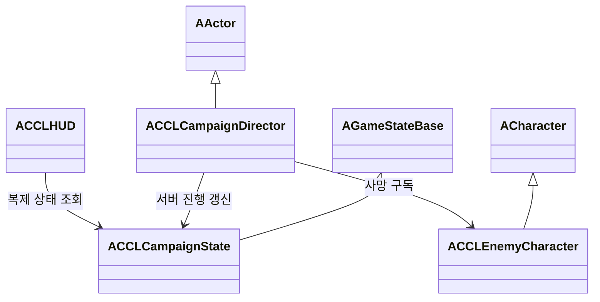

# 마을에서 보스까지의 진행 설계

마을 출발, 일반 적 구간, 보스 전투와 승리 표시를 하나의 플레이 가능한 흐름으로 연결한다. [StudyRoadmap](StudyRoadmap.md)의 단계 3 구현 사양이다. 검증 결과는 아래 표에 구분한다. 제작 범위는 [Direction](Direction.md), 최소 전투 규칙은 [CombatFoundation](CombatFoundation.md)을 따른다.

## 목표와 제약

현재의 플레이어 대 적 전투를 유지하고 월드 진행을 서버가 결정한다. 접속자는 같은 진행 상태를 보며 각자의 사망·재스폰은 계속 독립적으로 처리한다. 협동·대전의 최종 규칙과 게스트 성장 저장은 이 단계에서 확정하지 않는다.

전투 에셋과 애니메이션을 재사용해 보스의 첫 버전을 만든다. 최종 외형·패턴 보강은 단계 5에서 수행한다. 새 진행 맵은 기존 이동·전투 검증 맵과 분리하고 World Partition과 Nanite 구성을 따른다.

## 이번 구현의 구체 범위

진행 맵은 `Campaign`이며 서쪽 마을, 중앙의 일반 적 2명, 동쪽 보스 구역으로 구성한다. 일반 적과 보스는 Director가 서버에서 생성하며 이 맵의 적은 자동 재생성하지 않는다. 일반 적을 모두 처치한 뒤 보스를 생성하므로 보스를 먼저 공격할 수 없다. 보스는 같은 근접 전투 기반에 체력 240을 사용한다. 플레이어 사망은 진행을 되돌리지 않으며 R로 개별 재도전한다. Esc로 [SessionFoundation](SessionFoundation.md)의 메뉴를 열고 종료하거나 시작 화면으로 돌아간다. 단계 3의 직접 종료 입력은 단계 6에서 이 메뉴로 교체했다.

적 수와 구간은 하나의 복제 구조체에 담는다. 적 생성 실패는 승리로 처리하지 않고 진행 오류를 표시한다. 자동 검사는 실제 클라이언트의 공격 Ability 입력으로 적을 처치하고, 서버가 위치와 AI를 통제해 진행·복제 규칙을 검사한다. 일반 게임의 이동·AI 추적과 이 고정 검사를 구분한다.

## 책임과 수명

| 구성 | 책임 | 소유와 수명 | 권위 |
|---|---|---|---|
| `ACCLCampaignState` | 구간, 남은 일반 적과 승리 상태 복제 | 월드의 GameState | 서버 변경, 클라이언트 조회 |
| `ACCLCampaignDirector` | 맵의 적·진입 조건과 진행 상태 연결 | 진행 맵에 배치한 Actor | 서버 |
| `ACCLEnemyCharacter` | 전투와 사망 통지, 설정에 따른 재생성 | 적의 생명 | 서버 |
| `ACCLHUD` | 진행 목표·보스 체력·승리 표시 | 로컬 PlayerController | 조회 전용 |

일반 전투 판정은 진행 단계를 참조하지 않는다. 적의 사망 통지를 진행 맵의 Director가 받아 GameState에 반영한다. 검증 맵에서는 Director가 없어도 기존 전투가 동작해야 한다.



## 인터페이스

```cpp
enum class ECCLCampaignPhase : uint8 { Village, Road, Boss, Victory, Error };
ECCLCampaignPhase GetPhase() const;
int32 GetRemainingGuards() const;
void NotifyEnemyDefeated(ACCLEnemyCharacter* Enemy);
```

RPC에는 승리 여부나 남은 적 수를 직접 입력받는 함수를 제공하지 않는다. 사망 처리는 같은 적에 대해 한 번만 반영하고, 승리 이후 늦게 접속한 플레이어도 같은 상태를 받는다.

## 구현 예시

서버의 Director는 살아 있는 적, 소속되지 않은 적과 이미 처리한 적의 통지를 거부한다. 실제 처리 경로의 보스 분기는 다음과 같다.

```cpp
if (Enemy == Boss.Get() && State->GetPhase() == ECCLCampaignPhase::Boss)
{
    Defeated.Add(Enemy);
    State->SetProgress(ECCLCampaignPhase::Victory, 0);
    UE_LOG(LogTemp, Display, TEXT("CCL_CAMPAIGN victory"));
    return;
}
```

## 검증 방법

기본 실행 맵은 `/Game/Maps/Campaign`이다. WASD로 이동하고 마우스로 시점을 조작한다. 공격·방어·회피·재도전 입력은 CombatFoundation을 따른다. `Tools/Validation/create_campaign.py`는 맵이 이미 있으면 덮어쓰지 않고 중단한다. 자동 검사는 중복 사망 통지, 일반 적이 남았을 때의 보스 활성화 거부, 플레이어 재스폰과 승리의 보존을 포함한다. Dedicated와 Listen에서는 원격 입력으로 진행하고 새 접속자의 GameState가 서버와 일치하는지 확인한다.

최종 코드에서 프로젝트 파일 생성과 전체 프로젝트 빌드를 수행한다. 기존 이동·최소 전투 검사도 다시 실행한다. 원본 로그와 스크린샷은 `Saved/StageValidation/`과 `Saved/Tests/`에 남긴다.

## 대안과 검토 기준

GameState를 사용하면 서버가 계산한 진행을 새 접속자에게도 복제할 수 있다. 각 클라이언트가 적을 세는 방식은 일시적인 네트워크 가시성 차이로 진행이 어긋날 수 있어 채택하지 않는다. Director를 맵에 두면 콘텐츠 연결을 분리할 수 있지만 맵의 적 참조와 초기화 순서를 검증해야 한다. 적 클래스가 직접 승리를 결정하는 방식은 클래스 수를 줄이지만 일반 적 재사용을 어렵게 한다.


## 실행 근거

2026-10-07 UE 5.9.0에서 검사했다. 최종 내비게이션 복구 후 재검사한 결과는 아래 표에 반영한다. 원본 경로는 저장소 기준으로 표기했다.

| 항목 | 상태 | 로컬 근거 |
|---|---|---|
| 프로젝트 생성·CCLEditor 빌드 | 통과 | `Saved/StageValidation/Stage3-Generate.log`, `Stage3-Build.log` |
| World Partition·Nanite 진행 맵 생성 | 종료 코드 0 | `Saved/StageValidation/Stage3-Assets.log` |
| Standalone 진행·개별 재스폰 | 통과 | `Saved/StageValidation/Stage3-Navigation-Final.log` |
| Dedicated와 승리 후 늦은 접속 | 통과 | `Saved/StageValidation/Stage3-Dedicated-Final.log` |
| Listen 원격·호스트, Dedicated 왕복 지연 100ms·손실 2%와 늦은 접속 | 통과 | `Saved/StageValidation/Stage3-Listen-Final.log`, `Stage3-Host-Final.log`, `Stage3-Impaired-Final.log` |
| 기존 전투 회귀 | Standalone·Dedicated 통과 | `Saved/StageValidation/Stage3-Combat-Standalone-Final.log`, `Stage3-Combat-Dedicated-Final.log` |
| 기존 이동 회귀 | Standalone 통과 | `Saved/StageValidation/Stage3-Regression-Movement.log` |
| 기본 서버 맵 | 맵 인자 없이 Campaign 로드 후 정상 종료 | `Saved/StageValidation/Stage3-DefaultServer.log` |
| 화면 검사 | 마을·도로·보스·승리 목표와 체력 표시 확인, 표지판 회전 수정 | `Saved/Tests/CampaignVisual/`, `Saved/StageValidation/Stage3-Rendered-Final.log` |

진행 검사는 먼저 일반 적의 실제 StateTree 접근·공격을 확인한다. 그 뒤 위치를 고정하고 AI를 정지한 상태에서 실제 공격 Ability로 적을 처치한다. 일반 적과 보스의 자연스러운 추적, 플레이 난이도와 최종 표현을 모두 검증했다는 뜻은 아니다. 자동 사망 통지는 서버에서만 집계하고 클라이언트는 승리와 남은 적 수를 확인한다. 마을·일반 적·보스 공간의 외형은 임시 블록과 마네킹이다.


### 내비게이션 생성 결함 수정

추가한 AI 실행 검사에서 StateTree는 실행 중이지만 이동 거리 0, 내비게이션 투영 실패가 관찰됐다. 저장된 `CombatNavigation` 볼륨의 범위가 0이었다. `UCubeBuilder::Build`만 호출한 생성 경로에는 볼륨의 `UModel`과 브러시 컴포넌트 연결이 빠져 있었다.

`UCCLCombatAssetLibrary::ConfigureCombatWorld`는 엔진의 `UActorFactory::CreateBrushForVolumeActor`로 브러시를 만들고 0이 아닌 범위를 검사하도록 수정했다. 근거는 UE 5.9의 `<Engine>/Source/Editor/UnrealEd/Private/Factories/ActorFactory.cpp`에 있는 같은 함수다. `Tools/Validation/repair_navigation.py`로 기존 전투·진행 맵의 배치를 유지하면서 브러시를 복구했다. 저장 검사에서 반범위 `(2000, 2000, 300)`을 확인했다. 근거 로그는 `Saved/StageValidation/Stage3-Nav-Repair.log`다.

복구 후 최종 실행에서 내비게이션 투영 성공과 적의 300cm 이상 이동·공격 피해를 관찰했다. Standalone, Dedicated, Listen 원격·호스트, Dedicated 지연·손실 구성에서 진행·승리·개별 재스폰을 통과했고 네트워크 구성마다 늦은 접속을 확인했다. 화면 캡처의 순간 이동 잔상은 검사 실행에서 Motion Blur를 끄고 확인했다. Python Rotator의 위치 인자로 뒤집혔던 표지판은 이름 있는 pitch·yaw·roll 인자로 수정했다.

World Partition 외부 Actor의 기존 회전을 수정할 때는 `Modify`로 저장 대상을 표시해야 했다. 첫 회전 수정은 재로드 후 유지되지 않아 보정했고, `Saved/StageValidation/Stage3-Presentation-Saved.log`에서 재로드한 표지판의 pitch 0·yaw 180·roll 0을 확인했다.
