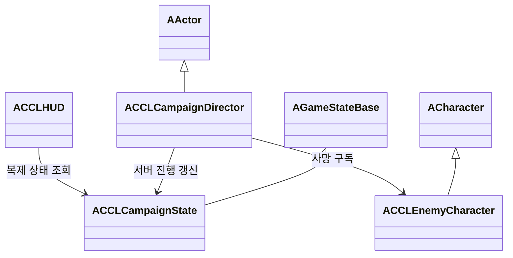

# 마을에서 보스까지의 진행 설계

마을 출발, 일반 적 구간, 보스 전투와 승리 표시를 하나의 플레이 가능한 흐름으로 연결한다. [StudyRoadmap](StudyRoadmap.md)의 단계 3 구현 초안이며 아직 구현·검증하지 않았다. 제작 범위는 [Direction](Direction.md), 최소 전투 규칙은 [CombatFoundation](CombatFoundation.md)을 따른다.

## 목표와 제약

현재의 플레이어 대 적 전투를 유지하고 월드 진행을 서버가 결정한다. 접속자는 같은 진행 상태를 보며 각자의 사망·재스폰은 계속 독립적으로 처리한다. 협동·대전의 최종 규칙과 게스트 성장 저장은 이 단계에서 확정하지 않는다.

전투 에셋과 애니메이션을 재사용해 보스의 첫 버전을 만든다. 최종 외형·패턴 보강은 단계 5에서 수행한다. 새 진행 맵은 기존 이동·전투 검증 맵과 분리하고 World Partition과 Nanite 구성을 따른다.

## 책임과 수명

| 구성 | 책임 | 소유와 수명 | 권위 |
|---|---|---|---|
| `ACCLCampaignState` | 구간, 남은 일반 적과 승리 상태 복제 | 월드의 GameState | 서버 변경, 클라이언트 조회 |
| `ACCLCampaignDirector` | 맵의 적·진입 조건과 진행 상태 연결 | 진행 맵에 배치한 Actor | 서버 |
| `ACCLEnemyCharacter` | 전투와 사망 통지, 설정에 따른 재생성 | 적의 생명 | 서버 |
| `ACCLHUD` | 진행 목표·보스 체력·승리 표시 | 로컬 PlayerController | 조회 전용 |

일반 전투 판정은 진행 단계를 참조하지 않는다. 적의 사망 통지를 진행 맵의 Director가 받아 GameState에 반영한다. 검증 맵에서는 Director가 없어도 기존 전투가 동작해야 한다.



## 인터페이스 초안

```cpp
enum class ECCLCampaignPhase : uint8 { Village, Road, Boss, Victory };
ECCLCampaignPhase GetPhase() const;
int32 GetRemainingGuards() const;
void NotifyEnemyDefeated(ACCLEnemyCharacter* Enemy);
```

초안의 함수명과 클래스 구성은 구현 시 실제 소스에 맞춰 확정한다. RPC에는 승리 여부나 남은 적 수를 직접 입력받는 함수를 제공하지 않는다. 사망 처리는 같은 적에 대해 한 번만 반영하고, 승리 이후 늦게 접속한 플레이어도 같은 상태를 받는다.

## 구현 예시

보스가 죽었을 때 서버의 진행 상태를 한 번 갱신하는 경로를 사용한다. 아래는 책임을 설명하는 초안이며 아직 실제 구현이 아니다.

```cpp
void ACCLCampaignDirector::NotifyEnemyDefeated(ACCLEnemyCharacter* Enemy)
{
    if (!HasAuthority() || !Enemy || DefeatedEnemies.Contains(Enemy))
    {
        return;
    }

    DefeatedEnemies.Add(Enemy);
    UpdateProgressFromEncounter();
}
```

## 검증 방법

Standalone에서 마을부터 보스 사망까지 이동하고 목표·체력·승리 표시를 확인한다. 자동 검사는 중복 사망 통지, 일반 적이 남았을 때의 보스 활성화 거부, 플레이어 재스폰과 승리의 보존을 포함한다. Dedicated와 Listen에서는 원격 입력으로 진행하고 새 접속자의 GameState가 서버와 일치하는지 확인한다.

최종 코드에서 프로젝트 파일 생성과 전체 프로젝트 빌드를 수행한다. 기존 이동·최소 전투 검사도 다시 실행한다. 원본 로그와 스크린샷은 `Saved/StageValidation/`과 `Saved/Tests/`에 남긴다.

## 대안과 검토 기준

GameState를 사용하면 서버가 계산한 진행을 새 접속자에게도 복제할 수 있다. 각 클라이언트가 적을 세는 방식은 일시적인 네트워크 가시성 차이로 진행이 어긋날 수 있어 채택하지 않는다. Director를 맵에 두면 콘텐츠 연결을 분리할 수 있지만 맵의 적 참조와 초기화 순서를 검증해야 한다. 적 클래스가 직접 승리를 결정하는 방식은 클래스 수를 줄이지만 일반 적 재사용을 어렵게 한다.
