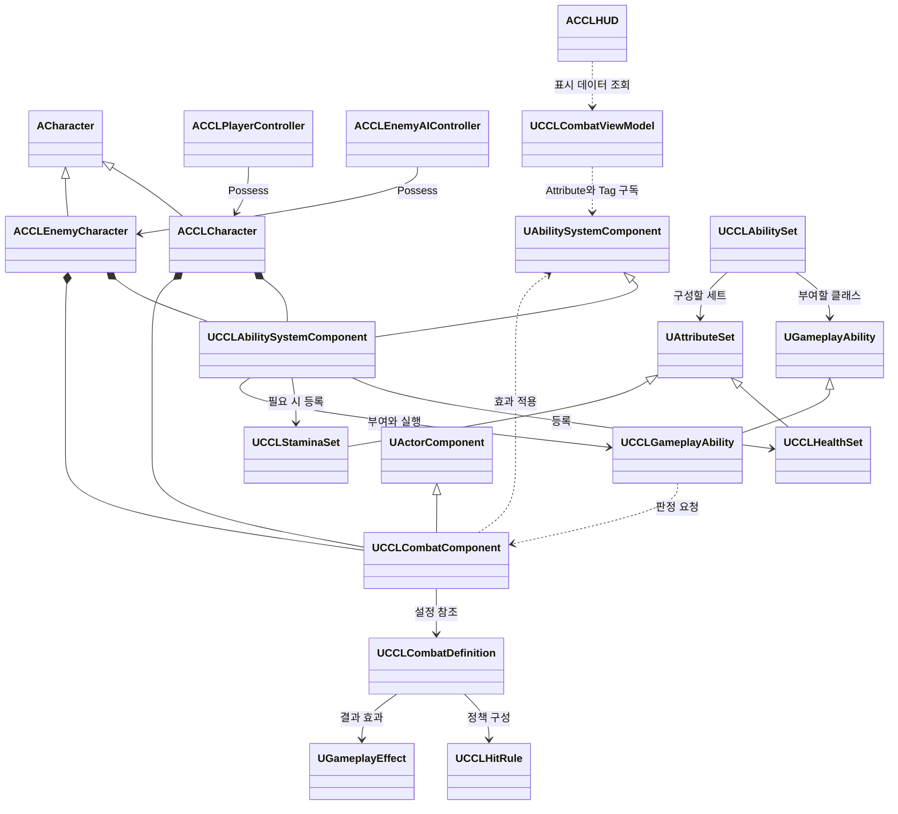

# 최소 전투 설계 초안

일반 몹 한 종류와 근접 무기 하나로 공격, 피격, 회피, 가드와 패링을 연결한다. [결정 8](DesignLog.md)의 세 방어 행동을 모두 포함하며, [결정 9](DesignLog.md)의 장르 독립 설계와 [결정 10](DesignLog.md)의 UE5 현행 시스템 우선 원칙을 적용한다. 전투의 실행 기반은 Gameplay Ability System(GAS)과 AbilitySystemComponent(ASC), 능력치는 Attribute·AttributeSet으로 설계한다.

아래 소유 구조, 클래스와 세부 규칙은 구현 전 설계 초안이다. GAS 연동과 전투 테스트는 아직 수행하지 않았다. 현재 이동과 개별 재스폰의 구현·검증 상태는 [MultiplayerFoundation](MultiplayerFoundation.md)이 소유한다.

## 목표와 제약

플레이어가 적의 예고를 보고 공격하거나 세 방어 행동을 선택할 수 있어야 한다. 서버가 능력 실행 허용, 적중, 방어 결과, 능력치 변화와 사망을 확정한다. Standalone, Dedicated Server와 Listen Server에서 같은 규칙을 사용한다.

첫 검증 장면에는 근접 일반 몹 한 종류와 기본 공격 하나를 둔다. 테스트의 피해 대상은 플레이어와 적 사이로 한정하는 안을 제안한다. 최종 협동·대전과 아군 피해 정책, 인원과 저장 규칙은 [GameDesign](GameDesign.md)의 미정 상태를 유지한다.

기본 공격의 거리·피해 정보, 행동 구간, 방어 정책과 능력 부여 구성을 정의 데이터로 조합한다. 초기 능력치는 초기화 GameplayEffect로 적용하며 현재 값은 AttributeSet에 둔다. 이번 ccl8의 체력·스태미나는 현재 생명에 속하고 재스폰 때 초기화한다. 영구 성장과 장비 소유권은 전투 상태와 별도로 설계한다.

맵과 환경 에셋을 제작·변경할 때는 Nanite와 World Partition도 적용 대상에 맞는 기본 선택으로 검토·사용한다. 이 문서에서 기존 테스트 맵의 World Partition 유형이나 에셋의 Nanite 적용 상태를 검증하지 않았다. 전투 설계 수정만으로 이 기능들의 활성화·전환이 완료된 것으로 기록하지 않는다.

## 공통 기반과 콘텐츠 경계

공통 기반은 Actor의 능력 시스템 접근, 서버가 구성한 적중 문맥, 대상 검증과 효과 적용을 연결한다. 특정 Character, 플레이어 HUD 또는 스태미나를 필수 구성으로 요구하지 않는다. 수신 Actor는 필요한 ASC와 AttributeSet, 판정 정책을 조합한다. 파괴 가능한 물체는 체력 세트만 사용하고 스태미나·방어 Ability 없이 같은 적중 계약을 사용할 수 있어야 한다.

ccl8의 회피 무적, 정면 가드, 패링 구간과 자원 비용은 콘텐츠 Ability·GameplayEffect·GameplayTag·판정 정책으로 구성한다. 공통 ASC에 장르별 행동 enum이나 패링 전용 필드를 넣지 않는다. AttributeSet도 기능별로 나눠 필요한 대상에만 부여한다. 공통 판정 컴포넌트는 거리·각도·대상·적중 식별을 검증하고 GAS로 결과를 전달한다. 효과의 지속시간·중첩·제거와 비용 처리를 자체 체계로 중복 구현하지 않는다.

Item은 [Coding](Coding.md)에 따라 `ItemDefinition`과 Fragment로 조합한다. 무기의 전투 Fragment가 공격 정의와 능력 부여 구성을 참조하도록 연결할 수 있다. 정의에는 런타임 AbilitySpecHandle, EffectHandle이나 현재 능력치를 저장하지 않는다. 이번 전투 초안을 위해 인벤토리·저장 기능 전체를 먼저 구현하지 않는다.

## 행동과 판정 제안

| 행동 | GAS 구성 | 서버 판정과 실패 조건 |
|---|---|---|
| 기본 공격 | 공격 GameplayAbility, 비용·쿨다운 GameplayEffect, 구간별 GameplayTag | 실행 조건·비용 확인 후 공격 구간 진행, 유효 구간의 서버 적중만 수락 |
| 회피 | 회피 GameplayAbility, 이동 AbilityTask, 비용 효과와 무적 구간 상태 | 방향·거리·충돌 검증, 서버 무적 구간만 피해 차단, 비용 부족이면 거부 |
| 가드 | 유지형 GameplayAbility, 가드 상태 효과, 피격 시 비용 효과 | 정면·가드 허용 공격이면 스태미나 소모, 후방은 피격, 자원 부족이면 가드 붕괴 |
| 패링 | 패링 GameplayAbility, 성공 구간 상태와 대상 경직 효과 | 성공 구간·정면·패링 허용 조건이 모두 맞아야 공격 취소와 빈틈 생성 |
| 피격·사망 | 피해 GameplayEffect, Attribute 변화 통지, 사망 상태와 능력 취소 | 체력 소진을 기존 사망 처리로 연결하고 후속 실행·예약 적중 거부 |

가드는 유지 입력, 패링은 별도 누름 입력으로 분리하는 안을 제안한다. 가드 시작 구간을 패링으로 사용하는 대안은 키 수를 줄이지만 가드 의도와 패링 시도를 구분하기 어렵다. 키 배치는 미정이다.

ccl8에서는 행동 잠금 Tag와 Ability의 차단·취소 규칙으로 공격·회피·가드·패링의 동시 실행을 제한한다. 준비·유효·회복 구간은 각 Ability가 관리하고, 지속되는 표현·판정 상태는 복제 가능한 Tag·효과로 전달한다. 입력 버퍼와 일반 공격 취소는 첫 구현에 넣지 않는 안을 제안한다. 조작이 경직될 수 있으므로 수동 플레이에서 입력 반응을 확인한다.

서버 판정 순서는 사망·유효하지 않은 요청·중복 적중 제외, 회피 무적, 패링 성공, 가드, 일반 피해 순으로 둔다. 이 순서는 ccl8 정책이다. 공격 한 번에 같은 대상을 한 번만 처리하고, 패링으로 취소된 공격은 남은 구간에서 추가 피해를 주지 않는다. 가드 붕괴 때 체력 피해를 함께 적용할지는 미정이다.

## 책임과 수명

아래 `CCL` 타입은 제안 이름이다. 엔진 타입을 제외한 새 전투 타입과 에셋은 아직 구현하지 않았다.

| 타입·구성 | 책임 | 소유자와 수명 | 네트워크 권위 |
|---|---|---|---|
| `UCCLAbilitySystemComponent` | 공통 능력 부여·입력 연결과 GAS 접근 확장 | 능력 보유 Actor의 컴포넌트 | 서버가 부여·최종 실행을 관리, 소유 클라이언트는 허용된 예측 |
| `UCCLHealthSet : UAttributeSet` | Health·MaxHealth, 값 범위와 소진 통지 | ASC에 등록된 대상별 세트 | 서버 효과로 최종 값 변경, 관찰에 필요한 값 복제 |
| `UCCLStaminaSet : UAttributeSet` | Stamina·MaxStamina와 값 범위 | 자원이 필요한 대상에만 등록 | 서버가 최종 비용 확정, 소유 클라이언트에 필요한 값 복제 |
| `UCCLAbilitySet : UDataAsset` | 부여할 Ability·AttributeSet·초기화 효과의 정의 | 공유 정의 에셋 | 서버가 인스턴스와 부여 핸들을 관리 |
| `UCCLCombatDefinition : UDataAsset` | 공격 구간·판정 정책·효과 구성의 참조 | 공유 정의 에셋 | 서버가 설정을 읽고 런타임 상태는 별도 보관 |
| `UCCLCombatComponent` | 활성 공격 문맥·거리·각도·대상·중복 적중 검증과 효과 전달 | 공격 Actor, 활성 공격 동안 판정 기록 유지 | 최종 적중과 적용 대상은 서버가 결정 |
| `UCCLHitRule` | 적대 관계·방어·적중 횟수 등의 정책 평가 계약 | 정의가 참조, 대상별 상태는 문맥에서 조회 | 서버 판정에서 호출, GAS 효과 수명을 직접 관리하지 않음 |
| 공격·회피·가드·패링 `UGameplayAbility` 파생 타입 | 콘텐츠 행동 구간·비용·취소·이동 Task 연결 | ASC가 부여, 실행별 Task는 종료 때 정리 | 플레이어 입력 예측과 서버 검증, AI는 서버 실행 |
| `UGameplayEffect` 에셋 | 초기값·피해·비용·쿨다운·일시 상태 | 정의 공유, 실행별 Spec과 지속 효과는 GAS가 관리 | 서버가 결과 확정, 지원되는 예측만 소유 클라이언트에서 수행 |
| `ACCLCharacter`, `ACCLEnemyCharacter` | 캐릭터 이동·시점·표현과 사망 연결 | 현재 생명 동안 유지 | 체력 소진에 따른 사망은 서버가 결정 |
| `ACCLEnemyAIController` | 대상 선택·접근과 부여된 Ability 실행 요청 | 서버에서 적을 Possess | 서버 전용 |
| `ACCLPlayerController` | Enhanced Input을 현재 Pawn의 능력 입력으로 전달 | 접속 동안 유지 | 소유 클라이언트 입력, 판정 값 전송 금지 |
| HUD 연결 객체 | ASC의 Attribute·Tag 통지를 표시 데이터로 변환 | 로컬 표시 대상과 함께 재연결 | 표현 전용, 게임 상태 변경 권한 없음 |

### ASC 소유와 초기화

이번 개별 재스폰 흐름에서는 플레이어 Character와 적 Actor가 각각 ASC와 필요한 AttributeSet을 소유하는 안을 제안한다. 플레이어의 ASC OwnerActor와 AvatarActor는 현재 Character로 둔다. 서버 Possess와 소유 클라이언트의 Controller 연결 완료 시점에 `InitAbilityActorInfo`를 호출하고, 관찰 클라이언트에서도 복제된 ASC의 ActorInfo를 준비한다. 초기화는 여러 번 호출돼도 능력·초기 효과를 중복 부여하지 않게 한다.

서버는 필요한 AttributeSet을 등록하고 초기화 효과와 AbilitySet을 한 번 적용한다. 소유 클라이언트는 ActorInfo와 AbilitySpec이 모두 준비된 후 입력을 활성화한다. 재스폰 시 이전 ASC·Task·효과·입력 핸들을 정리하고 새 Pawn의 ASC에 다시 연결한다. 죽은 Pawn은 기존 재도전 선택을 위해 남겨도 활성 행동과 공격 판정은 즉시 종료한다.

PlayerState에 ASC를 두는 대안은 Pawn 교체 뒤 능력과 효과를 유지하기 쉽다. 현재 생명과 함께 초기화하는 안은 잔존 효과의 처리 범위를 줄이지만, 영구 성장·장비 기능 도입 때 유지할 데이터와 재부여 절차를 설계해야 한다. 공통 ASC 계약은 어느 배치에도 사용할 수 있게 유지한다.

### 복제와 예측

플레이어 ASC에는 Mixed, AI에는 Minimal 효과 복제를 적용하는 안을 제안한다. Mixed의 소유 연결이 현재 PlayerController의 네트워크 연결로 이어지는지 검증한다. 효과 복제 모드와 Attribute 프로퍼티 복제 조건은 별도로 설정한다. Health·MaxHealth는 관찰 대상에게, 플레이어 Stamina·MaxStamina는 우선 소유자에게 전달한다. 적의 스태미나는 별도 표시 요구가 생기기 전까지 서버에서만 사용한다.

Attribute 프로퍼티는 `ReplicatedUsing`과 `GAMEPLAYATTRIBUTE_REPNOTIFY`로 변경을 연결하고 예측 보정에 필요한 RepNotify 조건을 확인한다. 복제되지 않는 스태미나로 다른 플레이어의 방어 성공을 추측하지 않는다. 관찰자는 서버가 전달한 가드·경직·사망 상태를 사용한다.

플레이어 Ability는 `InstancedPerActor`와 `LocalPredicted`를 기본안으로 삼는다. AI용 실행 구성은 서버에서 시작한다. `CommitAbility`가 비용·쿨다운을 확인하고 적용하도록 하며 서버와 클라이언트 양쪽에서 별도 비용 차감을 추가하지 않는다. 예측 허용 범위는 입력 반응·자신의 이동·지원되는 비용과 상태 표현까지다. 상대 체력, 패링 성공과 무적 피해 거부는 서버가 확정한다.

회피 이동은 CharacterMovement와 GAS의 Root Motion AbilityTask 경로를 우선 사용한다. 서버가 방향·거리·충돌을 검증하고, 예측 거절·중단 시 Task와 이동 상태를 정리한다. 단순 위치 변경 RPC로 회피를 구현하지 않는다. 실제 애니메이션의 루트 모션 사용 여부와 지연 환경의 이동 보정은 실행 검증 대상이다.

## 클래스 관계



`UCCLGameplayAbility`는 공통 GAS 연결만 담당하는 제안 기반 타입이며 구체적인 공격·방어 규칙은 파생 Ability와 데이터에 둔다. `UCCLCombatViewModel`은 HUD 연결 객체의 제안 이름이다. 세트 등록 화살표는 구성 관계이며 AttributeSet의 정확한 Outer·생성 방식은 구현에서 검증한다.

## 인터페이스 초안

다음은 구현 전 검토용 공개 계약이다. 공통 ASC의 입력 함수는 InputTag와 부여된 AbilitySpecHandle의 연결을 관리한다. 공격·가드별 서버 RPC와 별도 행동 enum을 추가하지 않는다.

```cpp
// 능력 보유 Actor: IAbilitySystemInterface 구현.
virtual UAbilitySystemComponent* GetAbilitySystemComponent() const override;

// UCCLAbilitySystemComponent: 프로젝트 입력 연결 함수.
void AbilityInputTagPressed(FGameplayTag InputTag);
void AbilityInputTagReleased(FGameplayTag InputTag);

// UCCLCombatComponent: 서버에서만 최종 판정.
FCCLHitResult ResolveHit(const FCCLHitContext& Context);

// UCCLHealthSet: 엔진 후처리와 복제 연결.
virtual void PostGameplayEffectExecute(
    const FGameplayEffectModCallbackData& Data) override;
virtual void PreAttributeChange(
    const FGameplayAttribute& Attribute, float& NewValue) override;
virtual void GetLifetimeReplicatedProps(
    TArray<FLifetimeProperty>& OutLifetimeProps) const override;
```

입력 연결 함수는 Pressed에서 부여된 Spec을 찾아 GAS의 `TryActivateAbility` 경로를 사용한다. Released는 실행 중인 Ability의 입력 해제 이벤트에 연결한다. 가드는 `WaitInputRelease`의 복제 이벤트 경로로 서버에서도 종료하고, 포커스 상실·입력 취소·사망 때도 해제를 처리한다. 로컬에서만 가드 Tag를 지우는 구현으로 끝내지 않는다.

`FCCLHitContext`는 서버가 만든 공격 식별자, 공격자·수신자, 서버 적중 위치·방향과 정의 참조를 담는 제안 타입이다. 클라이언트가 보낸 목표·방향 정보는 요청 자료이며 서버가 소유권·활성 Spec·현재 Avatar·거리·각도·유효 구간을 다시 검사한다. PredictionKey는 예측 연결에 사용하고 적중 증거나 시간 되감기의 근거로 취급하지 않는다. 초기 지연 보상은 서버 현재 상태 기준이며 되감기 판정은 아직 범위에 포함하지 않는다.

`FCCLHitResult`는 거부 사유·결과 Tag와 적용할 효과 요청을 담는다. 공격 단위의 서버 기록이 중복 적용을 막고 실제 변경은 GAS 효과 적용 경로로 한 번만 수행한다. 재스폰 이전 Spec·Avatar에 속한 요청은 새 Pawn으로 옮겨 실행하지 않는다.

## UE 5.8 코드 예시

아래는 서버에서 이미 검증한 적중 결과를 GameplayEffect로 전달하는 제안 함수다. 공통 기반은 Health나 Stamina를 직접 지정하지 않으며 콘텐츠 효과가 수정할 Attribute와 SetByCaller Tag를 정의한다. 이 함수는 판정 계층의 비공개 적용 경로이며 클라이언트가 EffectClass·Magnitude·TargetASC를 직접 지정하는 RPC로 노출하지 않는다.

```cpp
#include "CCLCombatComponent.h"

#include "AbilitySystemComponent.h"
#include "GameplayEffect.h"
#include "GameFramework/Actor.h"

bool UCCLCombatComponent::ApplyResolvedEffect(
    UAbilitySystemComponent* SourceASC,
    UAbilitySystemComponent* TargetASC,
    TSubclassOf<UGameplayEffect> EffectClass,
    FGameplayTag MagnitudeTag,
    float Magnitude,
    const FHitResult& ServerHit)
{
    if (!GetOwner() || !GetOwner()->HasAuthority()
        || !IsValid(SourceASC) || !IsValid(TargetASC)
        || !EffectClass || !MagnitudeTag.IsValid()
        || !FMath::IsFinite(Magnitude))
    {
        return false;
    }

    FGameplayEffectContextHandle Context = SourceASC->MakeEffectContext();
    Context.AddHitResult(ServerHit);
    FGameplayEffectSpecHandle Spec = SourceASC->MakeOutgoingSpec(
        EffectClass, 1.f, Context);
    if (!Spec.IsValid())
    {
        return false;
    }

    Spec.Data->SetSetByCallerMagnitude(MagnitudeTag, Magnitude);
    const FActiveGameplayEffectHandle Applied =
        SourceASC->ApplyGameplayEffectSpecToTarget(*Spec.Data.Get(), TargetASC);
    return Applied.WasSuccessfullyApplied();
}
```

Magnitude의 부호는 콘텐츠 효과 정의를 따른다. 예를 들어 Health에 가산 보정을 적용하는 효과라면 음수를 전달한다. 반환값 true는 효과 적용 성공이며 실제 체력 감소량을 뜻하지 않는다. Instant 효과는 지속 중인 유효 핸들이 없을 수 있으므로 `IsValid()`만으로 적용 실패를 판정하지 않는다.

코드는 미구현 제안 클래스를 사용하는 발췌이며 컴파일 검증은 하지 않았다. 대응 선언, 효과의 SetByCaller 설정, 등록 Tag와 AttributeSet이 필요하다. 엔진 API 근거는 문서 끝에 정리했다.

### 피격·능력치·사망 연결

공격 피해는 서버 판정 결과를 피해 GameplayEffect로 전달한다. Health 세트는 `PostGameplayEffectExecute`에서 즉시 실행된 피해 결과를 정리하고 체력 소진을 통지한다. 사망 연결 객체가 서버에서 기존 `Die`를 한 번 호출한다. AttributeSet이 구체적인 플레이어·적 클래스를 직접 참조하지 않게 한다.

`PreAttributeChange`와 필요한 base-value 처리에서 값의 범위를 관리한다. `PostGameplayEffectExecute`를 모든 지속 효과·집계 변화의 공통 콜백으로 가정하지 않는다. MaxHealth 변경 등 피해 외 경로에서도 Health 범위가 유지되는지 별도로 검증한다. HUD는 ASC의 Attribute 값 변경 델리게이트와 Tag를 구독하고 Pawn 교체 때 이전 구독을 해제한다.

현재 `Source/CCL/CCLCharacter.cpp`의 `TakeDamage`는 양수 피해로 즉시 사망한다. 구현에서는 월드 위험 피해도 서버의 GAS 피해 적용 연결 함수를 거치게 하고, 일반 공격은 같은 적중을 `TakeDamage`와 GameplayEffect로 두 번 적용하지 않게 한다. 반환할 실제 피해량과 엔진 피해 이벤트 통지의 순서는 구현에서 확정한다. KillZ와 개발용 사망은 체력 계산을 우회할 수 있어도 능력 취소·공격 판정 종료와 사망 상태 정리는 공통으로 실행한다.

### 모듈과 에셋 준비

구현할 때 `CCL.uproject`에 GameplayAbilities 플러그인을 명시하고 `CCL.Build.cs`에 `GameplayAbilities`, `GameplayTags`, `GameplayTasks` 의존을 추가한다. 공개 헤더에 노출되는 의존은 Public에 둔다. AI에는 `AIModule`을 추가하며 직접 경로 탐색 API를 쓰는 경우 `NavigationSystem`도 선언한다.

필요한 콘텐츠는 AbilitySet, 기능별 AttributeSet, 초기 능력치·피해·비용·상태 효과와 공격·회피·가드·패링 Ability다. 해당 설정은 아직 추가하지 않았다. 확인한 현재 `CCL.Build.cs`에는 GAS 모듈 의존이 없고 `CCL.uproject`에는 GameplayAbilities의 명시적 활성화 항목이 없다.

## 검증 방법

아래는 구현 전 예상 결과다. 설계 문서의 API 확인과 게임 실행 검증을 구분하며 전투 테스트는 아직 실행하지 않았다.

| 실행·조건 | 예상 결과 |
|---|---|
| UHT·프로젝트 빌드 | GAS 모듈, Attribute 반영·복제 선언과 Ability 에셋 참조 정상 |
| 범용 판정 계약 | 스태미나·방어 Ability가 없는 Actor도 HealthSet과 정책 연결로 적중 결과 처리 |
| ASC 초기화·재연결 | 서버·소유자·관찰자 ActorInfo 준비, 능력·초기화 효과 중복 부여 없음 |
| Standalone 전투 | 적 접근·예고·공격, 피격·사망과 재도전 가능 |
| 비용·예측 거절 | Commit에 의한 비용·쿨다운 적용, 서버 거절 시 예측 비용·상태·이동 정리 |
| 회피 성공·실패 | 서버 무적 구간에서만 피해 거부, 구간 밖 체력 감소, 벽 통과 없음 |
| 가드·해제·붕괴 | 정면은 비용 처리, 후방은 피해, 해제·포커스 상실·취소가 서버에 전달, 부족하면 가드 붕괴 |
| 패링 경계·불가 공격 | 성공 구간에서만 공격 취소·적 경직, 늦은 요청과 불가 공격은 성공하지 않음 |
| 반복 입력·다중 충돌 | 비용 중복 차감·동일 공격의 다중 피해·쿨다운 우회 없음 |
| Attribute 경계·HUD | 체력·자원 상하한 유지, Max 값 변경·효과 종료·복제 보정 후 표시 일치 |
| 사망·재스폰 | 기존 능력·Task·효과·예약 적중 정리, 새 ASC 초기화, 이전 요청 거부, 생존자 Pawn 보존 |
| Dedicated + 두 클라이언트 | 공격자·수신자·관찰자에서 최종 체력·행동·사망 상태 일치 |
| Listen 원격·호스트 각각 | 양쪽 모두 동일한 GAS 초기화·비용·공격·방어 규칙 적용 |
| 지연·손실·늦은 접속 | 예측 거절 정리, 지속 상태 복구, 과거 공격 재실행 없음, 조건·수치를 로그에 기록 |

자동 로그에는 서버 공격 ID, AbilitySpecHandle, Avatar, 구간 전이, 피해 전후 Attribute와 방어 결과를 남긴다. 실제 피해량은 Attribute 변화로 확인한다. 게임 시간으로 검사 구간을 측정하고 실제 시간은 중단 제한에 사용한다. 기존 이동·재스폰 검사도 유지한다.

첫 시각 검증은 단순 무기 도형과 공격 예고 표시로 진행할 수 있다. 기존 맨손 공격·대시·피격 애니메이션은 후보이며 리그 호환성과 실제 동작은 미검증이다. GameplayCue는 피격·방어 표현에 사용하고 게임 판정을 Cue 수신 여부에 의존시키지 않는다. 짧은 이벤트를 놓친 클라이언트와 늦게 접속한 관찰자는 복제된 Attribute·지속 상태를 기준으로 현재 상태를 복원한다.

## 검토에 필요한 설명과 대안

GAS를 기본 선택으로 사용하면서 능력 부여, 비용·쿨다운, 효과와 Attribute 복제를 엔진 경로에 통합한다. 초기 ActorInfo·소유 연결과 효과·Tag 설계가 필요하지만 별도의 능력치 저장·행동 실행·예측 체계를 함께 유지하지 않는다. 자체 구현은 필수 요구와 GAS의 충돌 등 구체적인 근거가 확인될 때만 대안으로 기록한다.

GAS와 서버 권위는 UE5에서 처음 생긴 기능이 아니다. 결정 10은 UE5의 현행 시스템 활용까지 포함한다. 입력은 기존 Enhanced Input을 유지한다. UE 5.8의 Ability 타입 선언은 `InstancedPerActor`를 기본으로 권장하고 `NonInstanced`를 deprecated로 표시하므로 오래된 예제를 그대로 옮기지 않는다.

ASC의 Character 소유는 현재 생명의 초기화 경계를 단순하게 하며 PlayerState 소유는 Pawn 교체 후 상태 유지에 유리하다. 기능별 AttributeSet은 필요한 자원만 구성할 수 있는 대신 세트 등록·초기화 순서와 효과 요구 Attribute 검증이 필요하다. 서버 현재 상태 기준 판정은 구현과 재현이 단순하지만 지연이 큰 환경에서 패링 체감이 달라질 수 있다. 수동 조작감과 지연 조건별 결과를 확인한 뒤 보상 정책을 별도 설계한다.

다음 구현은 ASC·AttributeSet 등록과 개별 재스폰 연결, AbilitySet·공통 판정, 근접 공격·일반 몹과 세 방어 Ability, 서버별 자동 검사와 수동 조작감 확인 순이다. 수치, 키 배치, 가드 붕괴 피해와 최종 애니메이션은 미정이다.

## 엔진 소스 근거

2026-10-06 집의 `<Engine>/Build/Build.version`에서 UE 5.8.1, Changelist 0을 확인했다. Graft 조회를 출발점으로 아래 실제 설치 소스를 확인했다. `<GAS>`는 `<Engine>/Plugins/Runtime/GameplayAbilities/Source/GameplayAbilities`다. 이 API 확인은 위 제안 코드의 빌드·실행 성공을 뜻하지 않는다.

| 근거 | 확인 내용 |
|---|---|
| `<GAS>/Private/AbilitySystemComponent_Abilities.cpp:161` | InitAbilityActorInfo의 OwnerActor·AvatarActor 설정 |
| `<GAS>/Private/AbilitySystemComponent_Abilities.cpp:1604` | TryActivateAbility 실행 경로 |
| `<GAS>/Private/AbilitySystemComponent_Abilities.cpp:2846` | 로컬 입력 해제를 Ability와 복제 이벤트에 전달 |
| `<GAS>/Private/Abilities/Tasks/AbilityTask_WaitInputRelease.cpp:16` | 예측 클라이언트의 입력 해제를 서버 이벤트로 전달 |
| `<GAS>/Private/Abilities/GameplayAbility.cpp:592` | CommitAbility가 CommitCheck 이후 비용·쿨다운 적용 경로 실행 |
| `<GAS>/Private/AbilitySystemComponent.cpp:525`, `:975` | 효과 Spec 생성과 대상 ASC 적용 |
| `<GAS>/Public/GameplayEffect.h:1117` | GameplayTag로 SetByCaller magnitude 설정 |
| `<GAS>/Public/ActiveGameplayEffectHandle.h:39` | Instant 효과의 IsValid와 WasSuccessfullyApplied 의미 구분 |
| `<GAS>/Public/AttributeSet.h:206`, `:220`, `:402` | 효과 실행 후처리·값 변경 전처리·Attribute RepNotify |
| `<GAS>/Public/AbilitySystemComponent.h:539` | Attribute 값 변경 델리게이트 조회 |
| `<GAS>/Private/GameplayEffect.cpp:5195`, `:5226` | Mixed·Minimal의 활성 효과 복제 범위와 소유 연결 검사 |
| `<GAS>/Public/Abilities/GameplayAbilityTypes.h:46`, `:65` | InstancedPerActor 권장과 LocalPredicted 선언 |
| `<GAS>/Public/Abilities/Tasks/AbilityTask_ApplyRootMotionConstantForce.h:33` | Root Motion 기반 이동 Task 진입점 |
