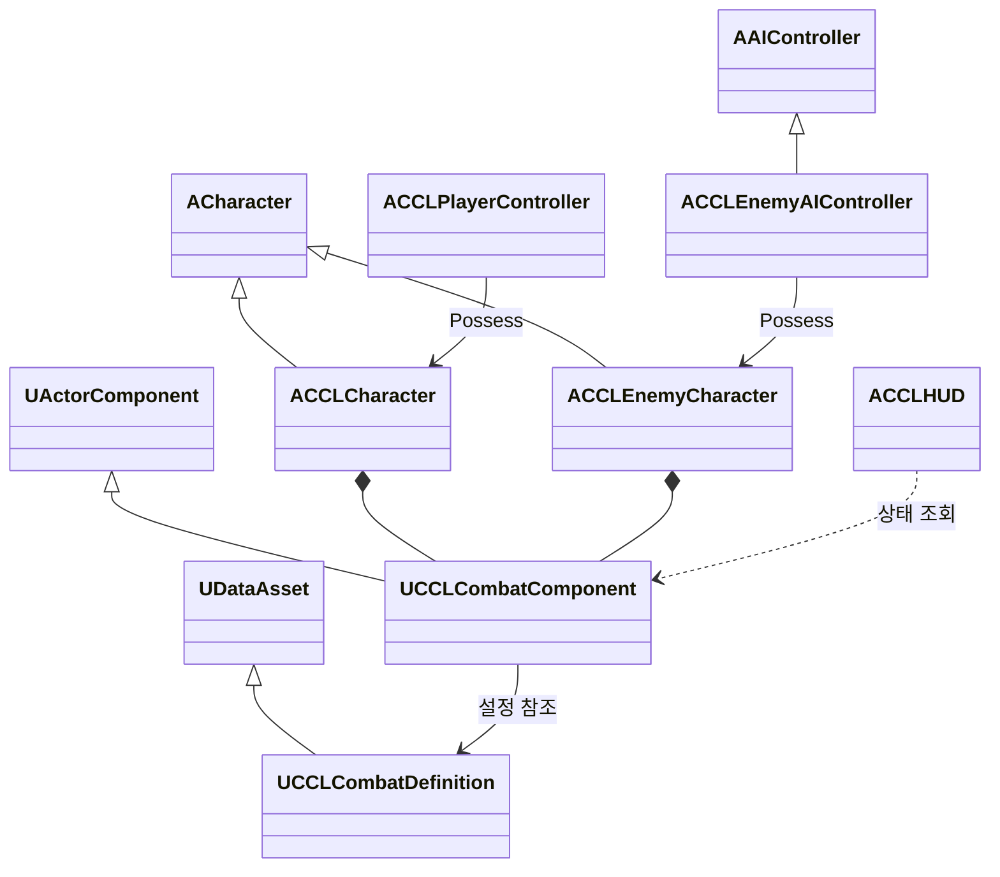

# 최소 전투 설계 초안

일반 몹 한 종류와 근접 무기 하나로 공격, 피격, 회피, 가드와 패링을 연결한다. 세 방어 행동을 모두 포함하는 범위는 [결정 8](DesignLog.md)로 확정했다. 아래 구조와 세부 규칙은 AI 설계 초안이며 아직 구현하지 않았다. 기존 이동과 개별 재스폰은 [MultiplayerFoundation](MultiplayerFoundation.md)이 소유한다.

## 목표와 제약

플레이어가 적의 예고를 보고 공격하거나 세 방어 행동을 선택할 수 있어야 한다. 서버가 공격 가능 여부, 적중, 방어 결과와 사망을 결정한다. Standalone, Dedicated Server와 Listen Server에서 같은 규칙을 사용한다.

첫 검증 장면에는 근접 일반 몹 한 종류와 기본 공격 하나를 둔다. 테스트의 피해 대상은 플레이어와 적 사이로 한정하는 안을 제안한다. 이 제한은 최종 협동·대전 규칙이나 아군 피해 정책을 확정하지 않는다. 인원과 저장 규칙도 [GameDesign](GameDesign.md)의 미정 상태를 유지한다.

무기 정의에는 공격 거리, 피해량, 스태미나 비용, 준비·유효·회복 시간과 방어 허용 여부를 둔다. 체력과 스태미나는 캐릭터의 현재 생명에 속하고 재스폰 때 초기화한다. 장비 소유권과 영구 성장은 후속 기능에서 다룬다.

## 행동과 판정 제안

| 행동 | 역할 | 서버 판정 | 실패·제약 |
|---|---|---|---|
| 기본 공격 | 적에게 피해를 주고 방어 선택을 유도 | 비용과 상태를 검사한 뒤 준비, 유효, 회복 구간 진행 | 사망·행동 잠금·비용 부족이면 거부 |
| 회피 | 공격 범위를 벗어나거나 무적 구간으로 피격 회피 | 이동 방향을 제한하고 충돌을 처리하며 무적 구간에서 피해 거부 | 벽 통과 불가, 비용 부족이면 거부, 회복 중 연속 발동 제한 |
| 가드 | 정면 공격을 지속해서 방어 | 공격 방향과 가드 가능 여부 검사, 피해 대신 스태미나 소모 | 후방 공격은 피격, 스태미나 부족이면 가드 붕괴 |
| 패링 | 짧은 타이밍으로 적의 공격을 끊고 반격 기회 생성 | 성공 구간, 정면 조건과 패링 가능 여부가 모두 맞으면 피해 차단 | 준비·회복 구간의 입력이나 패링 불가 공격은 성공하지 않음 |
| 피격·사망 | 피해와 조작 제한을 명확히 표현 | 체력 감소 후 0이면 기존 사망 처리 호출 | 사망 이후 공격·방어 요청과 추가 피해 거부 |

가드는 유지 입력, 패링은 별도 누름 입력으로 분리하는 안을 제안한다. 가드를 처음 누른 짧은 구간을 패링으로 사용하는 대안은 키 수를 줄이지만 가드 의도와 패링 시도를 구분하기 어렵다. 초기에는 별도 입력으로 두 행동을 검증한 뒤 조작감을 비교한다.

행동은 동시에 하나만 진행한다. 입력 버퍼와 공격 취소는 첫 구현에 넣지 않는 안을 제안한다. 상태 전이를 명확히 검증할 수 있지만 조작이 경직될 수 있으므로 수동 플레이에서 입력 반응을 확인한다. 공격마다 가드 가능 여부와 패링 가능 여부를 따로 정의해 후속 패턴을 지원한다.

판정 순서는 사망·중복 적중 제외, 회피 무적, 패링 성공, 가드, 일반 피해 순으로 둔다. 공격 한 번에 같은 대상을 한 번만 처리하고, 패링으로 취소된 공격은 남은 유효 구간에서 추가 피해를 주지 않는다. 가드 붕괴 때 체력 피해를 함께 적용할지는 수치 조정 전에 검토한다.

## 책임과 수명

| 타입 | 책임 | 소유자와 수명 | 네트워크 권위 |
|---|---|---|---|
| `UCCLCombatDefinition` | 무기·방어·최소 능력치의 초기 설정 | 공유 DataAsset, 캐릭터 교체와 독립 | 서버가 설정을 적용하며 런타임 상태를 저장하지 않음 |
| `UCCLCombatComponent` | 현재 체력·스태미나, 행동 전이, 공격 중복 적중 집합 | 플레이어 또는 적 Character, 현재 생명 동안 유지 | 서버가 상태·비용·피해를 변경, 필요한 상태 복제 |
| `ACCLCharacter` | 기존 플레이어 이동·카메라·사망과 전투 연결 | PlayerController가 Possess, 재스폰 때 교체 | 체력 소진을 기존 `Die`로 연결 |
| `ACCLEnemyCharacter` | 적의 이동과 피격·사망 표현 | 서버가 생성, 사망 후 정리 | 서버가 이동과 전투 상태를 결정 |
| `ACCLEnemyAIController` | 대상 선택, 접근, 공격 요청 | 서버에서 적을 Possess | 서버 전용 |
| `ACCLPlayerController` | 공격·회피·가드·패링 입력 전달 | 접속 동안 유지 | 소유 클라이언트의 요청을 서버가 검증 |
| `ACCLHUD` | 체력·스태미나와 행동·방어 결과 표시 | 로컬 플레이어 | 복제 상태를 읽어 표시 |

전투 컴포넌트는 Pawn에 두어 플레이어와 적의 피해·방어 계산을 공유한다. 카메라를 가진 플레이어 클래스를 적의 부모로 사용하는 대안보다 시점 구성의 불필요한 상속을 피할 수 있지만 두 캐릭터에서 사망 연결 코드는 각각 필요하다.

## 클래스 관계



## 인터페이스 초안

아래는 구현 전 검토용 선언이다. 클래스 이름과 함수는 아직 프로젝트 코드에 존재하지 않는다.

```cpp
enum class ECCLCombatAction : uint8
{
    Idle, Attack, Dodge, Guard, Parry, Stagger, Dead
};

// UCCLCombatComponent: 서버에서 실행하는 진입점.
bool TryStartAttack();
bool TryStartDodge(const FVector2D& Direction);
bool TryStartParry();
void SetGuardRequested(bool bRequested);
float ResolveIncomingHit(const FCCLCombatHit& Hit);

// ACCLPlayerController: 소유 클라이언트의 입력 요청만 전달.
UFUNCTION(Server, Reliable)
void ServerRequestAttack();

UFUNCTION(Server, Reliable)
void ServerRequestDodge(FVector2D Direction);

UFUNCTION(Server, Reliable)
void ServerSetGuard(bool bRequested);

UFUNCTION(Server, Reliable)
void ServerRequestParry();
```

`FCCLCombatHit`는 서버가 만든 공격자, 공격 식별자, 피해량, 방향과 방어 허용 정보를 담는 제안 타입이다. 클라이언트가 피해량·명중 대상·무적 여부를 지정할 수 없게 한다. 서버 RPC는 현재 소유 Pawn의 컴포넌트를 찾고 생존·상태·요청 빈도를 검사한다. 재스폰 이전 요청이 새 Pawn의 행동을 잘못 시작하지 않도록 생명 식별자를 포함하는 방안을 구현 전에 구체화한다.

## UE 5.8 코드 예시

현재 `Source/CCL/CCLCharacter.cpp`의 `TakeDamage`는 양수 피해로 즉시 사망한다. 다음은 체력 소진 때만 사망으로 연결할 제안 코드다. 공격 판정은 서버의 전투 컴포넌트가 담당하며, 이 함수는 월드 위험 등 일반 피해의 별도 진입점으로 유지한다. 중복으로 체력을 차감하지 않도록 전투 적중과 일반 피해가 공유할 내부 함수를 하나 둔다.

```cpp
float ACCLCharacter::TakeDamage(float DamageAmount,
    const FDamageEvent& DamageEvent, AController* EventInstigator,
    AActor* DamageCauser)
{
    if (!HasAuthority() || IsDead() || !FMath::IsFinite(DamageAmount)
        || DamageAmount <= 0.f)
    {
        return 0.f;
    }

    // 제안 인터페이스: 실제 감소량만 반환한다.
    const float AppliedDamage = Combat->ApplyWorldDamage(DamageAmount);
    if (Combat->GetHealth() <= 0.f)
    {
        Die();
    }
    return AppliedDamage;
}
```

예시의 `Combat`, `ApplyWorldDamage`, `GetHealth`는 제안 인터페이스다. 엔진의 `TakeDamage` 이벤트 통지를 유지할 시점과 실제 피해량 계약도 구현에서 확인해야 한다. AI 이동을 도입하면 `CCL.Build.cs`에 `AIModule` 의존이 필요하다. 경로 탐색 API를 직접 호출하는 경우에만 `NavigationSystem` 의존을 추가한다.

## 검증 방법

구현 전 예상 결과는 다음과 같다. 아직 전투 테스트를 실행하지 않았다.

| 실행·조건 | 예상 결과 |
|---|---|
| Standalone 기본 전투 | 적 접근, 예고, 공격, 피격과 사망 후 재도전 가능 |
| 회피 성공·실패 | 무적 구간은 체력 유지, 구간 밖 피격은 감소, 벽 통과 없음 |
| 정면·후방 가드 | 정면은 스태미나 소모, 후방은 체력 감소, 부족하면 가드 붕괴 |
| 패링 경계와 불가 공격 | 성공 구간에서만 공격 취소·적 경직, 구간 밖이나 불가 공격에는 성공하지 않음 |
| 반복 입력과 중복 충돌 | 비용 중복 차감·다중 피해·쿨다운 우회 없음 |
| 사망·재스폰 | 죽은 캐릭터의 예약 판정 취소, 새 생명은 기본 능력치, 다른 플레이어 Pawn 보존 |
| Dedicated + 두 클라이언트 | 요청자의 입력과 상대 관찰에서 체력·행동·사망 결과 일치 |
| Listen 원격·호스트 각각 | 호스트와 원격 플레이어 모두 동일한 공격·방어 규칙 적용 |
| 지연·손실·늦은 접속 | 복제 상태로 현재 행동 복구, 과거 공격 재실행 없음, 지연 조건은 로그에 기록 |

정확한 공격 ID와 구간 전이, 피해 전후 체력·스태미나, 방어 결과를 테스트 로그에 남긴다. 자동 입력의 시간 기준은 월드 게임 시간을 사용하고 실제 시간은 중단 제한에만 사용한다. 기존 이동·재스폰 테스트를 계속 통과해야 한다.

첫 시각 검증은 단순 무기 도형과 공격 예고 표시로 진행할 수 있다. 기존 맨손 공격·대시·피격 애니메이션은 후보이며 리그 호환성, 루트 모션과 실제 동작은 아직 검증하지 않았다. 최종 근접 무기의 동작을 맨손 에셋만으로 완성했다고 판단하지 않는다.

## 구현 대안과 남은 확인

전투 컴포넌트와 DataAsset을 먼저 사용하는 안은 현재 작은 전투의 상태·권위를 직접 추적하기 쉽다. GAS는 후속 능력치·효과·스킬과 예측을 통합할 수 있지만 초기 속성·효과·능력 구성을 함께 설계해야 한다. 컴포넌트로 진행하면 스킬·장비 도입 때 공통 효과 계산과 예측을 보강할 비용이 생긴다. 두 방식의 선택은 구현 착수 전에 확정한다.

RPC, ActorComponent 복제와 서버 권위는 UE5에 처음 도입된 개념이 아니다. 현재 입력은 UE4의 전통적인 이름 기반 Action/Axis 대신 Enhanced Input을 사용한다. 이동은 기존 CharacterMovement 경로를 유지하고 회피에 필요한 예측·보정 방식은 활성 엔진 소스를 확인해 결정한다. 순간 위치 변경 RPC만으로 회피를 구현하면 벽 충돌과 원격 보정이 달라질 수 있다.

다음 구현 단위는 체력·스태미나와 서버 행동 상태, 근접 공격·일반 몹, 세 방어 행동의 연결, 서버별 자동 검사와 수동 조작감 확인 순이다. 수치, 키 배치, 가드 붕괴 피해, 패링 후 전용 처형 동작과 최종 애니메이션은 미정이다.
