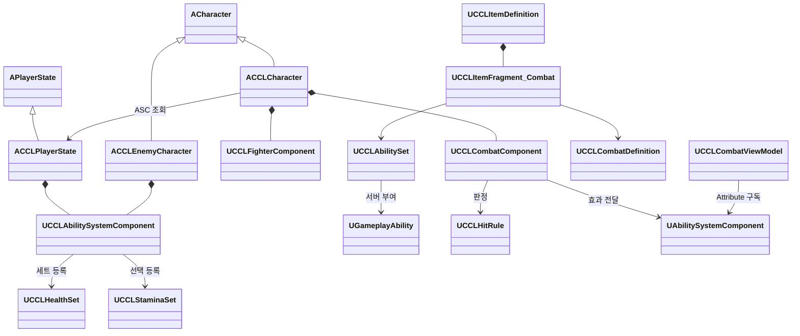

# 최소 전투 설계와 구현

마네킹의 맨손 공격 하나와 일반 몹 한 종류로 공격, 회피, 가드, 패링, 사망과 개별 재스폰을 연결한다. 범위와 초기 수치는 [결정 11](DesignLog.md)을 따른다. 장르에 독립적인 기반과 UE5 현행 시스템 우선 원칙은 [Coding](Coding.md)이 소유한다.

전투 코드는 `Source/CCL/AbilitySystem`, `Combat`, `Items`, `UI`에 있다. UE 5.8.1의 프로젝트 파일 생성, `CCLEditor Win64 Development` 전체 타깃 빌드와 비대화형 에디터의 클래스 로드 검사는 통과했다. 에셋 생성과 전투 실행 검증은 완료하지 않았다.

## 목표와 경계

서버가 행동 허용, 적중, 방어 결과, 능력치와 사망을 확정한다. Standalone, Dedicated Server, Listen Server에서 같은 규칙을 사용한다. 로컬 입력은 GAS의 예측 실행을 사용하고 상대 피해는 서버 결과를 따른다. 첫 구현에는 과거 시점으로 되돌리는 적중 판정을 넣지 않는다.

첫 검증의 피해 대상은 플레이어와 적 사이로 제한한다. 스태미나 없는 파괴 가능한 표적도 같은 적중 경로로 처리한다. 최종 협동·대전·아군 피해와 저장 규칙은 [GameDesign](GameDesign.md)의 미정 상태를 유지한다. 인벤토리, 성장, 저장, 락온과 입력 버퍼는 이번 범위에 포함하지 않는다.

기존 이동 검증용 `MultiplayerPlayground`를 보존하고 별도 `CombatPlayground`를 만든다. 새 맵은 World Partition을 사용하고 스트리밍은 끈다. 전투장 환경용 StaticMesh에는 Nanite를 적용한다. 이 구성은 생성 도구의 목표이며 맵 생성 완료를 뜻하지 않는다.

## 공통 기반과 콘텐츠

공통 ASC는 능력 부여·입력 Tag 연결·효과 적용을 제공한다. 체력과 스태미나 AttributeSet은 분리한다. 공통 적중 컴포넌트는 서버가 만든 공격 식별자, 대상·거리·차폐·중복 적중과 현재 Avatar를 검증한다. 구체적인 플레이어, HUD 또는 스태미나를 요구하지 않는다.

판정 정책은 결과 GameplayTag와 적용할 GameplayEffect·Magnitude를 반환한다. 공통 결과에 방어 행동 enum을 고정하지 않는다. 회피 무적, 정면 가드, 패링과 자원 소모는 `UCCLDuelHitRule`, 콘텐츠 Ability와 `UCCLFighterComponent`가 연결한다. 효과의 지속시간과 제거는 GAS가 관리한다.

`UCCLItemDefinition`은 `UPrimaryDataAsset`이고 인라인 편집 가능한 `UCCLItemFragment`를 조합한다. 전투 Fragment는 공격 정의와 AbilitySet을 참조한다. 공유 정의에 현재 체력, 개별 아이템 상태나 실행 중 핸들을 저장하지 않는다. 아이템 인스턴스·보관·저장은 이번 범위 밖이다.

| 구성 | 책임 | 소유와 수명 |
|---|---|---|
| `UCCLAbilitySystemComponent` | 입력 Tag로 능력 실행·해제, 효과 적용 | 플레이어는 PlayerState, 적은 적 Actor |
| `UCCLHealthSet`, `UCCLStaminaSet` | 현재·최대 자원과 값 범위, 복제 | ASC의 대상별 세트, 스태미나는 선택 구성 |
| `UCCLAbilitySet` | 능력·세트·초기 효과 부여 정의 | 공유 DataAsset, 서버가 부여 |
| `UCCLCombatDefinition` | 공격 구간·거리·정책·효과·Montage 정의 | 공유 DataAsset |
| `UCCLCombatComponent` | 공격 식별·적중 검증·정책 호출·효과 전달 | 공격 Actor, 공격 종료 때 기록 정리 |
| `UCCLHitRule` | 적중 정책의 결과 계약 | 상태 없는 정책 클래스 기본 객체 |
| `UCCLFighterComponent` | ccl8 자원 초기화·전투 행동·방향·표현 연결 | 현재 생명의 Pawn |
| `UCCLCombatAbility` 파생 타입 | 공격·회피·가드·패링과 Task 수명 | ASC의 InstancedPerActor 능력 |
| `ACCLEnemyAIController` | StateTree의 탐색·접근·공격·복귀 요청 | 서버의 적 Controller |
| `UCCLCombatViewModel` | Attribute 통지를 표시 값으로 변환 | 로컬 HUD, ASC 변경 때 구독 교체 |

### ASC 초기화와 재스폰

플레이어의 OwnerActor는 PlayerState, AvatarActor는 현재 Character다. 서버 `PossessedBy`와 클라이언트 `OnRep_PlayerState`에서 ActorInfo를 연결한다. 적은 OwnerActor와 AvatarActor가 같다. 플레이어 ASC는 Mixed, 적은 Minimal 효과 복제를 사용한다. 체력은 관찰자에게, 플레이어 스태미나는 소유자에게 복제한다.

서버가 능력과 필요한 세트를 부여하며 같은 클래스의 능력을 중복 부여하지 않는다. 현재 생명의 자원은 초기화 효과로 설정한다. 자원 회복은 주기 효과, 회복 지연과 방어·경직 조건은 효과의 Tag 요구조건으로 처리한다.

사망 시 능력·유지 입력·예약 적중과 생명 효과를 정리한다. 플레이어는 죽은 Pawn을 유지하다 R 재도전으로 교체한다. PlayerState의 ASC와 능력 부여는 유지하고 새 Pawn에 ActorInfo와 자원을 초기화한다. 이전 Pawn의 종료 콜백은 ASC의 Avatar가 여전히 자신일 때만 ActorInfo를 정리한다.

PlayerState 소유는 재스폰 후 능력을 유지하기 쉽지만 생명 단위 효과를 구분하고 제거해야 한다. Pawn 소유는 정리가 단순하지만 재스폰 때 능력을 다시 구성해야 한다. 이 구현은 전자를 따른다.

## 행동과 초기 수치

아래는 결정 11에서 승인한 프로토타입 값이다. 최종 밸런스가 아니며 공격 정의와 Fighter 설정에서 변경할 수 있다.

| 항목 | 초기값 |
|---|---|
| 체력 | 플레이어 100, 적 80 |
| 스태미나 | 최대 100, 마지막 소모 후 1초부터 초당 20 회복. 가드·경직·사망 중 회복 중지 |
| 플레이어 공격 | 피해 20, 비용 15, 준비·유효·회복 0.35·0.15·0.4초 |
| 적 공격 | 피해 20, 비용 없음, 준비·유효·회복 0.7·0.15·0.9초 |
| 근접 판정 | 전방 150cm, 검사 반경 35cm |
| 회피 | 비용 25, 이동 400cm·0.3초, 시작 후 0.05-0.25초 무적, 총 행동 0.55초 |
| 가드 | 정면 120도, 적중당 비용 30, 잔량이 비용 이하이면 붕괴·1초 경직 |
| 패링 | 비용 15, 정면 120도, 시작 후 0.08-0.28초 성공 구간, 총 행동 0.65초, 성공 시 적 1.2초 경직 |
| 적 재생성 | 사망 5초 후 원위치, 스폰이 막히면 0.5초 뒤 재시도 |

적은 원위치에서 1400cm 안의 살아 있는 플레이어 중 가장 가까운 대상을 선택한다. 대상이 사망·연결 해제되거나 원위치에서 1800cm를 벗어나면 다시 탐색한다. 대상이 없으면 원위치로 복귀한다. 탐색·추적 거리는 초기 구현값이며 전투 데이터 조정 시 함께 검토한다.

### 입력과 방향

| 입력 | 행동 |
|---|---|
| WASD, 마우스, Space | 이동, 시점, 점프 |
| 좌클릭 | 기본 공격 |
| 우클릭 유지 | 가드 |
| Q | 패링 |
| Shift | 회피 |
| R | 사망 후 개별 재도전 |
| K | 개발 빌드의 사망 검사 |

평소에는 이동 방향을 바라본다. 공격·가드·패링 중에는 카메라의 수평 방향을 바라보며 공격 방향은 유효 구간 시작에 고정한다. 회피는 현재 이동 가속도 방향, 이동 입력이 없으면 뒤쪽이다. 이동은 CharacterMovement와 Root Motion AbilityTask가 처리한다.

Busy Tag로 전투 행동의 동시 실행을 제한한다. 일반 행동끼리의 입력 취소는 제공하지 않는다. 피격·패링·가드 붕괴·사망은 진행 중인 행동을 중단시킨다. 가드는 GAS 입력 해제 이벤트를 기다리며 포커스 상실 시 눌린 입력을 해제한다.

서버 판정 순서는 무효·사망·중복 제외, 회피 무적, 정면 패링, 정면 가드, 일반 피해다. 공격 한 번은 대상별 한 번만 처리한다. 패링 성공 시 공격을 취소하고 남은 적중도 중단한다. 가드가 붕괴하는 공격은 막지만 경직 중 후속 공격은 체력 피해를 준다.

## 클래스와 호출 계약



입력은 `AbilityInputTagPressed`와 `AbilityInputTagReleased`를 거쳐 AbilitySpec을 실행한다. 판정 값을 보내는 입력별 RPC를 만들지 않는다. 자동 검증 전용 RPC는 검증 명령행 옵션으로 생성되는 서브시스템에만 연결한다.

`BeginAttack`은 서버 공격 ID를 발급하고 `ResolveHit`은 현재 공격과 Avatar를 확인한다. `UCCLHitRule::Resolve`는 `FCCLHitResolution`을 반환한다. 공통 효과 적용 경로의 핵심은 다음과 같다.

```cpp
FGameplayEffectSpecHandle Spec = SourceASC->MakeOutgoingSpec(
    Resolution.Effect, 1.f, EffectContext);
if (Spec.IsValid())
{
    Spec.Data->SetSetByCallerMagnitude(
        Resolution.MagnitudeTag, Resolution.Magnitude);
    if (!SourceASC->ApplyGameplayEffectSpecToTarget(
        *Spec.Data.Get(), TargetASC).WasSuccessfullyApplied())
    {
        return FGameplayTag();
    }
}
```

Instant 효과는 지속 중인 핸들이 없을 수 있으므로 적용 성공은 `WasSuccessfullyApplied()`로 확인한다. 체력 변경 통지가 사망을 연결하고 AttributeSet은 구체적인 캐릭터를 참조하지 않는다. 월드 위험의 `TakeDamage`는 GAS 체력 효과를 한 번 적용하고 관찰한 체력 감소량을 반환한다.

## 에셋 생성과 검증 상태

생성 도구는 `Tools/Validation/create_combat_playground.py`와 `UCCLCombatAssetLibrary`다. 프로젝트 전용 공격·회피 시퀀스, AnimBP, Montage, AbilitySet, Fragment 아이템, StateTree와 맵을 생성하도록 작성했다. 원본 시퀀스는 유지하고 복제한 시퀀스의 루트 이동을 잠가 AbilityTask 이동과 겹치지 않게 한다. 가드·패링 자세와 색상 표시는 임시 표현이다.

| 검증 항목 | 현재 상태 |
|---|---|
| 프로젝트 파일 생성·전체 타깃 빌드 | `GenerateProjectFiles.bat`과 `CCLEditor Win64 Development -NoEngineChanges` 통과 |
| 비대화형 에디터 클래스 로드 | GAS·DataRegistry·StateTree·CCL 클래스 확인 후 정상 종료 |
| 생성 Python·검증 PowerShell 구문 | 통과 |
| 전투 에셋·World Partition·Nanite 맵 생성 | 미완료. 생성 도구 실행 필요 |
| Standalone·Dedicated·Listen 전투 | 실행 미완료 |
| 새 코드의 기존 이동 회귀 검사 | 실행 미완료. 이전 결과는 MultiplayerFoundation 참조 |
| 100ms 왕복 지연·2% 손실 | 실행 미완료 |
| 화면이 있는 애니메이션·방향·예고 가독성 | 미확인 |

2026-10-06 사용자 승인으로 UBT의 `WriteMetadata` 두 작업을 실행했다. 실제 내용이 변경된 엔진 파일은 DataRegistry, GameplayAbilities, GameplayStateTree의 `.modules` 세 개이며 엔진 재컴파일은 없었다. 세 플러그인과 CCL의 BuildId가 실행 엔진과 일치한다. 갱신 전 파일과 실제 빌드 로그는 로컬 `Saved/ManifestUpdate/Before/`, `Saved/ManifestUpdate/Build.log`에 보존했다.

`CCLEffects.cpp`의 생성자는 `CreateDefaultSubobject`로 GameplayEffectComponent를 생성하고 `GEComponents`에 등록한다. 생성자에서 `FindOrAddComponent`가 이름 없는 `NewObject`를 호출해 발생한 초기화 오류를 수정했다. 수정 후 프로젝트 파일 생성, 전체 빌드와 클래스 로드 성공 표식 `CCL_MANIFEST_LOAD_PASS`를 확인했다. 로컬 근거는 `Saved/ManifestUpdate/GenerateProjectFiles.log`, `FinalBuild.log`, `EditorLoadFixed.log`다. 클래스 로드 검사는 전투·화면 검증을 대신하지 않는다.

### 완료에 필요한 검사

`Tools/Validation/run_combat_smoke.ps1`은 Standalone, Dedicated, Listen과 호스트 조작을 선택하고 `-Impaired`로 지연·손실을 설정하도록 작성했다. 서버 판정과 실제 클라이언트 Ability 입력을 연결하며 아래 항목을 검사한다. 스크립트 작성과 실행 통과는 구분한다.

- 기본 공격 적중과 비용의 단일 차감, 정면 가드와 입력 해제.
- 가드 붕괴 시 해당 공격 차단, 후속 피해, 후방 가드 실패.
- 패링 성공 구간과 공격자 경직, 회피 무적, 비용 부족 거부.
- 스태미나 없는 표적, 중복·종료된 공격 거부, 자원 상한.
- 재스폰 후 ASC 유지와 Avatar 교체, 자원 초기화, 능력 중복과 이전 생명 효과 제거.

정확한 방어 구간 경계, 불가 공격, 동시 피격, 서버 예측 거절, 벽 충돌, 재접속·늦은 관전자와 시각 검증은 추가 실행 검증이 필요하다. 현재 자동 시나리오만으로 통과했다고 판단하지 않는다. 기존 `run_network_smoke.ps1`의 네 실행 구성도 다시 통과해야 한다.

GAS는 UE5에서 처음 도입된 기능은 아니다. UE5.8의 Attribute 복제·예측과 GameplayEffect Component 구성을 활용한다. 자체 능력·효과 스케줄러를 줄일 수 있지만 ActorInfo 재연결, 생명 효과 정리와 예측 보정 검증이 필요하다.

## 엔진 소스 근거

2026-10-06 집의 `<Engine>/Build/Build.version`에서 UE 5.8.1, Changelist 0을 확인했다. Graft 조회를 출발점으로 아래 실제 설치 소스를 확인했다. `<GAS>`는 `<Engine>/Plugins/Runtime/GameplayAbilities/Source/GameplayAbilities`다. 엔진 API 확인과 프로젝트의 빌드·실행 검증은 구분한다.

| 근거 | 확인 내용 |
|---|---|
| `<GAS>/Private/AbilitySystemComponent_Abilities.cpp:161` | InitAbilityActorInfo의 OwnerActor·AvatarActor 설정 |
| `<GAS>/Private/AbilitySystemComponent_Abilities.cpp:1604` | TryActivateAbility 실행 경로 |
| `<GAS>/Private/AbilitySystemComponent_Abilities.cpp:2846` | 로컬 입력 해제를 Ability와 복제 이벤트에 전달 |
| `<GAS>/Private/Abilities/Tasks/AbilityTask_WaitInputRelease.cpp:16` | 예측 클라이언트의 입력 해제를 서버 이벤트로 전달 |
| `<GAS>/Private/Abilities/GameplayAbility.cpp:592` | CommitAbility가 CommitCheck 이후 비용·쿨다운 적용 경로 실행 |
| `<GAS>/Private/AbilitySystemComponent.cpp:525`, `:975` | 효과 Spec 생성과 대상 ASC 적용 |
| `<GAS>/Public/GameplayEffect.h:1117` | GameplayTag로 SetByCaller magnitude 설정 |
| `<GAS>/Public/ActiveGameplayEffectHandle.h:39` | Instant 효과의 IsValid와 WasSuccessfullyApplied 의미 구분 |
| `<GAS>/Public/AttributeSet.h:206`, `:220`, `:402` | 효과 실행 후처리·값 변경 전처리·Attribute RepNotify |
| `<GAS>/Public/AbilitySystemComponent.h:539` | Attribute 값 변경 델리게이트 조회 |
| `<GAS>/Private/GameplayEffect.cpp:5195`, `:5226` | Mixed·Minimal의 활성 효과 복제 범위와 소유 연결 검사 |
| `<GAS>/Public/Abilities/GameplayAbilityTypes.h:46`, `:65` | InstancedPerActor 권장과 LocalPredicted 선언 |
| `<GAS>/Public/Abilities/Tasks/AbilityTask_ApplyRootMotionConstantForce.h:33` | Root Motion 기반 이동 Task 진입점 |
