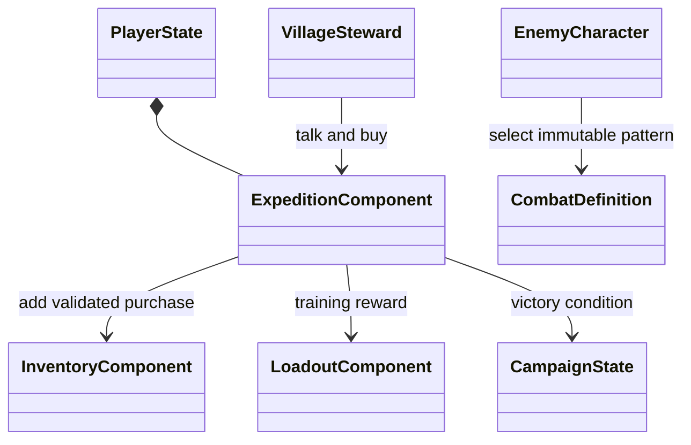

# 마을 서비스와 전투 콘텐츠

단계 5는 같은 원정 안에 일반 적 두 유형, 보스의 체력별 패턴, 마을 안내인·상점·퀘스트·튜토리얼을 연결한다. 아래 이름·수치·대사는 기능 검증용 초안이며 정본 서사와 최종 밸런스가 아니다.

## 책임과 수명

| 구성 | 책임 | 수명 |
|---|---|---|
| EnemyCharacter | 서버에서 적 유형과 체력에 맞는 공격 정의 선택 | 적 Actor |
| CombatDefinition | 공격 시간·범위·피해·방어 가능 여부 | 공유 에셋 |
| VillageSteward | 마을 NPC 표현과 상호작용 거리·시야 확인 | 월드 Actor |
| ExpeditionComponent | 개인 금화·퀘스트 수락·보상 수령, 서버 거래 | PlayerState |
| HUD | 가까운 NPC 입력, 퀘스트·튜토리얼·패턴 안내 | 로컬 플레이어 |

보관·성장 공통 컴포넌트에 상점·퀘스트 조건을 넣지 않는다. 이번 콘텐츠의 ExpeditionComponent가 규칙을 소유한다. 범용 퀘스트 그래프보다 단일 원정 상태가 구현·저장 검증 범위를 줄인다. 여러 퀘스트를 제작할 때 정의 에셋과 개별 상태로 분리한다.

## 기능 계약

2026-10-07 사용자의 요청으로 NPC 대사는 화면 하단 중앙의 사각형 상자에 표시한다. 왼쪽 위에 NPC 이름을 두고 다음 줄부터 대화 내용을 줄바꿈한다. 상호작용 결과는 서버가 해당 플레이어에게만 전달하고 HUD가 로컬에서 표시한다. T 대화·B 구매의 기존 규칙을 유지하며, Esc·인벤토리 열기·거리 이탈·사망으로 상자를 닫는다. 일반 퀘스트 안내와 NPC 대사는 별도 영역으로 구분한다. 별도 패키지의 1280×720·1920×1080 캡처에서 이름·대사·조작 안내를 확인했고 인벤토리 전환과 거리 이탈로 닫히는 검사도 통과했다. 근거는 `Saved/StageValidation/Equipment-Packaged-UI-1280.log`, `Equipment-Packaged-UI-1920.log`와 `Saved/Tests/UIVisual/`의 해당 실행 캡처다.

같은 날 옮겨온 커서 4개, 레벨 프로토타입 29개, 무기 27개와 애니메이션 관련 2개를 저장 없이 로드했다. 62개 모두 객체 로드에는 성공했으나 `BP_WobbleTarget`은 `/Game/DemoTemplate/_Core/MI_Intro_Colorway`가 없고, `ABP_FP_Copy`와 `CtrlRig_FPWarp`에는 `/Game/FirstPerson/Anims/` 참조가 남아 있다. `ABP_FP_Copy`는 유효한 Control Rig 클래스가 없어 Blueprint 컴파일 오류도 발생했다. 원본 에셋은 변경하지 않았으며 이번 UI는 해당 리소스에 의존하지 않는다. 원본 결과는 로컬 `Saved/StageValidation/ImportedResources-Report.json`과 `ImportedResources.log`에 보존한다.

마을 안내인 가까이에서 T를 눌러 원정을 수락한다. B는 금화 10으로 회복약 한 개를 산다. 시작 금화는 30이다. 서버가 NPC 거리·시야·생존 상태와 실제 잔액·보관 공간을 확인하고 아이템 추가에 성공한 경우에만 차감한다. 원정 승리 후 돌아와 T를 누르면 금화 60과 훈련 포인트 1을 한 번 받는다. 수락과 수령은 개인 상태이며 월드 승리 조건은 공유한다. 늦은 참가자도 수락 후 현재 승리 조건으로 수령할 수 있는 임시 협동 규칙이다. 최종 보상 소유권 규칙은 확정하지 않는다.

일반 적은 기존 경비병과 빠른 공격의 척후병으로 나눈다. 보스는 예고가 긴 강공격을 쓰고 체력이 절반 이하이면 넓은 휩쓸기와 강공격을 번갈아 쓴다. 공유 정의를 런타임에 수정하지 않는다. 공격 전 선택을 확정하고 실행 중인 공격은 바꾸지 않는다. 휩쓸기는 방어 불가·패링 불가로 표시해 회피를 안내한다. HUD는 준비·원정·귀환 순서의 튜토리얼과 현재 패턴을 표시한다.

## 검증 계획

프로젝트 생성 BAT·빌드·에셋 생성 후 실제 클라이언트 요청으로 수락·구매·귀환 보상을 검사한다. 원거리 요청, 잔액 부족, 중복 보상과 보관 공간 부족을 거부하는지 확인한다. 기존 원정의 AI·전투·재스폰·늦은 접속 검사와 함께 Standalone·Dedicated·Listen 및 지연 구성을 실행한다. 보스 패턴 정의와 체력 전환, 재스폰 후 개인 상태, 렌더링 화면을 확인한 뒤 결과를 기록한다.

## 현재 상태

2026-10-07 UE 5.9에서 생성 BAT·CCLEditor 빌드·공격 정의 3개와 NPC 저장을 통과했다. Standalone·Dedicated·Listen 원격·호스트·왕복 지연 100ms와 손실 2% 구성에서 실제 클라이언트 요청으로 수락·구매·귀환 보상을 검사했다. 각 네트워크 구성에서 늦은 접속도 통과했다. 원거리 거래, 잔액 부족, 보관 공간 부족과 중복 보상을 거부했고 재스폰 후 개인 상태를 유지했다. 보스는 절반 체력에서 휩쓸기와 강공격을 교대하며, 정면 방어 중인 대상에게 휩쓸기 피해 24가 적용됐다. 기존 성장·전투 회귀도 통과했다.

NPC 렌더링 화면에서 안내인·이름·구매 가격·거부 결과·다음 행동을 확인했다. NPC와 적은 기존 마네킹, 전투는 기존 공격 애니메이션을 재사용한다. 전용 캐릭터 아트·보스 휩쓸기 모션·대사·효과음의 최종 제작과 사용자 조작감 검토는 남아 있다. 자동 검사는 기능 연결과 일관성을 확인하며 콘텐츠 분량과 최종 완성도를 보증하지 않는다.

| 검사 | 로컬 근거 |
|---|---|
| 생성 BAT·빌드·에셋 | `Saved/StageValidation/Stage5-Generate.log`, `Stage5-Build.log`, `Stage5-Assets.log` |
| 기능·멀티플레이 | 같은 폴더의 `Stage5-Standalone.log`, `Stage5-Dedicated.log`, `Stage5-Listen.log`, `Stage5-Host.log`, `Stage5-Impaired.log` |
| 기존 기능 회귀 | `Stage5-Progression.log`, `Stage5-Combat.log` |
| NPC 화면 | `Saved/Tests/CampaignVisual/steward.png` |

근거 경로는 저장소 기준이다. 엔진의 몽타주 재생은 GAS AbilityTask를 사용하고 공격 정의의 총 시간에 맞춰 재생 속도를 조정한다. 기존 공통 전투 정책이 각 정의의 방어·패링 가능 여부를 판정한다.
