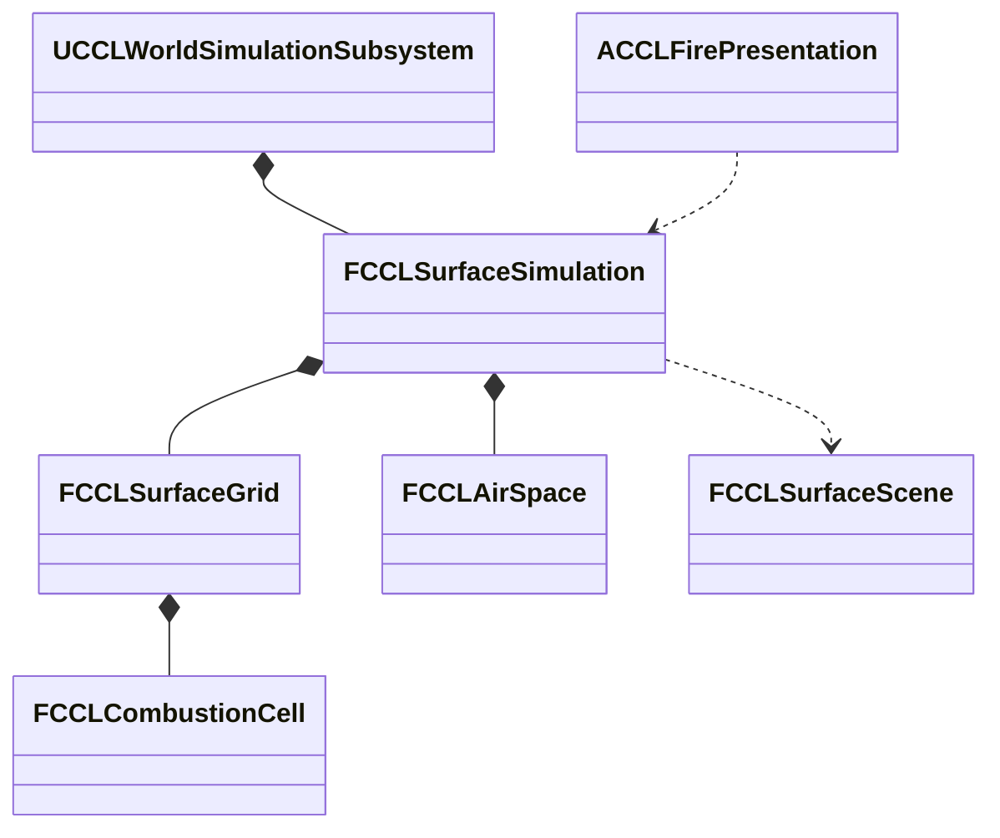

# 불·열·공간 환경

단계 7은 연소·소화·확산과 공간별 온습도·연기를 공통 환경 상태에 연결한다. 범위는 결정 19와 [환경 계획](EnvironmentPlan.md#불열공간-차폐)을 따른다. 연소 코어와 표면의 융해·건조·열 확산을 연결하고 자동 검사 및 실제 월드 저장·복제를 검증했다. 공간 환기·실험장 조작·불꽃과 연기 표현은 아직 남았으며 단계 7 전체의 통과 기록은 아니다.

## 목표와 단위

연소는 연료 kg, 연료 수분 kg, 열 J, 열용량 J/K, 연기 kg를 사용한다. 불의 진행과 공간 환기는 게임 초를 쓴다. 세계 시간을 가속해 계절을 바꿔도 불꽃 확산과 플레이어의 소화 반응 시간이 같은 배율로 빨라지지 않게 한다. 비·눈의 유입은 기존 세계 초 기준을 유지한다. 시험 수치는 콘텐츠의 초기값이며 실제 물질의 정확한 열역학이나 최종 밸런스를 뜻하지 않는다.

연료 수지는 초기 연료 = 남은 연료 + 연소 누계다. 소화는 온도를 낮추거나 수분을 공급하며 소모한 연료를 복원하지 않는다. 연소 열량과 냉각·외부 손실을 기록하고, 융해·건조가 이동시킨 물은 표면 수지에 남긴다. 연기는 발생·공간 보유·환기 배출을 구분한다.

## 목표 책임과 수명

서버 World의 기존 표면 값 상태가 셀별 연료·열·연소 흔적을 소유한다. 계산 코어는 인접 셀로 보내는 열을 같은 이전 상태에서 구하고 한 번 적용한다. 공간 값 상태는 안정적인 공간 ID와 체적, 온도·수분·연기를 보관한다. `FCCLSurfaceScene`의 개구부는 공간과 외부 또는 다른 공간을 연결한다. 표현 Actor와 Niagara 컴포넌트는 확정 상태를 읽으며 연료를 직접 소모하지 않는다.



## 예정 인터페이스

아래 이름은 구현 시 기존 API와 맞춰 확정한다.

```cpp
bool Ignite(FGuid RegionId, int32 CellIndex, double HeatJoules, FString& Error);
bool AddAirSpace(const FCCLAirSpace& Space, FString& Error);
bool Advance(const FCCLWorldStep& Step, FString& Error);
```

날씨·열·물·공기 후보를 먼저 계산하고 생활 진행까지 성공한 뒤 공통 시계를 확정한다. 중간 오류에서 불만 타거나 환기만 진행한 상태를 게시하지 않는다. 저장·복제는 같은 표면 스냅샷 버전을 확장한다.

## 구현과 검증 순서

1. 연료·수분·발화·열 전달·소화의 값 코어와 수지를 검사한다. 건조 연료, 젖은 연료, 비, 바람, 연료 고갈, 실패 재시도와 저장 재개를 포함한다.
2. 열을 기존 물·눈의 융해·건조에 연결한다. 불이 없거나 게임 시간이 0이면 연소량이 늘지 않아야 한다. 같은 물을 연료 습기와 표면에 중복 저장하지 않는다.
3. 공간 체적과 개구부 면적으로 공기를 교환한다. 닫힘·반 열림·열림, 두 실내 공간 사이 전송과 외부 배출을 확인한다. 닫힌 공간의 연기가 원인 없이 없어지지 않아야 한다.
4. 구역 10에 마른 연료·젖은 연료·눈과 소화 조작을, 구역 11에 실내 열원·문·연기 조작을 연결한다. 메뉴와 Niagara는 서버의 확정 결과를 표시한다.
5. 실제 Standalone·Listen·Dedicated 실행에서 조작 권한, 늦은 참가자, 저장·복원과 장면을 확인한다. 자동 검사만으로 시각 검토를 대신하지 않는다.

## 대안과 비용

공간 평균 모델은 셀 전체를 3D 유체로 계산하는 방식보다 적은 상태로 환기·열 축적을 검증할 수 있다. 대신 정밀 연기 흐름과 실내 온도 분포는 제공하지 않는다. 이는 계획의 초기 제외 범위와 일치한다. UE5 Niagara는 표현을 맡고 값 코어는 화면 없는 서버에서도 실행한다. 기존 복제와 저장을 재사용하며 별도 Framework 분리는 진행하지 않는다.


## 연소 코어의 현재 구현

`CCLCombustionModel.h/.cpp`가 연료·열 상태와 전달량을 계산한다. `FCCLCombustionCell`은 남은 연료·연소 누계와 초기·추가·연소·손실·전달 열량을 저장한다. 열은 절대온도 기준의 열용량 곱으로 저장하며 표시 기온은 섭씨로 환산한다. `FCCLCombustionFlux`는 증발시킨 물 kg, 표면에 넘길 열 J와 발생 연기 kg를 반환한다. `CCLSurfaceFire`가 실제 표면의 물과 눈·얼음에 전달량을 반영한다. 연기는 현재 발생 누계로 보관하며 공간 공기에 넣는 연결은 남았다.

```cpp
static bool Advance(const FCCLCombustionMaterial& Material,
    double GameSeconds, double AmbientCelsius, double WindMetersPerSecond,
    double AvailableWaterKg, FCCLCombustionCell& State,
    FCCLCombustionFlux& Flux, FString& Error);
```

계산은 최대 0.1게임 초로 나누며 한 요청은 409.6게임 초까지 허용한다. 실패하면 상태와 출력 전달량을 모두 보존한다. 물은 호출자가 소유하며 모델 내부의 지역 변수에서 가용량을 차감한다. 같은 물을 연료 상태에 영구 복제하지 않는다. 열·연료 검증 뒤에 후보 상태와 출력 전달량을 한 번 교체한다.

```cpp
if (!Validate(M, S, Error)) { return false; }
State = S;
Flux = F;
return true;
```

초기 연료 1kg·섭씨 20도에 외부 열 500kJ를 넣은 검사에서 건조 연료는 타고 물 1kg이 접촉한 연료는 발화하지 않았다. 풍속 8m/s에서 연소량이 증가하며, 물 공급으로 추가 연소를 멈추는 것을 확인했다. 기본값은 실험용 근사치다. 상변화에 쓰는 2.5MJ/kg도 가열·증발을 합친 게임용 계수이며 정밀 물성표를 대신하지 않는다.

2026-10-10 검증 근거는 `Saved/EnvironmentStages/Fire-GPF.log`, `Fire-Build.log`와 `Saved/Tests/Automation/20261010-120839-890/report/index.json`이다. 프로젝트 파일 생성·Editor 빌드가 성공했고 환경 자동 검사 60/60, 경고·실패·미실행 0이다. 새 검사는 `CCL.Environment.Fire.FuelHeatWaterAndWind`, `CCL.Environment.Fire.ResumeValidationAndExhaustion`이며 연료·열 수지, 물·열·연기 전달량, 연료 고갈, 실패 시 상태·출력 보존, 0게임 초와 저장 후 동일 진행을 포함한다.

다음 구현은 공간 온습도·환기·연기, 공간과 표면 사이 열 교환, 구역 10·11 조작·표현이다. 아래 표면 결합 검증은 단계 7 전체의 완료를 뜻하지 않는다.


## 표면의 융해·건조와 열 확산

`FCCLSurfaceGrid::Fire`는 선택적인 `FCCLSurfaceFireLayer`를 소유한다. `Cells`가 비어 있으면 연소 상태를 할당하지 않으며, 사용하면 표면 셀 수와 같아야 한다. 재질은 지역 단위로 한 번 저장한다. `UCCLWorldSimulationSubsystem::IgniteSurface`는 서버 권위를 검사하고 기존 연료 셀에 외부 열을 더한다. 발화 요청으로 소모한 연료를 채우지는 않는다.

`CCLSurfaceSimulation`은 최대 0.25게임 초인 표면 하위 단계마다 `CCLSurfaceFire::AdvanceCandidate`를 호출한다. 비·눈 유입과 기존 상변화 뒤에 연소를 계산하고 물 흐름을 적용한다. 연소에 제공하는 물은 표면 액체와 토양의 실제 보유량이다. 증발량은 액체, 토양 순서로 차감하고 기존 물 수지의 증발 항목에 한 번 넣는다. 표면에 남은 열은 얼음, 눈 순서로 녹이며 눈 부피도 남은 질량에 비례해 줄인다. 융해에는 게임용 계수 334kJ/kg를 쓴다.

열 수지는 셀별 저장·추가·연소·손실·전달량과 지역별 전달 내역을 함께 검사한다. 지역의 전달 내역에는 인접 셀 전송, 융해, 증발과 나머지 표면 방출 열을 기록한다. 연기 발생 누계는 연소한 연료와 재질의 연기 비율에 일치해야 한다. 아직 공간 공기 모델이 없으므로 방출 열을 실내 온도 상승으로 해석할 수 없다.

인접 열 전달은 각 하위 단계의 연소가 끝난 상태에서 한 번 계산한다. 각 경계는 이전 열 차이의 최대 1/8을 전송하므로 네 이웃이 모두 차가워도 보낸 셀의 열 절반 이상이 남는다. 받은 열은 다음 하위 단계부터 다시 전송한다. 기본 전도 계수는 실험값 60W/K이며 풍속과 두 셀의 바람 노출률을 반영한다. 전송은 네 방향 이웃 중 바닥·천장 사이 높이 범위가 겹치는 셀에 한한다. 벽·문 패치가 열 전송을 차단하는 연결과 풍향에 따른 비대칭 확산은 아직 구현하지 않았다.

이 방식은 같은 시간 단계 안에서 순회 순서에 따라 열이 여러 셀을 건너뛰는 문제를 막는다. 대신 정밀 복사열·대류·연료 형상은 계산하지 않으며, 열 확산 속도와 계수는 콘텐츠 장면에서 추가 조정해야 한다. 화재는 기반 지형의 높이·재질을 변경하지 않는다.

## 저장 형식과 실패 경계

표면 스냅샷 버전 5는 각 지역의 표면 셀 뒤에 연소 활성 여부를 저장한다. 활성 지역에는 재질·확산 계수·전달 수지 120바이트와 셀당 73바이트가 추가된다. 비활성 지역은 표시 1바이트만 추가한다. 전체 스냅샷의 기존 8MiB 제한은 유지하므로 모든 최대 크기 지역에 연료를 채울 수 있다는 보장은 없다.

버전 1-4의 표면 저장은 연소 비활성으로 복원한다. 새 저장의 연료·탄 양·열·전달 수지는 동일 표면 스냅샷에 포함되며 기존 분할 복제 경로를 사용한다. 연소 계산이 실패하면 물·날씨·불과 완료 시각의 후보 전체를 버린다. 손상된 저장이나 잘못된 발화 요청도 기존 상태를 유지한다.

## 실행 검증

2026-10-10 UE 5.8.3에서 다음을 실행했다. 경로는 저장소 기준이며 원본 로그와 보고서는 로컬 `Saved/`에 있다.

| 검사 | 결과와 근거 |
|---|---|
| 프로젝트 파일 생성 | 성공, `Saved/EnvironmentStages/FireSurface-GPF.log` |
| CCLEditor Win64 Development 빌드 | 성공, `Saved/EnvironmentStages/FireSurface-Build.log` |
| 환경 자동 검사 | 64/64, 경고·실패·미실행·진행 중 0. `Saved/Tests/Automation/20261010-122053-736/report/index.json` |
| Standalone 화재 | 건조 연료 연소·젖은 연료 억제·눈 융해·토양 건조·비 소화·저장 복원 통과. `Saved/Tests/Fire/Standalone-20261010-122352-516` |
| Dedicated 첫·늦은 참가자 | 서버와 두 참가자의 연소 누계·연기 발생 누계·융해 열량 일치, 직접 발화 거부. `Saved/Tests/Fire/Dedicated-20261010-122351-621` |
| Listen 첫·늦은 참가자 | 같은 수치 비교와 권위 검사 통과. `Saved/Tests/Fire/Listen-20261010-122352-146` |

새 표면 자동 검사는 `CCL.Environment.Fire.SurfaceMeltDryAndQuench`, `NeighbourSpreadAndFrozenBudget`, `SurfaceSaveResumeAndRollback`, `LegacySurfaceVersions`다. 열 전송의 대칭성과 같은 단계에서 받은 열을 다시 쓰지 않는 조건, 연결된 이웃 발화와 분리된 높이의 비발화, 버전 1-4 복원, 손상·잘못된 입력·후속 계산 실패의 상태 보존을 검사한다. 기존 연소 코어 두 검사도 유지한다.

실제 월드 검사는 `-CCLFireSmoke`로만 생성되는 서브시스템이 임시 연료 지역을 추가한다. 세계 시간 배율 0에서 10게임 초 동안 연소한 뒤 세계 시간을 진행해 비를 공급한다. 저장 후 발화 열을 추가하고 복원한 결과는 이전 표면 스냅샷과 바이트 단위로 같다. Dedicated 실행의 서버·첫·늦은 참가자 값은 연소량 `0.098085674kg`, 연기 발생량 `0.003908419kg`, 융해 열량 `24973.987631J`다. 연소량은 첫 셀, 연기와 융해 열량은 지역 합계이므로 서로 다른 집계 범위를 비교하지 않는다.

```powershell
& Tools/Validation/run_fire_smoke.ps1 -Mode Standalone
& Tools/Validation/run_fire_smoke.ps1 -Mode Dedicated -Port 19892
& Tools/Validation/run_fire_smoke.ps1 -Mode Listen -Port 19893
```

세 실행은 NullRHI를 사용했다. 화재 전용 메뉴·Niagara 화면과 공간 환기를 검증한 결과가 아니며, 서버 실행도 실제 Server 타깃 패키지 검증과 구분한다. 구역 10·11의 상시 콘텐츠, 문 개폐에 따른 실내 열·수분·연기 변화와 화면 검토가 남았다.
