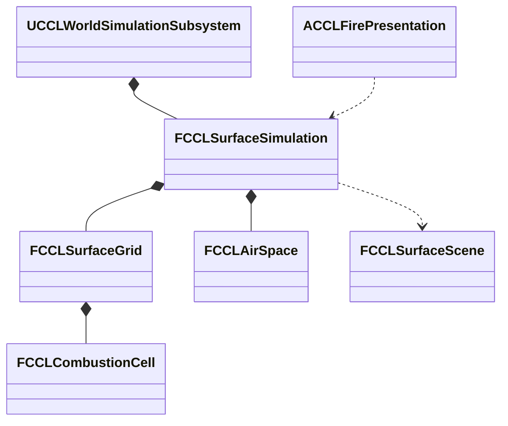

# 불·열·공간 환경

단계 7은 연소·소화·확산과 공간별 온습도·연기를 공통 환경 상태에 연결한다. 범위는 결정 19와 [환경 계획](EnvironmentPlan.md#불열공간-차폐)을 따른다. 연소 값 코어를 구현하고 자동 검사를 통과했다. 표면·공간·실험장 통합은 아직 남았으며 단계 7 전체의 통과 기록은 아니다.

## 목표와 단위

연소는 연료 kg, 연료 수분 kg, 열 J, 열용량 J/K, 연기 kg를 사용한다. 불의 진행과 공간 환기는 게임 초를 쓴다. 세계 시간을 가속해 계절을 바꿔도 불꽃 확산과 플레이어의 소화 반응 시간이 같은 배율로 빨라지지 않게 한다. 비·눈의 유입은 기존 세계 초 기준을 유지한다. 시험 수치는 콘텐츠의 초기값이며 실제 물질의 정확한 열역학이나 최종 밸런스를 뜻하지 않는다.

연료 수지는 초기 연료 = 남은 연료 + 연소 누계다. 소화는 온도를 낮추거나 수분을 공급하며 소모한 연료를 복원하지 않는다. 연소 열량과 냉각·외부 손실을 기록하고, 융해·건조가 이동시킨 물은 표면 수지에 남긴다. 연기는 발생·공간 보유·환기 배출을 구분한다.

## 책임과 수명

서버 World의 기존 표면 값 상태가 셀별 연료·열·연소 흔적을 소유한다. 계산 코어는 인접 셀로 보내는 열을 같은 이전 상태에서 구하고 한 번 적용한다. 공간 값 상태는 안정적인 공간 ID와 체적, 온도·수분·연기를 보관한다. `FCCLSurfaceScene`의 개구부는 공간과 외부 또는 다른 공간을 연결한다. 표현 Actor와 Niagara 컴포넌트는 확정 상태를 읽으며 연료를 직접 소모하지 않는다.



## 예정 인터페이스

아래 이름은 구현 시 기존 API와 맞춰 확정한다.

```cpp
bool Ignite(FGuid RegionId, int32 CellIndex, double HeatJoules, FString& Error);
bool AddAirSpace(const FCCLAirSpace& Space, FString& Error);
bool Advance(const FCCLWorldStep& Step, FString& Error);
```

날씨·열·물·공기 후보를 먼저 계산하고 생활 진행까지 성공한 뒤 공통 시계를 확정한다. 중간 오류에서 불만 타거나 환기만 진행한 상태를 게시하지 않는다. 저장·복제는 같은 표면 스냅샷 버전을 확장한다.

## 구현과 검증 순서

1. 연료·수분·발화·열 전달·소화의 값 코어와 수지를 검사한다. 건조 연료, 젖은 연료, 비, 바람, 연료 고갈, 실패 재시도와 저장 재개를 포함한다.
2. 열을 기존 물·눈의 융해·건조에 연결한다. 불이 없거나 게임 시간이 0이면 연소량이 늘지 않아야 한다. 같은 물을 연료 습기와 표면에 중복 저장하지 않는다.
3. 공간 체적과 개구부 면적으로 공기를 교환한다. 닫힘·반 열림·열림, 두 실내 공간 사이 전송과 외부 배출을 확인한다. 닫힌 공간의 연기가 원인 없이 없어지지 않아야 한다.
4. 구역 10에 마른 연료·젖은 연료·눈과 소화 조작을, 구역 11에 실내 열원·문·연기 조작을 연결한다. 메뉴와 Niagara는 서버의 확정 결과를 표시한다.
5. 실제 Standalone·Listen·Dedicated 실행에서 조작 권한, 늦은 참가자, 저장·복원과 장면을 확인한다. 자동 검사만으로 시각 검토를 대신하지 않는다.

## 대안과 비용

공간 평균 모델은 셀 전체를 3D 유체로 계산하는 방식보다 적은 상태로 환기·열 축적을 검증할 수 있다. 대신 정밀 연기 흐름과 실내 온도 분포는 제공하지 않는다. 이는 계획의 초기 제외 범위와 일치한다. UE5 Niagara는 표현을 맡고 값 코어는 화면 없는 서버에서도 실행한다. 기존 복제와 저장을 재사용하며 별도 Framework 분리는 진행하지 않는다.


## 연소 코어의 현재 구현

`CCLCombustionModel.h/.cpp`가 연료·열 상태와 전달량을 계산한다. `FCCLCombustionCell`은 남은 연료·연소 누계와 초기·추가·연소·손실·전달 열량을 저장한다. 열은 절대온도 기준의 열용량 곱으로 저장하며 표시 기온은 섭씨로 환산한다. `FCCLCombustionFlux`는 증발시킨 물 kg, 표면에 넘길 열 J와 발생 연기 kg를 반환한다. 전달량을 실제 표면과 공기에 한 번 반영하는 연결은 후속 구현이다.

```cpp
static bool Advance(const FCCLCombustionMaterial& Material,
    double GameSeconds, double AmbientCelsius, double WindMetersPerSecond,
    double AvailableWaterKg, FCCLCombustionCell& State,
    FCCLCombustionFlux& Flux, FString& Error);
```

계산은 최대 0.1게임 초로 나누며 한 요청은 409.6게임 초까지 허용한다. 실패하면 상태와 출력 전달량을 모두 보존한다. 물은 호출자가 소유하며 모델 내부의 지역 변수에서 가용량을 차감한다. 같은 물을 연료 상태에 영구 복제하지 않는다. 열·연료 검증 뒤에 후보 상태와 출력 전달량을 한 번 교체한다.

```cpp
if (!Validate(M, S, Error)) { return false; }
State = S;
Flux = F;
return true;
```

초기 연료 1kg·섭씨 20도에 외부 열 500kJ를 넣은 검사에서 건조 연료는 타고 물 1kg이 접촉한 연료는 발화하지 않았다. 풍속 8m/s에서 연소량이 증가하며, 물 공급으로 추가 연소를 멈추는 것을 확인했다. 기본값은 실험용 근사치다. 상변화에 쓰는 2.5MJ/kg도 가열·증발을 합친 게임용 계수이며 정밀 물성표를 대신하지 않는다.

2026-10-10 검증 근거는 `Saved/EnvironmentStages/Fire-GPF.log`, `Fire-Build.log`와 `Saved/Tests/Automation/20261010-120839-890/report/index.json`이다. 프로젝트 파일 생성·Editor 빌드가 성공했고 환경 자동 검사 60/60, 경고·실패·미실행 0이다. 새 검사는 `CCL.Environment.Fire.FuelHeatWaterAndWind`, `CCL.Environment.Fire.ResumeValidationAndExhaustion`이며 연료·열 수지, 물·열·연기 전달량, 연료 고갈, 실패 시 상태·출력 보존, 0게임 초와 저장 후 동일 진행을 포함한다.

다음 구현은 셀 사이 열 전달, 표면의 실제 융해·건조 반영, 공간 온습도·환기·연기, 저장·복제 확장과 구역 10·11 조작·표현이다. 현재 값 코어 검사 결과를 실제 화재 월드 실행이나 단계 7 완료로 확대하지 않는다.
