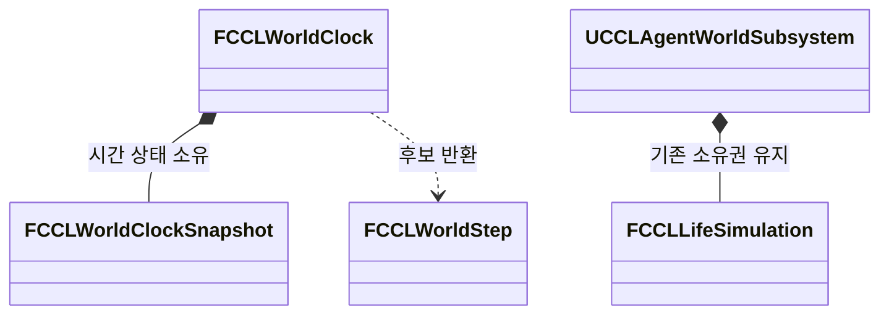
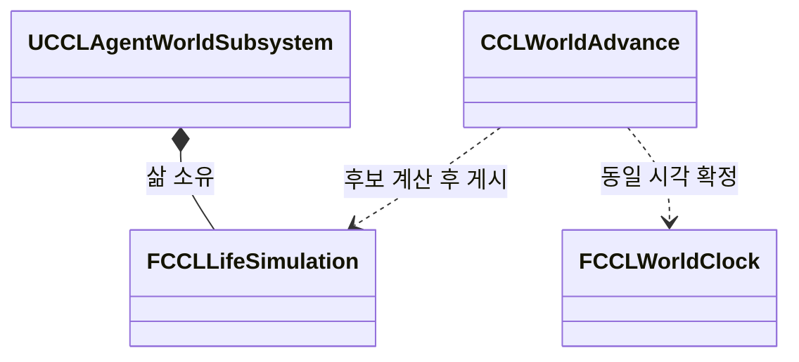
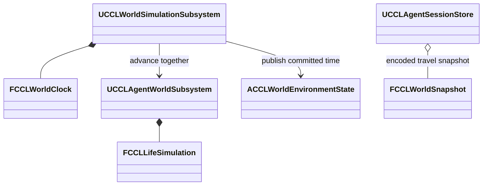
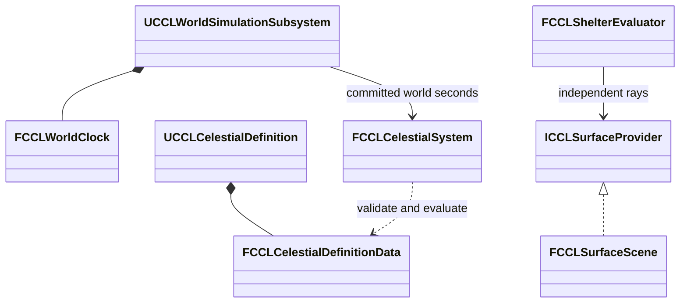
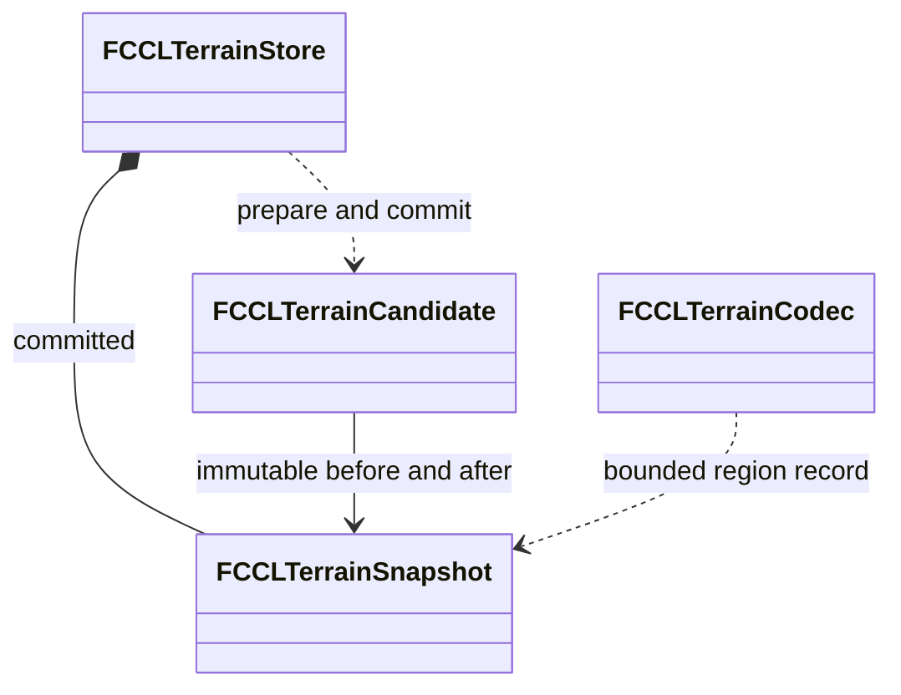
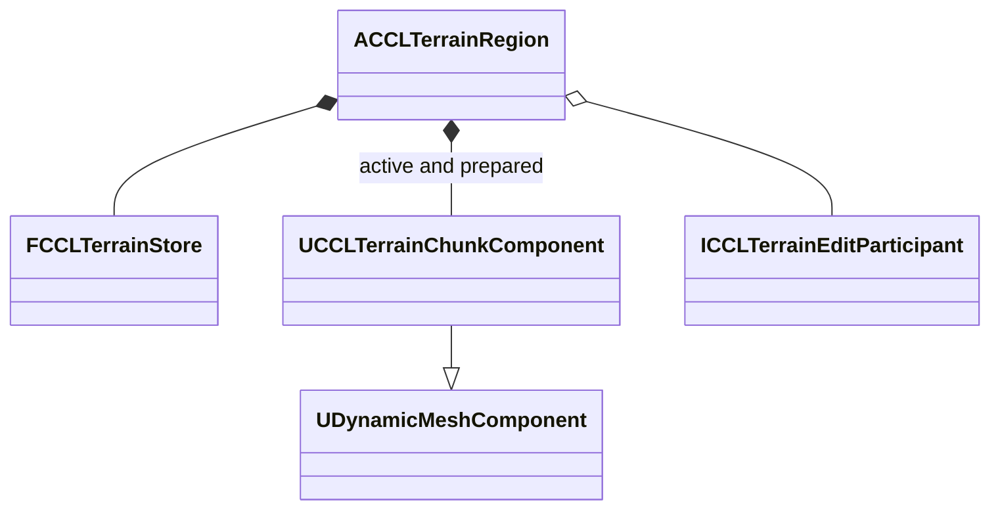

# 자연 환경과 생태계 구현 계획

천체·공통 시간, 날씨, 영구 지형 변경, 눈·물·불·공간 차폐, 생태계와 실험장의 구현 계획과 검증 기록이다. 사용자 확정 범위는 [결정 19](DesignLog.md)에 근거한다. 완료 단계는 0·1·2이며 단계 3은 지형·충돌 실행기까지 구현했다. 저장 복구·내비게이션·네트워크·실험장 조작 연결이 남아 있으므로 단계 3 전체는 진행 중이다.

## 다음 세션의 시작점

다음 실행 담당자는 [지형 실행기 검증과 인계](#지형-실행기-검증과-인계)를 읽고 단계 3의 남은 연결부터 진행한다. 현재 세션은 지형·충돌 작업 묶음에서 종료하며 단계 4는 시작하지 않는다. 기존 게임과 생활 Agent, 다른 작업의 미커밋 변경을 보존한다. 기기가 바뀌면 아래 확인 항목을 다시 실행한다.

1. [Guide](Guide.md), [Coding](Coding.md), [VersionControl](VersionControl.md), 이 문서를 읽고 Git 상태와 원격을 확인한다. 미커밋 변경을 덮거나 자동으로 stash하지 않는다.
2. 깨끗한 작업 트리와 승인된 upstream을 확인한 뒤 문서와 LFS 에셋을 받는다. 기기별 경로는 [AgentContextTools](AgentContextTools.md)에 따라 로컬 설정에서 확인한다.
3. 실제 엔진의 `Engine/Build/Build.version`, 다운로드 완료 여부와 빌드 도구를 확인한다. 집에서 확인한 설치본은 UE 5.8.3이다. 과거 문서의 UE 5.9.0 검증 기록은 당시 결과이며 노트북의 현재 버전을 증명하지 않는다.
4. 관련 코드와 호출 관계는 Graft로 먼저 확인한다. 누락된 부분만 실제 소스로 보완하고 사용자 요청 없이 그래프를 재생성하지 않는다.
5. 아래 인계 항목과 현재 소스를 대조하고 단계 3의 다음 작업 묶음을 정리한 뒤 구현한다. 엔진 준비 전에는 빌드를 시도하지 않고 가능한 소스 작업과 미검증 항목을 구분한다.

다음 세션에 전달할 작업 지시:

> Docs/Guide.md와 Docs/EnvironmentPlan.md의 시작점·지형 실행기 인계 절을 읽고 단계 3의 남은 표면 질의, 저장 세대 복구, 내비게이션, 클라이언트 준비와 구역 05 연결을 이어서 구현해. 현재 기기의 UE 버전·경로와 Git 상태를 먼저 확인하고 기존 미커밋 변경은 보존해. 0·1·2단계는 완료됐고 3단계 전체는 진행 중이야. 지형·충돌 검사를 재현한 뒤 남은 계약을 연결하고 프로젝트 파일 생성·빌드·실행 결과를 문서에 기록해. 3단계 통과 기준을 충족하기 전에는 4단계로 넘어가지 마. 제출은 Docs/VersionControl.md의 승인된 원격·브랜치와 작업 범위를 따라.

## 확정 범위

날씨와 지면의 상호작용이 우선이다. 처음에는 한 행성의 지상에서 플레이하되 다른 행성·위성·우주 공간으로 확장할 기반을 설계한다. 기존 마을·전투·보스 흐름을 유지한다. 환경 전체를 기존 3-4개월 목표 안에 완성할 수 있다는 일정 검증은 아직 없다.

| 분야 | 기반에 포함할 내용 | 초기 제외 범위 |
|---|---|---|
| 천체 | 항성·행성·위성의 부모 관계, 자전·공전·자전축 기울기, 위도별 일조와 계절 | 우주 이동 콘텐츠, 모든 천체의 실제 크기 공간, N체 중력 계산 |
| 시간 | 서버 권위 공통 시간, 행성별 현지 시각, Agent와 생애 주기 연결 | 종료 중 현실 시간만큼 자동 진행, 플레이어 노화 |
| 지형 | 플레이어와 지정 사건에 의한 영구 굴착·성토, 저장, 보호 구역 | 일상적인 비·바람에 의한 영구 침식, 자동 지반·건물 붕괴 |
| 눈·물 | 깊은 눈과 통과 흔적, 강수·융해·유출·젖음·진흙·웅덩이·결빙·건조, 강·해안 수위 | 전 행성의 정밀 유체 해석 |
| 불·차폐 | 연료·열·수분에 따른 연소·확산·소화, 지붕·벽·문·동굴 차폐, 실내 온습도·환기 | 정밀 3D 연기 유체 해석, 구조 파괴 |
| 생태계 | 서식지·개체군·무리·개체, 대표 생물의 먹이·성장·번식·사망·이동 | 모든 종의 콘텐츠와 정밀 행동을 한 번에 제작 |
| 식생·부패 | 식물·보이는 버섯의 성장과 상태, 음식 부패·곰팡이 수치 | 보이지 않는 미생물·균의 개별 Actor나 AI |
| 검증 | 걸어 다닐 실험장과 격리 시나리오, 저장·네트워크·성능 검사 | 배치 완료만으로 기능 완료 판정 |

지형 데이터는 터널을 표현할 수 있는 형태를 후보로 삼되 첫 플레이 실험은 구덩이·수로·성토로 제한한다. 마을 핵심 시설·퀘스트 필수 경로·스폰 구역은 변경 권한으로 보호하고 일반 야외를 우선 편집 대상으로 삼는다.

일반 생물과 주민은 공통 시간의 생애 주기를 사용한다. 핵심 퀘스트 NPC는 자연 수명으로 진행이 막히지 않도록 보호한다. 전투·화재 등 모든 피해에 대한 무적을 뜻하지는 않는다. 피해와 퀘스트 실패 정책은 해당 기능에서 별도로 정한다.

## 착수 시 확인할 기존 구현

계획 수립 중 확인한 위치다. 편집 전 현재 브랜치와 엔진에서 다시 확인한다. 줄 번호는 이후 변경될 수 있다.

| 대상 | 근거 | 설계 제약 |
|---|---|---|
| Agent 시간 | `Source/CCL/Agents/CCLAgentWorldSubsystem.cpp:66` | 누적 시간이 0.25초 이상이면 60배로 AdvanceTo를 호출한다. 60의 설계 근거는 확인하지 못했다 |
| 삶의 소유권 | `Source/CCL/Agents/CCLAgentWorldSubsystem.h:45` | 기존 Subsystem이 FCCLLifeSimulation을 소유한다. 환경에서 복제 소유하지 않는다 |
| 시간 진행 실패 | `Source/CCL/Agents/CCLLifeSimulation.cpp:918` | AdvanceTo는 void이며 중도 실패·부분 적용 가능성이 있다. 호출만으로 완료를 확정할 수 없다 |
| 저장 | `Source/CCL/Session/CCLSessionRecord.h:28`, `Source/CCL/Session/CCLSessionRecord.cpp:221` | v5와 64MiB 검사 경계가 있다. 지형 데이터를 무제한으로 기존 레코드에 넣지 않는다 |
| 충돌 생성 | `<Engine>/Source/Runtime/GeometryFramework/Private/Components/DynamicMeshComponent.cpp:1598`, `:1669` | 비동기 완료는 여러 청크·내비게이션의 동시 반영을 보장하지 않는다 |
| 표면 추출 | `<Engine>/Source/Runtime/GeometryCore/Public/Generators/MarchingCubes.h:50` | FMarchingCubes를 실험 후보로 쓸 수 있다. 전체 월드 성능은 미검증이다 |
| 캐릭터 바닥 | `<Engine>/Source/Runtime/Engine/Private/Components/CharacterMovementComponent.cpp:7058` | 바닥 판정·이동 예측과 눈의 지지 높이를 일치시켜야 한다 |
| 내비게이션 | `<Engine>/Source/Runtime/NavigationSystem/Public/NavigationSystem.h:973` | 변경 통지와 실제 경로 준비는 별도 상태다 |

기존 맵은 `FrontEnd`, `Campaign`, `CombatPlayground`, `MultiplayerPlayground`다. 새 환경 맵은 생성 예정이다. `Tools/Validation/create_playground.py`의 기존 맵 보호와 에디터 생성 경로, `Tools/Validation/run_network_smoke.ps1`의 프로세스·로그 관리를 참고한다.

기존 `UCCLNetworkSmokeSubsystem::ShouldCreateSubsystem`은 Dedicated Server를 제외한다. 환경 서버 검증기에 이 조건을 그대로 복사하지 않는다. 현재 빌드·도구 설정의 사용자 변경은 자동으로 되돌리거나 제출하지 않는다. 테스트 소스가 실제 빌드 대상에 포함되는지도 확인한다.

## 공통 시간과 천체

서버 월드 시뮬레이션이 시간을 한 번만 진행시킨다. 내부 시간은 행성을 바꿔도 이어지고 현지 시각·달력은 천체 정의에서 계산한다. 밤낮은 자전, 계절은 자전축 기울기와 공전 위치에 따른 일조 차이를 기본으로 한다. 지구의 계절도 단순한 태양과의 거리 변화로 설명하지 않는다. [NASA 계절 설명](https://science.nasa.gov/helio-and-you-seasons-on-earth-mars-and-beyond/)

- `GameSeconds`는 일시 정지를 제외한 게임 진행 시간이다. 이동·전투·물리적 흐름의 시간 간격에 사용한다.
- `WorldSeconds`는 배율을 적용한 세계 시간이다. 천체·날씨 경과·성장·노화·부패에 사용한다.
- 60배속은 기존 Agent 호환과 실험을 위한 변경 가능한 기본 후보다. 게임의 최종 배율은 미정이다. 24시간 자전 행성이면 60배속에서 하루는 현실 24분이다.
- 계절·종별 생애 길이는 데이터다. 하루 배율을 올려도 이동·전투는 빨라지지 않는다. 짧은 플레이에서 노화가 체감되는지는 별도 밸런스 검증 대상이다.
- 배율 변경 시각과 완료 시각·누적 간격을 저장한다. 먼 지역 재진입 시 현재 배율 하나로 과거 전체를 계산하지 않는다.
- 강수율을 세계 초 기준으로 정의했다면 구간의 강수량을 한 번 계산하고 물리 하위 단계에 분배한다. 물의 흐름은 게임 초와 안정성 조건으로 나눈다. 입력량을 이중 적용하지 않는다.

천체는 `BodyId`, `ParentBodyId`, 궤도·자전 요소와 좌표 기준을 가진다. 첫 단계는 해석 가능한 궤도와 행성 표면의 지역 좌표를 사용한다. 거대한 우주 좌표를 그대로 지역 물리에 넘기지 않는다. 높은 배율에서 계산 예산을 넘으면 허용 배율과 따라잡기 상태를 표시하고 미처리 시간을 완료로 보고하지 않는다.

## 소유권과 실행 계약

초기에는 `CCL` 모듈 안에서 기능별 디렉터리를 나눈다. 순수 값 자료형·계산 코어와 UE 연결부를 분리한다. 아래 이름은 후보이며 기존 계약과 중복되는 타입은 합친다.

| 소유자 후보 | 책임과 수명 |
|---|---|
| `UCCLWorldSessionStore` | GameInstance 수명. 세계 ID·저장 세대·맵 전환 스냅샷을 보관하며 독립 실행하지 않는다 |
| `UCCLWorldSimulationSubsystem` | 서버 World 수명. 공통 시계·실행 순서·완료 판정 |
| `FCCLCelestialSystem` | 천체 정의에서 위치·일조 계산 |
| `FCCLTerrainStore` | 청크 밀도·재질·리비전과 영구 편집 기록 |
| `FCCLEnvironmentSimulation` | 날씨, 표면의 눈·물·열·연료, 차폐 계산 |
| `FCCLEcosystemSimulation` | 서식지·개체군 집계와 개체 표현 전환 |
| 기존 `UCCLAgentWorldSubsystem` | FCCLLifeSimulation과 Actor 연결 유지. 자체 시간 진행을 제거하고 공통 실행기의 호출을 받는다 |
| `ACCLTerrainChunk` | 확정 지형의 메시·충돌 표시와 준비 상태 |
| `UCCLEnvironmentCharacterMovementComponent` | 기존 CMC의 눈 지지·침하·저항과 네트워크 예측 연결 |
| `UCCLSurfaceInteractionComponent` | 발·몸·동물 접촉 요청과 중복 식별자 |
| `ACCLWorldEnvironmentState` | 서버 확정 상태의 관련 클라이언트 복제 |

단계는 입력 고정, 후보 계산, 불변 조건 검증, 확정 순서로 처리한다. 천체·일조와 차폐, 날씨·열·강수, 표면 융해·물 이동, 생태·Agent 순서를 명시한다. 양방향 영향은 이전 확정값 또는 제한된 반복으로 처리하며 읽는 값의 시점을 기능마다 다르게 정하지 않는다.

개별 삶의 기록은 기존 LifeSimulation이, 개체군 집계는 EcosystemSimulation이 소유한다. 같은 개체의 나이·생존 상태를 두 시스템이 각각 갱신하지 않는다. 전환 시 소유권과 예약 수량을 함께 이전한다.

기존 AdvanceTo에는 실제 완료 시각·오류 계약이 필요하다. 외부 자원 변경까지 후보로 확정하거나 실패 후 안전하게 재개할 기록을 둔다. 부분 적용 후 시계만 되돌리는 구현은 허용하지 않는다. 저장·복제는 확정 상태만 읽는다.

인터페이스 초안이며 컴파일 가능한 완성 헤더는 아니다.

```cpp
struct FCCLWorldStep
{
    uint64 StepId = 0;
    double GameDeltaSeconds = 0;
    double WorldFromSeconds = 0;
    double WorldToSeconds = 0;
};

FCCLAdvanceResult Advance(const FCCLWorldStep& Step);
bool QuerySurface(const FCCLSurfaceQuery& Query, FCCLSurfaceSample& OutSample) const;
FCCLEditTicket RequestTerrainEdit(const FCCLTerrainEdit& Edit);
FCCLEditState GetEditState(FCCLEditTicket Ticket) const;
FCCLContactResult ApplySurfaceContact(const FCCLSurfaceContact& Contact);
bool CaptureCommittedSnapshot(FCCLWorldSnapshot& OutSnapshot, FString& OutError);
```

결과 타입에는 완료 시각·오류·리비전을 넣는다. 표면 질의는 천체 ID, 위치·방향·거리, 종류 필터와 요구 리비전을 받는다. 표면 ID·위치·법선·재질·리비전·눈·물을 반환한다. 같은 XY에 동굴 바닥과 지붕이 있는 자료로 질의를 검증한다. Actor 포인터·삼각형 번호는 저장 ID로 쓰지 않는다.

기하 실험의 모듈 의존성은 GeometryCore·GeometryFramework부터 확인한다. Niagara·Water·PCG는 실제 사용 지점에서 추가하며 기존 MassEntity·StateTree·CommonUI는 필요한 계약을 재사용한다. 플러그인 활성화만으로 기능이 구현됐다고 처리하지 않는다.

## 영구 지형과 이동

첫 기술 실험은 희소 3D 밀도·재질 청크에서 Marching Cubes로 표면을 추출하고 DynamicMesh로 표시한다. 터널 확장 가능성을 확인하는 후보이며 전체 월드의 최종 방식을 확정한 것은 아니다. 변경하지 않는 환경은 기존 Nanite 사용을 유지한다. DynamicMesh와 Nanite의 지원 차이는 실제 엔진에서 확인한다. [Epic Geometry Scripting 안내](https://dev.epicgames.com/documentation/en-us/unreal-engine/geometry-scripting-users-guide-in-unreal-engine)

1. 서버가 요청 ID·권한·보호 구역·입력 범위·기준 리비전을 검사한다.
2. 인접 경계를 포함한 후보 청크의 메시·충돌을 준비하고 기존 확정 표면을 유지한다.
3. 확정 직전 리비전·캐릭터 겹침·현재 물과 눈을 재검사한다. 실패한 묶음은 기존 상태를 유지한다.
4. 영향 청크를 물리 갱신 경계에서 함께 반영하고 표면층을 옮긴다. 겹치는 요청은 순서를 정하고 오래된 비동기 결과를 폐기한다.
5. 내비게이션과 각 클라이언트 충돌의 준비를 별도로 추적한다. 준비되지 않은 경로로 AI를 보내지 않는다.

성토가 차지한 물은 연결된 빈 공간이나 명시한 외부 경계로 이동시킨다. 수용할 수 없으면 편집을 거절하거나 제한한다. 눈의 지지면이 사라지면 새 지지면이나 정의된 낙하·융해 경로로 처리한다. 편집으로 물·눈을 조용히 삭제하지 않는다. 식생의 지지와 서식지 연결도 같은 리비전의 변경을 받는다.

지상 AI는 동적 내비게이션과 필요한 지역의 갱신을 시험한다. 물고기·새는 수중·공중 이동 어댑터가 필요하다. 지상 NavMesh만으로 해결된다고 가정하지 않는다. [Epic Navigation Invokers](https://dev.epicgames.com/documentation/en-us/unreal-engine/using-navigation-invokers-in-unreal-engine)

## 눈·물·날씨

날씨는 일조, 지역 기후, 기온·수분·바람과 이전 상태에서 변한다. 실험용 강제 날씨는 화면에 표시하고 자연 진행과 결과를 구분한다.

눈은 물 환산 질량·밀도·두께·압축·변형 상태를 가진다. 얕은 발자국부터 무릎 이상 깊이의 연속 통과 흔적까지 시험한다. 압축은 밀도·깊이를 바꾸며 질량을 없애지 않는다. 밀려난 눈은 주변에 재분배한다. 표면 변위, 침하·저항·발 배치와 눈가루 표현이 같은 상태를 읽는다. 데칼과 GPU 렌더 타깃만으로 지속 상태를 소유하지 않는다. 흔적은 저장하고 새 적설·융해 등 원인에 따라 지운다. 깊이·마스크 접근은 참고 사례이며 사용자가 제시한 게임의 내부 구현과 같다고 단정하지 않는다. [눈 변형 개발 사례](https://geoffeep.artstation.com/projects/baZqwG)

물은 CPU의 권위 있는 체적과 인접 셀 사이 유량으로 계산한다. 경계 유량은 한 주체가 한 번 기록하고 유출량은 가용 물을 넘지 못한다. 지형 경사·연결성·강·해안 경계가 이동을 결정한다. 강수·융해가 물을 더하고 증발·경계 유출이 줄인다. 젖음·진흙·웅덩이·결빙·건조는 이 상태를 사용한다. 물 순환은 인과관계 참고이며 모든 과정을 정밀 재현하는 요구는 아니다. [USGS 물 순환](https://www.usgs.gov/special-topics/water-science-school/water-cycle)

강·바다 수위는 유입·유출과 유효 저수 면적으로 계산한다. 게임 규모의 해안 저수 영역과 외부 경계를 명시하고, 바다 전체를 닫힌 고해상도 시뮬레이션으로 만들지 않는다. 조석은 향후 별도 천체 경계 입력이며 강우 유입과 구분한다. [NOAA 조석 설명](https://oceanservice.noaa.gov/facts/tidescurrents.html)

Epic Water는 작성된 강·호수·바다의 표현을 검토한다. 임의의 굴착 웅덩이·수로와 체적 보존까지 자동 해결한다고 가정하지 않는다. Niagara는 비·눈·연기·물보라 표현을 맡고 권위 상태와 분리한다. [Epic Water System](https://dev.epicgames.com/documentation/en-us/unreal-engine/water-system-in-unreal-engine)

서버는 접촉 ID마다 눈 변형을 한 번 확정한다. 클라이언트의 임시 흔적은 확정 결과에 맞춘다. CMC 예측에는 표면 리비전과 필요한 이력을 보존한다. 재현할 수 없는 오래된 상태는 재동기화하며 예측 재실행으로 눈을 두 번 파지 않는다. [Epic CMC 네트워크 이동](https://dev.epicgames.com/documentation/en-us/unreal-engine/understanding-networked-movement-in-the-character-movement-component-for-unreal-engine)

## 불·열·공간 차폐

융해·결빙은 물 환산 질량을 보존한다. 토양으로 스며든 물도 저장량에 포함한다. 열 입력·냉각·상변화의 시간 단위와 상한을 명시해 배율 변경으로 중복 융해나 음수 저장량이 생기지 않게 한다.

불과 차폐는 기본 환경 범위다. 연료·발화 조건·온도·수분·바람으로 연소·확산·소화를 결정한다. 열은 눈·얼음을 녹이고 젖은 표면을 말린다. 비와 젖은 연료는 발화·유지에 영향을 준다. 연료 소모·식생의 탄 상태를 저장하되 일반 화재가 기반 지형을 영구 침식시키지는 않는다.

강수·일사·바람의 차폐는 각각 계산한다. 지붕 아래라도 측면이 열려 있으면 바람이 들어온다. 벽·문·동굴 입구·지형 편집으로 연결성이 바뀌면 영향 영역을 갱신한다. `bIndoor` 하나로 모든 효과를 처리하지 않는다.

실내·동굴은 공간별 온도·습도·연기량과 개구부 환기를 먼저 사용한다. 문 개폐에 따른 열·연기 배출과 외부 강수 차폐를 독립 시험한다. 연기 표현과 공간 수치를 연결하되 정밀 3D 유동·산소 대사·연기 중독 피해는 초기 기본 계약으로 추가하지 않는다. 연소 속도의 시간 단위는 단계 7에서 플레이 체감과 물질 수지를 함께 시험해 기록한다.

## 생태계와 생애 주기

서식지·개체군·무리·개체를 분리한다. 인간·판타지 적 외에 곤충·벌레·물고기·새·포유류·파충류·양서류·연체동물·갑각류 등을 종 데이터로 표현할 수 있게 한다. 식물은 나무·풀·꽃 외에 관목·이끼·양치류·조류·수생 식물과 보이는 버섯을 구분한다. 모든 에셋 제작을 첫 단계의 완료 조건으로 삼지는 않는다.

먼 지역은 개체 수·연령군으로 집계하고 가까운 지역은 Actor 또는 Mass로 표현한다. 구체 개체로 전환한 수는 집계에서 예약·차감한다. 기억·서사·소유권이 필요한 생물은 안정적인 ID를 유지한다. 출생·죽음·포획·이주는 사건 ID로 한 번 적용한다. 회복은 번식이나 기록된 유입으로 설명하며 화면 밖에서 이유 없이 채우지 않는다.

Mass는 실행 수단이다. 서식 조건·먹이 관계·개체 수 보존을 자동 제공하지 않는다. 인간의 직업·경제·기억은 선택 기능으로 유지하고 모든 곤충에 붙이지 않는다. 대표 지상 생물·물고기·새·곤충 집단으로 전환을 검증한다. [Epic MassGameplay](https://dev.epicgames.com/documentation/en-us/unreal-engine/overview-of-mass-gameplay-in-unreal-engine)

식물·버섯의 성장·휴면·죽음·재생 상태를 저장한다. PCG는 배치·표현을 담당하며 생존 상태의 원본이 되지 않는다. 토양 수분·영양, 일조·계절·화재 영향을 대표 종에서 시험한다. 보이지 않는 미생물·균은 부패·곰팡이·유기물 분해 수치로만 존재한다. 음식 보관 조건·경과 시간으로 신선도를 계산하며 묶음 병합으로 생성 시각을 초기화하지 않는다. [Epic PCG 생성 모드](https://dev.epicgames.com/documentation/en-us/unreal-engine/using-pcg-generation-modes-in-unreal-engine)

## 저장·스트리밍·네트워크

세계 ID·기반 월드 버전·스키마·확정 시각·세대를 공통 헤더에 둔다. 지형·표면·개체군·Agent를 같은 확정 세대로 저장하고 완료 표식을 마지막에 기록한다. 중단 시 이전 완료 세대를 유지한다. 기존 UCCLAgentSessionStore와 새 저장 경로가 같은 삶을 각각 복원하지 않도록 하나로 연결한다.

v1-v5 세션은 기존 변환 후 Agent 시각을 새 공통 시각의 시작점으로 사용한다. 환경이 없는 저장은 정의된 초기 환경으로 시작한다. 기반 월드 버전이 다른 저장은 명시한 변환 없이 적용하지 않는다. 큰 청크는 별도 저장 단위로 분리하고 크기 제한·손상·부분 누락을 검사한다.

지역을 내릴 때 물질 총량과 세부 지형·눈길을 보존한다. 먼 지역은 저해상도 모델로 진행하며 누적 기후 입력과 배율 이력으로 상태를 맞춘다. 현재 날씨 하나로 과거 전체를 대신하지 않는다. World Partition과 실제 맵 구성을 확인한 뒤 로딩 어댑터를 선택한다.

서버는 관련 지역의 스냅샷과 리비전별 변경분을 복제한다. 누락·지연 접속·재접속은 스냅샷으로 회복한다. 늦은 클라이언트 하나 때문에 서버 전체를 멈추지 않는다. 해당 클라이언트는 충돌과 필수 표면이 준비된 지역부터 참여한다.

## 실험장 구성

EnvironmentPlayground는 중앙 안내도·설정판·구역 표지판·안전한 연결 길·순간 이동을 갖춘 실험장이다. EnvironmentScenario는 같은 정의·배치 템플릿을 사용하는 격리 맵이다. Campaign 저장과 실험 저장은 분리한다. 기존 `CombatPlayground`·MultiplayerPlayground로 이동하는 입구도 둔다.

| 구역 | 시험 대상 | 대표 판정 |
|---|---|---|
| 00 안내·설정 | 엔진·Seed·배율·상태·전체 안내 | 실행 설정과 결과 기록 일치 |
| 01 천체·시간 | 자전·공전·위도·계절·그림자 | 동일 시각 재현, 현지 시각과 나이 분리 |
| 02 날씨 | 강수·바람·기온·지붕·나무 그늘 | 자연 진행·강제 입력 구분, 노출 차이 |
| 03 깊은 눈 | 얕은 눈·종아리·무릎 깊이·경사·동물 | 연속 눈길·질량 보존·이동 일치 |
| 04 물·진흙·얼음 | 언덕·웅덩이·수로·강·해안 | 유출·수위·젖음·결빙 변화 |
| 05 지형 | 굴착·성토·청크 경계·보호 구역 | 충돌·물·눈·AI 경로 변경 |
| 06 생태계 | 지상·수중·공중·곤충 집단 | 근거리·원거리 전환 전후 개체 수 |
| 07 생애·식생·부패 | 성장·휴면·수명·버섯·식품 | 공통 시간, 핵심 NPC 수명 보호 |
| 08 상태 복원 | 저장·로딩·스트리밍·네트워크 | 같은 세대 복원, 누락·재접속 회복 |
| 09 연계 순환 | 눈길·융해·유출·진흙·결빙·건조·새 수로 | 물질 수지와 변경 지형의 영향 |
| 10 불·열 | 마른 연료·젖은 연료·바람·비·눈 | 발화·확산·소화·융해·건조 |
| 11 차폐·환기 | 지붕·벽·문·동굴·열원 | 강수·일사·바람 차이, 열·연기 배출 |

각 구역에 한국어 기능명·조작법·예상 결과·현재 수치를 표시한다. 시작·초기화·재실행·결과 확인을 제공한다. 상태는 `NotImplemented`, `Ready`, `Running`, `Passed`, `Failed`, ManualReviewNeeded로 구분한다. 미구현 기능은 비활성화하고 이유를 표시한다.

전역 시간·계절 실험은 격리 맵에서 독점 실행한다. 같은 공통 시간을 쓰는 지역 시험만 동시에 실행한다. 초기화는 연결된 수역·이웃 상태까지 포함한다. 플레이어를 안전 지점으로 옮기고 AI·편집을 정지한 뒤 실행 세대 토큰으로 이전 비동기 결과를 폐기한다.

| 구현 후보 | 책임 |
|---|---|
| `UCCLExperimentDefinition` | ID·템플릿·초기 상태·Seed·조작법·기대값 |
| `ACCLExperimentDirector` | 서버 실행·정지·초기화·세대·결과 |
| `ACCLExperimentStation` | 표지판·조작부·안전 스폰 |
| `UCCLExperimentScreen` | 기존 CommonUI의 설정·결과 화면 |
| `UCCLEnvironmentValidationSubsystem` | 입력 검사·실제 경과 시간 기준 제한 시간·자동 판정·로그 |

StartCase(FName)이 실행 ID를 반환하고 RequestReset(RunId), Stop(RunId), GetResult(RunId)가 그 실행을 참조하는 API를 제안한다. 실험 전용 맵이나 명시한 개발용 실행 옵션에서만 활성화한다. 서버 자동 검증은 Dedicated Server에서도 실행한다.

## 단계별 구현과 통과 기준

각 단계에 관련 실험 구역을 함께 만든다. 아래 순서는 완료 이력이 아니다. 결과는 마지막 절에 기록한다. 아직 없는 후속 기능은 명시한 시험 입력으로 연결하고 완료로 표시하지 않는다. 예를 들어 단계 2는 평면·다중 표면 시험 자료로 질의 계약을 검증하며 실제 지형 편집은 단계 3에서 연결한다.

| 단계 | 작업 | 통과 기준 |
|---|---|---|
| 0 환경 확인 | 엔진·경로·Git·테스트 포함 여부·기존 게임 회귀 기준 | 실제 빌드 가능 여부와 기존 실패 구분 |
| 1 실험장·시간 | 두 맵·조작부·서버 시계·Agent 이전·실패·저장 계약 | 중복 시간 없음, 초기화·저장 재개, Standalone/Listen/Dedicated 최소 실행 |
| 2 천체·차폐 입력 | 천체·일조·현지 시각·표면 질의·지붕·벽·개구부 입력 | Seed·시각 재현, 위도·기울기, 위아래 표면 질의 |
| 3 영구 지형 | 추출·권한·충돌 준비·묶음 확정·저장·내비게이션 | 경계·겹침·실패·재시작, 오래된 결과 폐기·보호 구역 유지 |
| 4 물 순환 | 체적·경계 유량·강수·수위·젖음·진흙·결빙 | 질량 수지, 굴착·성토 후 흐름, 복원 총량 |
| 5 깊은 눈·이동 | 적설·압축·변형·융해·CMC·IK·접촉·예측 | 무릎 깊이 통과, 흔적 저장·중복 제거·보정 |
| 6 자연 날씨 | 기후·기온·수분·바람과 천체 연결 | 강제 입력 없이 일조·계절 반응, 물·눈 순환 |
| 7 불·공간 환경 | 연소·열·소화·차폐·실내 온습도·환기·연기 | 구역 10·11, 융해·건조 연계, 시간·물질 단위 |
| 8 생태·생애 | 개체군·Actor/Mass·식생·부패·Agent 나이 | 중복 없음, 전환·사망·번식·저장, 보호 NPC |
| 9 통합·규모 | 먼 지역·저장 장애·네트워크 장애·성능·게임 연결 | 구역 08·09, 장시간 반복·패키지·수동 시각 검토 |

최종 소스 변경 후 프로젝트 파일 생성과 Editor 빌드를 확인하고 실험을 실행한다. 엔진 준비 문제로 실행할 수 없으면 소스 완료와 빌드·실행 미검증을 나눠 보고한다. 미실행 상태에서 의존 단계가 통과했다고 기록하지 않는다. 새 맵·에셋은 에디터에서 열고 저장하며 LFS 대상과 실제 콘텐츠를 확인한다.

## 검증 수치와 성능

다음은 첫 비교 실험의 제안값이다. 사용자 확정 사양이나 성능 보장이 아니다. 실험장 전체가 아닌 활성 구역에 적용한다.

| 항목 | 초기 후보 | 조정 근거 |
|---|---|---|
| 시험 영역 | 수평 128m × 128m, 높이 32m | 굴착·수로·경계 관찰 |
| 지형 청크 | 16m, 표본 간격 0.5m | 품질·충돌 생성 시간 |
| 물 격자 | 수평 0.5m | 안정성·작은 수로 |
| 세부 눈 | 타일 8m, 간격 0.05m, CPU 캐시 최대 64개 | 흔적 품질·메모리·저장 |
| 시간 | 변경 가능한 60배 시험 기본값 | 낮밤·계절·노화 체감·계산 예산 |
| 물질 수지 | 초기 상대 오차 목표 0.01% | 유입·유출·융해 포함한 오차 |

물질 수지는 시작량·외부 유입·유출을 기록해 예상량과 비교한다. 상대 오차 분모에 명시한 최소 기준량을 두고, 물이 없는 시험은 별도 절대 허용 오차로 인위적 물 생성을 검사한다. 개체 수·중복 사건·ID 같은 정수 불변 조건은 정확히 일치해야 한다.

자동 검사는 동일 Seed 반복, 저장 중단·손상·과거 버전, 청크 경계 편집, 물 위 성토, 눈길 저장·융해, 로딩 반복을 포함한다. 네트워크는 Standalone·Listen Server·Dedicated Server와 클라이언트 2개에서 지연·손실·지연 접속·재접속을 시험한다. 일반 Windows 게임 패키지와 실제 Server 타깃 검증은 구분한다.

결과에는 엔진 버전·Seed·설정·입력·예상값·실제값·로그 위치를 남긴다. CPU/GPU 시간·메모리·충돌 생성 지연·저장 크기·대역폭을 측정한다. Headless 통과는 수치 계약의 증거다. 눈 모양·발 배치·물 경계·연기·표지판은 렌더링 화면과 직접 조작으로 검토한다. 목표 하드웨어·프레임 예산은 미정이므로 고정 FPS 달성을 약속하지 않는다.

## 추가 자연 현상의 분류

자연 현상은 계속 세분화할 수 있다. 아래 범주로 누락을 관리하되 구체 사양을 정하지 않은 현상을 자동으로 필수 구현에 넣지 않는다.

| 범주 | 기반 또는 연결점 | 후속 후보 |
|---|---|---|
| 대기 | 기온·습도·기압 입력·바람·구름·강수·시야 | 안개·이슬·서리·우박·번개·폭풍의 개별 규칙 |
| 수권 | 지표 유출·강·해안·얼음·증발 | 지하수·샘·염도·조석·파도·부력 상세 결합 |
| 지권 | 지형·재질·토양 수분·영양·차폐 | 지진·화산·산사태·눈사태·영구 침식 |
| 생물권 | 먹이·서식지·성장·번식·죽음·부패 | 수분·씨앗 전파·계절 이동·질병·기생의 종별 규칙 |
| 공간·감각 | 일조·그늘·열·연기·강수 차폐 | 냄새·음향 차폐·오염·산소 상세 모델 |

후속 기능에는 소유 상태·시간 단위·저장·네트워크 영향·실험을 먼저 정한다. 자연 재해도 지정 사건으로 승인된 경우에만 영구 지형을 바꾼다.

## 설계 검토와 미확인 항목

| 충돌 위험 | 계획의 처리 | 실제 검증할 사항 |
|---|---|---|
| 짧은 RPG와 큰 시뮬레이션 | 기반·콘텐츠 확장을 분리하고 기존 게임 유지 | 단계별 비용·출시 포함 범위 |
| 영구 지형과 순환형 날씨 | 기반은 편집으로 저장하고 눈·물은 그 위에서 순환 | 편집 직후 이동·저장 일치 |
| 터널과 수평 물 격자 | 데이터·질의는 다중 표면, 첫 물 실험은 지표 | 터널 유체의 다층·체적 표현은 별도 검증 |
| 세계 시간과 물리 안정성 | 두 단위·입력량과 하위 단계 명시 | 높은 배율 예산·연소 체감 |
| 삶의 중복·부분 시간 진행 | 기존 소유자 유지, 완료 계약 보강 | 외부 자원 변경 중 실패·재실행 |
| 변형 표면과 이동 예측 | 리비전·접촉 ID·이력·재동기화 | 패킷 손실 시 침하·통과·중복 |
| 집계와 개인의 기억 | 예약 수량·고유 ID 분리 | 로딩 반복 후 수와 기억 |
| 차폐와 실내 판정 | 강수·일사·바람·환기 분리 | 열린 지붕·문·동굴 편집 경계 |

주요 비용은 동적 메시·충돌, 이동 예측 확장, 저장량·복제량이다. 높이맵만 쓰면 단순하지만 터널 기반 요구에 맞지 않는다. 전 영역 고해상도 물리는 구현·성능 비용이 커 채택하지 않는다. 단계 3·5의 품질·비용이 맞지 않으면 표현 방식을 수정한 뒤 확장한다.

## 실행 결과 기록

문서 작성 시점에는 이 계획에 따른 코드·새 맵의 구현과 실행을 시작하지 않았다. 노트북에서 단계별 상태, 변경 파일, 실행 환경, 생성·빌드·자동 검사·수동 검토 결과, 남은 문제와 다음 작업을 기록한다. 실패·미실행을 성공에 포함하지 않는다. 상세 로그와 실제 기기 경로는 Git에서 제외된 로컬 위치에 보관한다.


### 2026-10-09 착수 범위

단계 0의 설치 확인을 진행하고 단계 1의 시간 코어를 준비한다. 엔진 설치 완료 전에는 빌드와 에디터 실행을 보류한다. 기존 5.9 리소스의 로드·임포트 문제는 사용자가 보고한 환경 제약이며 이 기기에서 재현 검증하지 않았다. 기존 맵·에셋과 사용자 빌드 설정 변경을 보존한다.

첫 작업 묶음은 설치 상태를 다시 확인하는 진단 도구, 공통 시간의 후보·확정·재시도·복원 계약, 그 계약의 자동 검사 소스다. 목표는 배율 변경 전후의 시간을 구분하고 처리하지 못한 시간을 완료 시각에 포함하지 않는 것이다. 기존 Agent의 시간 소유권 이전은 부분 실패와 저장 계약을 함께 검증할 때 연결한다. 이 준비 작업만으로 단계 1을 통과 처리하지 않는다.


#### 단계 0 확인 결과

설치 대상은 UE 5.8.3, Changelist 58210709다. `Engine/Build/Build.version`은 존재하지만 런처의 엔진 설치 완료 등록이 없고 `.egstore/Pending`에 파일이 남아 있다. 엔진 소스 조회, 프로젝트 파일 생성, Editor 빌드와 에디터 실행은 보류했다. 실행 파일이 존재하는 것만으로 설치 완료를 판정하지 않는다.

| 확인 항목 | 결과 | 근거와 남은 검사 |
|---|---|---|
| Git | `main`, upstream `origin/main`, 작업 시작 때 기존 변경 7개 | 기존 변경을 보존했고 pull·LFS pull을 실행하지 않았다. 작업 중 추가된 다른 문서도 이번 변경에 포함하지 않는다 |
| C++ 도구 | MSVC 14.44.35207, Windows SDK 10.0.22621.0·10.0.26100.0 존재 | UBT의 실제 도구 선택과 호환 여부는 빌드 때 확인한다 |
| 프로젝트 파일 생성 | 미실행 | 현재 설치 경로에는 `Build/BatchFiles/GenerateProjectFiles.bat`이 없다. 설치 완료 후 Launcher 배포본의 UBT 생성 경로를 확인한다 |
| 테스트 포함 | 기존 `bForceIncludeTestsFolder` 설정은 사용자 변경으로 주석 상태 | 해당 설정을 되돌리지 않았다. 기존 Tests 폴더의 실제 컴파일·테스트 검색 여부는 미확인이다 |
| 콘텐츠 | 검사한 `.uasset`·`.umap` 279개, LFS 포인터 0개 | 파일 헤더만 확인했다. 5.8.3 로드·임포트 호환을 증명하지 않는다 |
| 기존 에셋 오류 | 저장된 5.8.2 로그에서 최신 커스텀 버전으로 인한 로드 실패 확인 | `Saved/Logs/CCL.log:473`, `:1121`의 `SKM_Manny_Simple`, `:1123`의 `ABP_Combat`. 이번 실행으로 재현한 결과는 아니다 |
| 기존 회귀 기준 | 이동·사망·재스폰, 전투·마을·저장, Agent 실행 검사 | [MultiplayerFoundation](MultiplayerFoundation.md#검증-상태), [AgentFoundation](AgentFoundation.md#검증)의 과거 결과를 기준으로 삼는다. 이 기기의 새 실행 결과는 없다 |

진단 원본은 `Saved/Tests/EnvironmentPreflight/20261008T180704Z.json`에 있다. 파일명과 보고 시각은 UTC이며 한국 시각으로 2026-10-09에 해당한다. 실제 기기 경로는 이 로컬 보고서에만 보관했다. `Tools/Validation/environment_preflight.py`는 로컬 경로 설정을 읽고 설치·도구·Git·LFS 상태를 수집한다. 소스 설치본의 BAT가 없는 경우를 별도로 표시하며 빌드 성공을 보고하지 않는다.

#### 시간 코어의 책임과 경계

`Source/CCL/Environment/CCLWorldClock.h`와 `.cpp`는 Actor·에셋을 참조하지 않는 시간 코어다. 현재는 소스 준비 상태이며 서버 Subsystem과 기존 Agent에는 연결하지 않았다. 모듈 의존성과 기존 빌드 설정은 변경하지 않았다.

| 타입 | 책임과 소유 | 수명·권위 |
|---|---|---|
| `FCCLWorldClock` | 입력 시간, 배율 이력, 처리 대기 구간과 완료 시각 소유 | 향후 서버 World 실행기가 단독 소유한다. 코어 자체는 Tick이나 네트워크 권한 검사를 수행하지 않는다 |
| `FCCLWorldStep` | 후보 시간 구간, 완료 순번과 시도별 Ticket 전달 | Prepare부터 Commit 또는 Abort까지 사용한다. 티켓은 재시도·초기화·복원 뒤 재사용하지 않는다 |
| `FCCLWorldClockSnapshot` | 완료 시각·순번, 대기 구간, 입력 시점별 배율의 값 복사 | Capture·Restore용 메모리 자료다. 디스크 저장·세션 v5 변환은 아직 연결하지 않았다 |
| 기존 `UCCLAgentWorldSubsystem` | LifeSimulation의 소유권과 기존 시간 진행 유지 | 공통 실행기 이전 전까지 기존 게임 동작을 유지한다 |



현재 다이어그램에는 두 실행기를 잇는 호출이 없다. Agent의 부분 실패와 외부 자원 변경을 안전하게 확정하는 계약을 만든 뒤 연결해야 한다. `Abort`는 시계의 후보만 취소하며 이미 변경한 Agent·물리·자원 상태를 되돌리는 함수가 아니다.

주요 진입점은 다음과 같다. 전체 계약은 헤더를 따른다.

```cpp
bool QueueGameTime(double DeltaSeconds, bool bPaused, FString& Error);
bool ChangeTimeScale(double NewScale, FString& Error);
bool Prepare(double MaxGameSeconds, double MaxWorldSeconds, FCCLWorldStep& OutStep, FString& Error);
bool Commit(const FGuid& Ticket, FString& Error);
bool Abort(const FGuid& Ticket, FString& Error);
bool Capture(FCCLWorldClockSnapshot& OutSnapshot, FString& Error) const;
bool Restore(const FCCLWorldClockSnapshot& Snapshot, FString& Error);
```

다음은 자동 검사에 포함한 재시도 흐름의 발췌다. 소비자 상태를 바꾸기 전 실패한 경우를 가정한다.

```cpp
FCCLWorldClock Clock;
FString Error;
FCCLWorldStep First;
FCCLWorldStep Retry;
Clock.QueueGameTime(1, false, Error);
Clock.Prepare(1, 15, First, Error);
Clock.Abort(First.Ticket, Error);
Clock.Prepare(1, 15, Retry, Error);
// Retry는 같은 시간 구간과 새로운 Ticket을 가진다.
Clock.Commit(Retry.Ticket, Error);
```

이 예시의 배율 60과 세계 시간 예산 15초는 검사용 입력이다. 실패하면 완료 시각은 그대로 남고 대기 시간을 다음 시도에서 처리한다. 배율을 바꾸면 이미 받은 시간은 원래 배율로 처리한다. 배율 0에서는 게임 시간이 진행되고 세계 시간만 정지한다. 월드 일시 정지 입력은 두 시간에 모두 누적하지 않는다.

메모리 상한은 대기 구간 256개와 배율 이력 4096개로 두었다. 상한을 넘는 입력·배율 변경은 오류를 반환하며 기존 상태를 유지한다. 이는 구현 보호 한도이며 출시 성능 목표가 아니다. 호출자는 거부된 입력을 처리 완료로 보고하거나 버려서는 안 된다.

배율 이력을 보관하면 먼 지역과 저장 재개에서 과거 입력을 해석할 수 있지만 검증 비용과 저장량이 늘어난다. 단일 배율만 저장하는 구현은 작지만 대기 중 배율 변경을 잘못 적용하므로 채택하지 않았다. UE4와 UE5의 월드 Tick 차이를 바꾸는 작업은 아직 없으며, 이 코어는 UE의 값 타입을 사용하는 일반 C++ 코드다. 실제 UE 5.8.3 컴파일은 미검증이다.

#### 검사 결과와 다음 작업

| 검사 | 결과 | 범위 |
|---|---|---|
| 진단 도구 단위 검사 | 9개 통과 | 플러그인만 설치된 상태, 미완료 매니페스트·대기 파일, 경로 불일치, 필수 파일·버전 누락, 주석 처리한 테스트 설정, LFS 포인터 구분 |
| `CCL.Environment.Clock` 자동 검사 | 4개 작성, 미실행 | 확정·재시도, 배율·일시 정지, 복원·손상, 입력 상한·소수 시간 누적 |
| 프로젝트 파일 생성·Editor 빌드 | 미실행 | 엔진 설치 완료 대기 |
| 두 실험 맵·조작부·서버 시계 연결 | 미구현 | 공통 시간 코어와 구분한다 |
| Agent 시간 이전·통합 저장·Standalone/Listen/Dedicated | 미구현·미검증 | 단계 1 통과 조건으로 남아 있다 |

실행한 도구 검사는 `python -X utf8 -m unittest discover -s Tools/Validation/Tests -p test_environment_preflight.py -v`다. 시간 자동 검사 소스는 `Source/CCL/Environment/CCLWorldClockTests.cpp`에 두고 `WITH_DEV_AUTOMATION_TESTS`로 감쌌다. 기존 Tests 폴더 설정에 의존하지 않는 배치지만 실제 테스트 검색까지 통과한 것은 아니다.

설치 완료 후 AI는 진단 도구를 다시 실행하고 현재 엔진의 프로젝트 파일 생성 경로와 테스트 포함 규칙을 확인한다. 에셋 의존성이 없는 빈 맵에서 시간 자동 검사를 먼저 실행한다. Agent의 실제 완료 시각·부분 실패·외부 자원 확정 계약을 구현한 뒤 자체 Tick의 시간 진행을 공통 실행기로 옮긴다. 두 실험 맵은 기존 맵을 덮지 않고 5.8.3에서 새로 생성하며 통합 저장과 세 가지 실행 모드를 검증한다. 단계 0의 실행 기준과 단계 1의 통과 조건이 확인되기 전에는 단계 2로 넘어가지 않는다.

2026-10-09 사용자의 전체 push 지시에 따라 시간 코어·자동 검사·진단 도구를 문서와 함께 제출한다. 프로젝트 생성·빌드·실행 검증은 엔진 설치 후 수행하며, 이번 소스 제출을 단계 1 통과로 처리하지 않는다.


### 9단계까지의 실행 관리

사용자가 9단계까지의 구현과 단계별 완료 알림을 요청했다. 위 통과 기준을 그대로 적용하며 코드 작성·빌드·실행·시각 검토를 구분한다. 완료 알림은 통과 근거를 확인한 단계에만 보낸다.

현재 작업은 단계 0의 실행 기준 재확인과 단계 1의 시간 트랜잭션이다. 소스 엔진을 런처 등록 누락 때문에 미설치로 판정하지 않도록 진단 도구를 보완한다. 기존 게임과 시간 자동 검사를 실제 엔진에서 실행한다. 기존 로컬 에셋·UI 수정은 이 작업의 변경과 구분해 보존한다.

Agent 시간 진행은 후보 상태에서 사건·욕구·판단·경제를 계산하고 모든 갱신이 성공했을 때 게시한다. 진행 중인 실행권이나 데이터 오류, 처리 예산 초과가 있으면 완료 시각과 자원 상태를 유지하고 재시도 가능한 오류를 반환한다. Activity 처리기와 Goal 정책은 입력 자료만 계산하며 외부 Actor나 자원을 직접 변경하지 않아야 한다. 후보 복사는 초기 구현 비용을 늘리므로 실제 시간과 메모리를 측정하고, 이후 변경 기록 방식과 비교한다.

기존 `UCCLAgentWorldSubsystem`은 삶의 단일 소유자로 유지한다. 공통 실행 함수는 시계 후보를 먼저 검증하고 삶의 후보가 성공했을 때 두 상태를 함께 확정한다. 먼저 실패·재시도와 기존 30일 경제 검사를 통과시킨 뒤 서버 실행·실험 맵·통합 저장을 연결한다. 단계 2 이후의 구현 범위와 완료 기준은 위 표를 따른다.

#### 시간 트랜잭션 구현과 검증

`FCCLLifeSimulation::TryAdvanceTo`는 실제 완료 시각을 바꾸기 전에 후보 계산을 끝낸다. 처리 예산 초과나 실행권 충돌은 실패로 반환한다. `CCLWorldAdvance::Advance`는 기존 삶의 소유권을 가져오지 않고 호출자가 넘긴 시계와 삶을 같은 시각으로 확정한다. 기존 `AdvanceTo` 호출부는 호환 경로를 유지하며 서버 Tick 이전은 아직 하지 않았다.



```cpp
bool FCCLLifeSimulation::TryAdvanceTo(double TargetTime, FString& Error, int32 MaxSlices);
// 실패하면 대기 입력과 두 시스템의 완료 시각을 유지한다.
bool bCommitted = CCLWorldAdvance::Advance(Clock, Life, 0.25, 15, Error);
```

입력 예산은 호출자가 정한다. 위 게임 시간 0.25초·세계 시간 15초는 실행 예시이며 최종 배율을 고정하지 않는다. 값 상태의 후보 복사와 게임 스레드 확정은 일반 C++ 계약이다. UE4에서 UE5로 바뀐 Tick API라고 설명하지 않는다. Agent의 `FInstancedStruct`와 강한 UObject 참조를 포함한 복사 코드는 UE 5.8.3에서 컴파일됐고, 아래 자동 검사에서 후보 계산과 게시를 확인했다.

| 검사 | 결과 | 로컬 근거 |
|---|---|---|
| 엔진 진단 | UE 5.8.3 소스 설치, 필수 파일 존재, LFS 포인터 0개 | `Saved/EnvironmentGoal/preflight.json` |
| 진단 도구 | 12개 통과 | `Tools/Validation/Tests/test_environment_preflight.py`의 실행 결과 |
| 프로젝트 파일 생성 | 성공 | `Saved/EnvironmentGoal/generate-project.log` |
| Editor 빌드 | 성공 | `Saved/EnvironmentGoal/build.log` |
| CCL 자동 검사 | 20개 통과, 실패·미실행 0개 | `Saved/Tests/Automation/20261009-115646-020/report/index.json` |
| 실제 생활 Agent | 행동·경제·피해 기억·저장 복원 통과 | `Saved/Tests/AgentWorld/20261009-115349/editor.log` |
| Dedicated와 클라이언트 2개 | 이동·사망·재스폰·다른 Pawn 유지 통과 | `Saved/Tests/NetworkSmoke/Dedicated-20261009-115350/` |
| 별도 프로세스 저장 복원 | 검증 슬롯 기록·재시작·아이템·진행 복원 통과 | `Saved/Tests/SessionSmoke/20261009-115720/` |

새 검사는 후보의 첫 시간 구간에서 자원이 바뀐 뒤 다음 구간이 예산 때문에 실패하는 상황을 포함한다. 실패 전후 저장 바이트가 같고, 재시도 결과가 중단 없는 실행의 경제·판단 기록과 같은지 확인한다. 실행권과 예약·Actor 실행 주체도 보존한다. 배율 변경 전에 받은 대기 입력이 새 배율로 해석되지 않는지 함께 확인한다. 30일 경제 검사도 통과했다.

실제 게임 실행에서는 기존 선택적 EditorToolset의 `AgentSkill`, ToolsetRegistry의 `PythonTestRunner` 초기화 오류가 남아 있다. 위 게임 회귀의 PASS와 구분하며 엔진 플러그인은 수정하지 않았다. NullRHI 검사로 최종 화면 품질이나 패키지 실행을 증명하지 않는다.

단계 0은 현재 엔진의 빌드 가능 여부와 기존 실패를 구분하는 통과 기준을 충족했다. 단계 1은 시간 트랜잭션 검사까지 진행했으며 두 실험 맵·CommonUI 조작부·서버 Tick 이전·시간과 Agent의 통합 저장·세 가지 실행 모드의 환경 검사가 남아 있다. 단계 2-9는 아직 시작하지 않았다.

#### 서버 시간과 통합 저장 연결 설계

다음 작업은 단계 1의 서버 실행과 저장 이전이다. `UCCLWorldSimulationSubsystem`이 시계를 소유하고 기존 `UCCLAgentWorldSubsystem`의 독립 Tick을 제거한다. Agent 상태의 소유자는 바꾸지 않는다. 클라이언트는 복제 Actor의 확정 시각과 대기량을 읽으며 서버 진행 함수를 실행할 수 없다.

`FCCLWorldSnapshot`은 세계 ID, 기반 세계 버전, 스키마, 저장 세대, 캠페인 또는 실험 영역, 시계 스냅샷과 Agent 저장 바이트를 묶는다. CRC, 배열 한도, 두 시각의 일치와 영역을 검증한 후 복원한다. 기존 `UCCLAgentSessionStore`를 맵 전환 보관소로 확장하고 캠페인·실험장·격리 실험의 바이트를 구분한다. 별도의 삶 시뮬레이터를 만들지 않는다.

세션 버전 6은 기존 `AgentSimulation` 필드에 통합 스냅샷을 넣는다. 버전 5의 Agent 저장은 해당 완료 시각을 새 시계의 시작으로 이전한다. Agent 데이터가 없는 버전 1-4는 기존 초기화 경로를 유지한다. 오프라인 경과 시간은 추가하지 않는다. 이번 묶음의 세대는 시간·Agent 동기화를 식별하며, 큰 지형 파일의 세대별 원자적 게시와 복구는 단계 3·9에서 연결한다.



공통 실행은 `QueueGameTime`, `AdvancePending`, `ChangeTimeScale`을 제공한다. 저장은 `Capture`·`Encode`, 복원은 `Decode`·`Restore`로 나누어 손상된 입력이 실행 상태를 변경하지 않도록 한다. Tick은 게임 시간 0.25초를 모아 제한된 횟수로 처리하고 남은 시간을 버리지 않는다. 후보 복사 비용과 처리 지연이 생기므로 후속 규모 시험에서 실제 비용을 측정한다.

검사는 배율 변경 전후의 대기 시간 보존, CRC·길이·영역·시각 불일치 거부, 쓰기 중 복원 실패, 구버전 이전을 포함한다. 실제 캠페인의 Agent·세션 스모크로 연결 결과를 확인하고 세 실행 모드에서 서버 단독 진행과 클라이언트 복제를 검증한다. 두 실험 맵과 CommonUI는 이 연결 이후 제작하며 이 저장 작업만으로 단계 1을 완료 처리하지 않는다.

#### 서버 실행과 통합 저장 검증 결과

단계 1의 서버 시계 연결과 세션 버전 6 저장을 구현했다. `Source/CCL/Environment/CCLWorldSimulationSubsystem.cpp:21`의 Tick이 공통 시간을 입력하고 `CCLWorldAdvance`로 Agent와 함께 확정한다. 기존 Agent 서브시스템은 Tick을 제거한 `UWorldSubsystem`으로 바꿨다. `ACCLWorldEnvironmentState`는 세계 ID·실행 세대·확정 시각·배율·대기량을 하나의 복제 구조체로 전달한다. 서버만 상태를 갱신한다.

`CCLWorldSnapshot.cpp:165`의 복원은 영역과 저장 내용을 먼저 검증하고 Agent 교체 성공 후 시계를 게시한다. 캠페인·실험장·격리 실험은 맵 전환 저장과 초기화 세대를 따로 보관한다. 캠페인 새 게임은 실험 기록을 지우지 않는다. 저장 성공 시 묶음의 세대를 올리고, 복원 시 실행 세대 GUID를 새로 부여한다. 큰 지형 파일과 완료 표식의 원자적 저장은 아직 구현하지 않았으며 단계 3·9에서 이어간다.

현재 엔진의 `Source/Runtime/Engine/Private/Subsystems/WorldSubsystem.cpp:94`와 `:104`에서 Tick 등록·해제가 Initialize·Deinitialize에 연결된 것을 확인했다. 새 서브시스템은 Super 호출과 기존 Agent 초기화 의존성을 유지한다. 해당 경로는 UE 5.8.3 소스 기준이며 이번 변경에 UE4 구현을 적용하지 않았다.

| 검사 | 결과 | 근거 |
|---|---|---|
| 최종 프로젝트 파일 생성 | 성공 | `Saved/EnvironmentGoal/runtime-generate.log` |
| 최종 CCLEditor Development 빌드 | 성공 | `Saved/EnvironmentGoal/runtime-build.log` |
| 전체 자동 검사 | 24개 성공, 실패·미실행 0개 | `Saved/Tests/Automation/20261009-123047-132/report/index.json` |
| 통합 저장 검사 | 미처리 시간·배율 이력, 손상·영역·기반 버전 거부, 쓰기 충돌, 버전 1-5 이전, 영역별 초기화 통과 | `CCL.Environment.Save`의 4개 검사 |
| Standalone 시간·복원 | 세계 배율 0에서 게임 시계 진행, Agent 동시 복원과 세계 식별 유지 통과 | `Saved/Tests/WorldSmoke/Standalone-20261009-122659-925/result.json` |
| Listen 시간 복제 | 호스트 검사와 클라이언트 권한 거부·동일 시각 수신 통과 | `Saved/Tests/WorldSmoke/Listen-20261009-122322-354/result.json` |
| Dedicated 시간 복제 | 서버 검사와 순차 접속 클라이언트 2개의 동일 세계 ID·시각 수신 통과 | `Saved/Tests/WorldSmoke/Dedicated-20261009-122320-929/result.json` |
| 실제 NPC 연결 | 작업·부상·저장 복원·Actor 제거 후 공통 시계 진행 통과 | `Saved/Tests/AgentWorld/20261009-122236/editor.log` |
| 별도 프로세스 세션 저장·복원 | 쓰기·읽기 및 메뉴 복귀 후 재복원 통과 | `Saved/Tests/SessionSmoke/20261009-122659/` |

재실행 명령은 `Tools/Validation/run_world_smoke.ps1 -Mode Standalone`, `-Mode Listen -Port 19782`, `-Mode Dedicated -Port 19783`이다. 세 실행 모드 검사는 기존 Campaign 맵과 NullRHI를 사용했다. 실험장 화면이나 눈·물·날씨를 검증한 결과가 아니다. Listen·Dedicated와 NPC 검사는 영역별 초기화 보완 전 실행했으며, 해당 보완 후 전체 자동 검사·Standalone·세션 재시작 검사를 다시 실행했다. 로컬 로그 경로는 저장소 기준 상대 경로로 기재했다.

단계 1에는 두 실험장 맵, CommonUI 조작부·시험 상태, 안전한 실험 초기화와 해당 맵의 세 실행 모드·화면 검사가 남아 있다. 현재 단계는 계속 진행 중이며 단계 2-9도 전체 목표에 포함된다. 단계 완료 알림은 남은 통과 기준을 만족한 뒤 보낸다.

#### 실험장 맵과 조작부 제작 범위

단계 1의 다음 묶음은 `EnvironmentPlayground`와 `EnvironmentScenario`를 새 에셋으로 생성하는 작업이다. 두 맵은 같은 `UCCLExperimentDefinition` 자산 12개를 참조하고 구역 이름·조작법·기대값·구현 여부를 표시한다. 현재 실행 가능한 시험은 도구 준비 확인, 공통 시간의 실패·재시도, 통합 저장 복원이다. 천체 계산·날씨·눈·물·지형·생태·불·차폐 시험은 해당 단계에서 구현할 때까지 실행 버튼을 비활성화한다.

`ACCLExperimentDirector`는 서버에서 실행 ID·세대·결과·초기 상태를 소유한다. `ACCLExperimentPlayerController`는 소유 연결의 RPC를 전달하고 기존 CommonUI에 `UCCLExperimentScreen`을 등록한다. 첫 접속자를 조작 담당자로 지정하며 다른 참가자는 결과를 볼 수 있다. 서버는 영역·담당자·세대·실행 ID를 확인한다. 단계 1의 시험 실행은 맵마다 하나로 제한한다. 공통 시간 변경은 격리 맵에서만 허용한다.

초기화는 플레이어를 안내 구역의 안전 지점으로 옮기고 AI 이동·판단을 중지한 뒤 공통 시계와 Agent를 초기 스냅샷으로 복원한다. 실행 세대를 바꾸고 이전 실행의 타이머·요청을 거부한다. 이후 구현할 지형·수역·비동기 작업도 이 초기화 경계에 참가해야 하며, 이번 묶음만으로 해당 기능의 복구를 검증했다고 처리하지 않는다.

실험 저장 슬롯은 캠페인과 분리하고 자동 검사에는 검사용 슬롯을 쓴다. 실험 화면은 기존 CommonUI의 입력·포커스·닫기 경로를 사용한다. 검사는 구역별 상태, 미구현 시험 거부, 서버 권한·낡은 세대 거부, 실제 실패 후 재시도, 초기화·재실행·저장 재개를 포함한다. 에디터 저장과 세 실행 모드, 화면 캡처까지 확인한 뒤 단계 1 통과 여부를 다시 판단한다.


#### 실험장 구현과 단계 1 통과

단계 1의 통과 기준을 충족했다. `EnvironmentPlayground`와 `EnvironmentScenario`는 각각 12개 구역 표지판과 같은 실험 정의를 갖춘 World Partition 맵이다. CommonUI 화면에서 구역 이동, 시작·중지·초기화·재실행, 저장·복원과 기존 두 테스트 맵으로 이동할 수 있다. 공통 시간 시험과 배율 변경은 격리 맵에서만 실행한다. 천체·날씨·눈·물·지형·생태·불·차폐의 후속 시험은 미구현 표시와 비활성화 상태를 유지한다.

`ACCLExperimentDirector`가 서버의 조작 담당자와 실행 세대를 검증한다. 쓰기 중 초기화는 상태를 바꾸기 전에 거부하고, 플레이어를 안전 지점으로 옮기고 진행 중인 시험을 취소한 뒤 기준 상태를 복원한다. 이전 세대와 실행 ID의 요청은 거부한다. 종합 맵에서 격리·전투·멀티플레이 맵을 왕복한 뒤에도 원래 세계 ID와 시각을 이어가며, 초기화는 첫 진입 때의 기준 상태로 복원한다.

실험 저장은 맵별 슬롯을 사용한다. 자동 검사는 실행 GUID를 붙인 검사용 슬롯으로 분리한다. 별도 프로세스 재시작에서 세계 ID, 시계 전체, 미처리 시간과 Agent 상태를 비교했다. Unreal SaveGame 헤더의 커스텀 버전 등록 순서는 프로세스마다 달라질 수 있으므로 읽는 프로세스에서 헤더를 정규화한다. 시각·Agent 본문의 차이를 제외하거나 오프라인 경과 시간을 추가하지 않는다. 결과 JSON에는 엔진·Seed·맵·세계 ID·실행 세대·조작·기대값·시각·배율을 기록한다.

| 검사 | 결과와 근거 |
|---|---|
| 최종 프로젝트 파일 생성 | 성공, `Saved/EnvironmentGoal/experiment-generate.log` |
| 최종 CCLEditor Win64 Development 빌드 | 성공, `Saved/EnvironmentGoal/experiment-build.log` |
| CCL 전체 자동 검사 | 24개 성공, 실패·미실행 0개, `Saved/Tests/Automation/20261009-133042-749/report/index.json` |
| 새 에디터의 저장 맵 검사 | 두 맵의 표지판 12개·공통 정의 12개 확인, `Saved/EnvironmentGoal/experiment-assets-verify.log` |
| 종합 맵 Standalone·화면 | `Saved/Tests/Environment/EnvironmentPlayground-Standalone-20261009-133542-865/` |
| 격리 맵 Standalone·화면 | `Saved/Tests/Environment/EnvironmentScenario-Standalone-20261009-133634-902/` |
| 종합 맵 Listen·Dedicated | `Saved/Tests/Environment/EnvironmentPlayground-Listen-20261009-132542-350/`, `EnvironmentPlayground-Dedicated-20261009-133043-397/` |
| 격리 맵 Listen·Dedicated | `Saved/Tests/Environment/EnvironmentScenario-Listen-20261009-133139-710/`, `EnvironmentScenario-Dedicated-20261009-131955-908/` |
| 두 맵의 별도 프로세스 복원 | `Saved/Tests/Environment/EnvironmentPlayground-Standalone-20261009-132542-101/`, `EnvironmentScenario-Standalone-20261009-132542-350/` |
| 네 맵 왕복·UI 해제·원래 초기 상태 복원 | `Saved/Tests/Environment/EnvironmentPlayground-Standalone-20261009-133043-121/` |
| 기존 NPC 행동·경제·복원 | `Saved/Tests/AgentWorld/20261009-133138/editor.log` |
| 기존 캠페인 별도 프로세스 저장 복원 | `Saved/Tests/SessionSmoke/20261009-133139/` |

화면 검사는 1280×720에서 실제 Slate 포인터 클릭과 F8 닫기를 실행하고 `controls.png`, `station.png`, `overview.png`를 열어 한국어·배치·구역 색상을 확인했다. Nanite 재질의 사용 플래그와 표지판의 Dedicated 처리도 수정했다. 현재 조명은 실험장 가독성을 위한 고정 조명이며 천체에 따른 일조는 단계 2에서 연결한다. 네트워크 검사는 Editor의 게임·서버 모드이며 실제 Server 타깃 패키지의 증거로 사용하지 않는다. 기존 선택적 엔진 플러그인의 Python 초기화 오류는 앞 절과 같다.

직접 확인하려면 에디터에서 `/Game/Maps/EnvironmentPlayground` 또는 `/Game/Maps/EnvironmentScenario`를 열고 실행한다. F8로 실험 화면을 열고 닫는다. 화면의 구역 목록을 스크롤해 00-11을 선택할 수 있다. 각 실행 결과는 `Saved/EnvironmentExperiments/Results/`에 남는다.

재현 도구는 `Tools/Validation/run_environment_smoke.ps1`이다. `-Map`에 두 맵 중 하나를 지정하고 `-Mode Standalone`, `-Mode Listen`, `-Mode Dedicated`로 검사한다. `-Rendered`는 Standalone의 화면 검사, `-Restart`는 별도 프로세스 저장 복원, `-Map EnvironmentPlayground -Travel`은 맵 왕복 검사다. 새 에셋 생성은 `create_environment_playgrounds.py`, 가독성 조명 설정은 `configure_environment_visuals.py`, 새 에디터의 저장 내용 확인은 `verify_environment_playgrounds.py` 순으로 실행한다.

현재 완료 단계는 0·1이다. 다음 작업은 단계 2의 천체 계산·일조·현지 시각과 다중 표면·차폐 입력이다. 단계 2-9는 미완료이며 기존 전체 목표에 포함된다. 단계별 알림 자동화는 새로 통과한 단계만 알려주도록 유지한다.


#### 천체·표면 질의의 구현 설계

단계 2는 천체 계산·표면 질의 코어를 먼저 검증한 뒤 서버 저장·복제와 실험장 표현을 연결한다. 천체 코어에는 별도 시계를 두지 않는다. 확정된 `WorldSeconds`와 정의 버전·Seed에서 위치와 일조를 재계산한다. 우주 좌표는 double km, 지역 표면 질의는 double m, 에디터 Actor 좌표는 cm로 구분한다. 표현 경계에서만 변환한다.

`FCCLCelestialSystem`은 항성·행성·위성의 안정적인 이름 ID와 부모 관계를 검증하고 타원 궤도를 계산한다. 궤도 요소는 부모 위치에 상대적이며 축 방향은 공통 관성 좌표를 기준으로 한다. 자전축은 공전 위치를 따라 회전시키지 않는다. 자전은 부호 있는 항성일 주기, 현지 태양시는 관측 지점 자오선과 항성 방향의 차이로 계산한다. 따라서 자전 주기와 태양일을 같은 값으로 취급하지 않는다. 계산식은 [JPL의 케플러 요소와 좌표 변환](https://ssd.jpl.nasa.gov/planets/approx_pos.html)을 참고한다. 게임 천체의 수치와 주기는 정의 데이터이며 JPL의 실제 태양계 천문력이라고 표시하지 않는다.

위도·경도·축 기울기에서 지역의 북·동·상 방향을 구한다. 항성별 고도·방위·현지 태양시와 대기권 밖의 복사량을 반환하고, 이후 기후가 대기·구름·지역 차폐를 적용한다. 계절은 거리 하나로 분류하지 않고 공전 위치에 따른 태양 적위와 일조에서 파생한다. [NASA의 축 기울기·계절 설명](https://science.nasa.gov/helio-and-you-seasons-on-earth-mars-and-beyond/)과 부합하는지 무기울기·남북 반구·극지 시험으로 확인한다. 천체 간 차폐는 우선 점광원 광선과 구체로 검사하며 반영식·굴절·N체 중력은 이번 계산의 정확도 주장에 포함하지 않는다.

`ICCLSurfaceProvider`는 천체 ID·지역 광선·종류 필터·요구 리비전으로 여러 표면을 질의하는 공통 경계다. 시험용 `FCCLSurfaceScene`은 유한 평면 패치와 직사각형 개구부를 사용한다. 표면 ID·법선·재질·리비전·눈·물 입력을 반환하며 Actor 주소나 삼각형 인덱스를 영구 ID로 쓰지 않는다. 표면 질의 공급자를 교체하는 방식으로 단계 3의 실제 지형을 연결한다.

차폐는 일사·강수·바람의 서로 다른 광선과 투과율로 계산한다. 개구부에는 닫힘 비율 대신 0-1의 열림 비율과 연결 공간 ID를 둔다. 부분 개방은 열린 실제 사각 영역에 적용하고 환기 입력으로 유효 개구 면적을 반환한다. 열·습도·연기의 시간 진행은 단계 7에서 이 공간 연결을 사용한다. 전체 입력 교체는 먼저 검증하고 성공했을 때만 새 리비전을 게시한다.



```cpp
bool FCCLCelestialSystem::Initialize(const FCCLCelestialDefinitionData& Definition, FString& Error);
bool FCCLCelestialSystem::Observe(double WorldSeconds, const FCCLCelestialObserver& Observer,
    FCCLCelestialObservation& OutObservation, FString& Error) const;
bool ICCLSurfaceProvider::QuerySurfaces(const FCCLSurfaceQuery& Query,
    TArray<FCCLSurfaceSample>& OutSamples, FString& Error) const;
```

최대 64개 천체와 제한된 반복의 케플러 해법은 첫 구현의 계산 한도다. 표면 시험 장면은 선형 탐색을 사용하므로 광범위 지형에는 공간 인덱스가 필요하다. 이 한도를 대규모 월드 성능 검증으로 대신하지 않는다. 천체 정의 버전·관측 위치·개구부 상태는 실행 연결 때 저장·복제 계약에 포함하고, 다른 정의의 저장을 조용히 적용하지 않는다. 기존 환경 없는 저장의 이전 경로도 함께 검사한다.

예상 검증은 원·타원 궤도의 알려진 좌표, 부모가 움직이는 위성, 같은 Seed·시각 재현, 역행 자전, 위도·기울기·남북 반구·극지, 거리 제곱에 따른 복사량, 천체 차폐, 위아래 표면·재질 필터·오래된 리비전, 닫힌 문·열린 문·부분 개구부의 독립 차폐다. 잘못된 입력은 기존 정의와 출력 상태를 유지해야 한다. 코어 검사만 통과해도 실험장·저장·네트워크 연결 전에는 단계 2 완료로 표시하지 않는다.


#### 천체·차폐 코어와 세계 저장 연결

단계 2의 수치 코어와 서버 저장 연결을 구현했다. `CCLCelestialSystem`은 항성·행성·위성의 부모 관계를 검증하고, 확정 세계 시각에서 타원 궤도·자전·현지 태양시·항성 고도·방위·복사량을 계산한다. 같은 정의와 시각을 다시 넣으면 이전 계산 순서와 관계없이 같은 관측값을 얻는다. 초기 제공 정의는 항성 1개, 행성 2개, 위성 1개다. `UCCLCelestialDefinition`으로 에디터 편집용 타입을 만들었으며 현재 서버 시작은 Seed 42의 기본 정의를 사용한다. 천체 에셋 선택과 실험 조작 연결은 남아 있다.

`CCLSurfaceQuery`는 안정적인 표면 ID, 천체 ID, 재질, 미터 단위 위치·법선과 빛·강수·바람 투과율을 반환한다. 같은 XY의 바닥·지붕 윗면·아랫면을 따로 질의하고 거리순으로 정렬한다. 개구부는 실제 열린 사각형 영역으로 처리한다. 반쯤 열린 문은 열린 쪽의 광선을 통과시키며 닫힌 쪽은 계속 막는다. 방별 유효 개구 면적도 조회할 수 있다. 요청 개수 한도를 넘으면 결과를 잘라 차폐가 사라진 것처럼 처리하지 않고 질의 전체를 거부한다.

표면 질의는 리비전과 실행 세대 GUID를 제공한다. 복원으로 같은 리비전 숫자가 재등장해도 이전 실행 세대를 지정한 질의는 거부한다. 지연 작업은 두 값을 함께 보관해야 한다. 이 코어는 게임 스레드의 검증 후 교체를 전제로 하며 공유 가변 장면의 동시 쓰기를 허용하는 구현은 아니다. 단계 3의 비동기 추출은 별도 불변 입력과 완료 검증으로 연결한다.

`CCLEnvironmentInputsCodec`은 정의 ID·버전·Seed·전체 천체 요소, 관측 위치, 표면과 개구부를 길이 제한과 CRC가 있는 입력 묶음으로 저장한다. 세계 스냅샷 스키마 2는 이 묶음을 시계·생활 상태와 같은 저장 세대에 포함한다. 스키마 1은 원래 세계 ID와 완료 시각을 유지하면서 기본 환경을 부여한다. 세션 버전 1-5의 기존 이전 경로도 유지한다. 서버는 환경 후보를 먼저 검증하고 생활 복원이 성공한 뒤 시계·환경을 게시한다. 현재 실행과 다른 천체 정의 ID·버전, 오래된 입력 리비전과 클라이언트 변경은 거부한다.

현재 범위는 고정 궤도 요소를 이용하는 계층 모델, 점광원 기준 천체 차폐, 기하학적 위상과 대기 밖 복사량이다. 다체 중력, 반그림자, 굴절, 대기·구름 감쇠, 고도에 따른 지평선 하강은 계산하지 않는다. 표면은 유한 평면 시험 자료이며 영구 지형 메시와 물리 충돌은 단계 3의 작업이다. 태양 고도에 따른 실험장 조명·하늘 표현, 개구부 Actor 조작, CommonUI, 환경 관측의 클라이언트 복제도 아직 연결하지 않았다.

천체는 최대 64개, 표면과 개구부는 각각 최대 4096개, 환경 입력 직렬화는 최대 4 MiB로 제한한다. 천체 시각 범위는 0-10¹²초다. 표면 탐색은 선형이며 최대 규모 성능을 보장하지 않는다. 같은 실행의 정확한 재현을 검사했으며 다른 플랫폼 사이의 비트 단위 일치를 검증한 것은 아니다.

최종 소스의 프로젝트 파일 생성과 `CCLEditor Win64 Development` 빌드는 성공했다. 로그는 `Saved/EnvironmentGoal/celestial-generate.log`, `celestial-build.log`다. 전체 자동 검사 40개가 성공했고 경고·실패·미실행은 0개다. 보고서는 `Saved/Tests/Automation/20261009-141915-846/report/index.json`이며 실행 시간은 약 2.75초다. 천체 7개·표면 5개·입력 저장 3개·세계 저장 이전 1개를 새로 포함한다. 초기 시험 코드의 배열 자기 참조와 길이 비교의 부호 경고를 수정한 뒤 다시 생성·빌드·검사한 결과다.

실제 실행 검사는 다음과 같다. Dedicated의 클라이언트 검사는 기존 공통 시각 수신과 새 환경 변경 API의 권한 거부를 확인했다. 환경 관측값 자체의 클라이언트 복제 검증은 남아 있다. 이번 화면 없는 검사로 천체 조명이나 차폐 외형의 시각 품질을 판단하지 않는다.

| 검사 | 결과와 근거 |
|---|---|
| Standalone 환경·시계·생활 동시 복원 | 성공, `Saved/Tests/WorldSmoke/Standalone-20261009-141957-839/` |
| Dedicated 서버와 클라이언트 2개 | 성공, `Saved/Tests/WorldSmoke/Dedicated-20261009-142016-231/` |
| 격리 실험장 별도 프로세스 복원 | 성공, `Saved/Tests/Environment/EnvironmentScenario-Standalone-20261009-141959-683/` |
| 종합·격리·전투·멀티플레이 맵 왕복 | 성공, `Saved/Tests/Environment/EnvironmentPlayground-Standalone-20261009-142029-962/` |
| 기존 캠페인 세션 재시작 | 성공, `Saved/Tests/SessionSmoke/20261009-141959/` |

단계 2는 계속 진행 중이다. 다음 작업은 두 실험 맵의 천체·차폐 배치, 서버 조작, 조명·하늘·진단 화면, 저장된 변경 사항의 재시작과 클라이언트 표시 검증이다. 단계 3-9의 기존 범위는 유지한다.


#### 실험장 표현과 서버 관측 복제 설계

다음 연결은 맵의 `ACCLWorldEnvironmentConfig`가 천체 정의·관측 지점·초기 표면·개구부와 진단 위치를 제공하는 방식으로 구현한다. 공통 서버 실행은 특정 실험 구역 번호를 알지 않으며 맵 설정을 검증해 시작한다. 저장이 있으면 해당 정의 ID·버전과의 호환성을 확인한 뒤 저장된 입력을 사용한다.

서버 관측 화면은 공통 시각과 같은 복제 구조체에 넣는다. 천체 방향·일조·입력 리비전·표면 실행 세대, 맵이 지정한 진단 위치의 차폐와 개구부 상태를 전달한다. 진단 위치는 최대 8개, 표시 대상 개구부는 최대 64개다. 이는 실험 화면의 관심 목록 한도이며 전 행성의 표면 데이터를 매 갱신마다 복제하는 계약이 아니다. 일반 지형·수역의 범위별 복제는 해당 단계에서 연결한다.

표현 Actor는 이 관측값으로 Directional Light와 표면 외형을 갱신한다. 물리 계산의 W/m²와 실험장 가독성을 위한 조명 강도 배율을 구분한다. 평면 차폐의 열린 영역과 같은 치수로 문 판을 줄여 표시하며 지붕·벽·유리와 실내외 진단 위치를 배치한다. 천체·차폐 수치 시험은 두 맵에서 실행하고, 세계 시간 변경을 수반하는 조작은 격리 맵에서만 허용한다. 자동 수치 통과와 렌더링 검토 결과를 따로 남긴다.


#### 단계 2 완료 결과

천체·차폐 입력과 두 실험장의 연결을 검증했다. 현재 완료 단계는 0·1·2이며 다음 작업은 단계 3의 영구 지형 변경이다. 단계 3-9의 범위와 통과 기준은 그대로 유지한다.

`DA_CelestialSystem`과 맵의 `ACCLWorldEnvironmentConfig`가 천체 정의·관측 지점·차폐 표면·문과 진단 위치를 제공한다. 서버가 확정 시각에서 관측값을 계산하고 시계와 같은 `NetSerialize` 메시지에 담아 복제한다. 불완전한 메시지는 기존 시각·관측값을 유지한다. 표시 대상 표면이 없거나 해당 표면의 문이 표시 목록에서 빠진 입력은 시작·변경·복원 전에 거부한다. 두 맵은 표면 8개, 문 1개와 실내·실외·유리 지붕 아래의 진단 위치 3개를 공유한다.

F8 화면의 구역 01에서 천체 재현 검사를 실행한다. 격리 맵에서는 위도·자전축 기울기·자전 위상·공전 위상을 바꿀 수 있다. 위상 조작은 시험용 궤도 요소를 바꾸며 세계 시각이나 NPC 나이를 건너뛰지 않는다. 구역 11은 문을 닫힘·반 열림·열림으로 바꾸고 빛·비·바람의 투과율을 각각 표시한다. 문을 열어도 지붕의 강수 차폐는 유지된다. 유리의 투과율은 실제 질의 방향에서 해당 표면에 닿을 때 적용한다.

태양 조명은 서버가 보낸 방향을 사용하며 지평선 아래에서는 직접광을 끈다. 달·다른 행성의 방향·각반경·밝은 면 비율은 관측 자료이고, 현재 실험 화면에는 각반경과 밝은 면 비율을 표시한다. 달·행성의 별도 하늘 메시와 최종 아트는 이 결과에 포함하지 않는다. 방의 표시·충돌은 질의 평면을 중심으로 두께 5cm인 메시를 사용한다. 문 폭의 변경과 실제 충돌이 일치하는지 검사했으며 임의의 곡면 지형은 단계 3에서 연결한다.

검증 환경은 UE 5.8.3 소스 빌드와 Windows Editor다. 아래 경로는 저장소 기준이며 실제 기기 절대 경로는 생략했다. 원본 로그와 화면은 Git에서 제외된 `Saved/`에 보관한다.

| 검사 | 결과와 근거 |
|---|---|
| 최종 프로젝트 파일 생성·Editor 빌드 | 성공, `Saved/EnvironmentGoal/celestial-view-generate.log`, `celestial-view-build.log` |
| CCL 자동 검사 | 42개 성공, 경고·실패·미실행 0개, `Saved/Tests/Automation/20261009-150828-426/report/index.json` |
| 새 에디터의 저장 맵 확인 | 표면·개구부·진단 위치와 태양의 Movable 설정 확인, `Saved/EnvironmentGoal/celestial-assets-verify.log` |
| 격리 맵 실제 조작·화면 | 자전·문 버튼의 Slate 클릭, 조명 방향·문 충돌·복원 통과, `Saved/Tests/Environment/EnvironmentScenario-Standalone-20261009-151147-412/` |
| 종합 맵 실제 조작·화면 | 문 클릭·전역 조작 제한·조명·충돌·복원 통과, `Saved/Tests/Environment/EnvironmentPlayground-Standalone-20261009-151231-173/` |
| 격리 맵 Listen·Dedicated | `Saved/Tests/Environment/EnvironmentScenario-Listen-20261009-150446-279/`, `EnvironmentScenario-Dedicated-20261009-150328-845/` |
| 종합 맵 Listen·Dedicated | `Saved/Tests/Environment/EnvironmentPlayground-Listen-20261009-150828-972/`, `EnvironmentPlayground-Dedicated-20261009-150444-487/` |
| 별도 프로세스 복원 | 위도·문 개방 상태 포함, `Saved/Tests/Environment/EnvironmentScenario-Standalone-20261009-150447-295/`, `EnvironmentPlayground-Standalone-20261009-150829-581/` |
| 기존 네 맵 왕복 | 원래 세계·시각과 초기화 기준 유지, `Saved/Tests/Environment/EnvironmentPlayground-Standalone-20261009-150858-861/` |
| 기존 공통 시간 서버 검사·캠페인 저장 | `Saved/Tests/WorldSmoke/Dedicated-20261009-151147-911/`, `Saved/Tests/SessionSmoke/20261009-151147/` |

Dedicated 검사는 서버와 조작·관찰 클라이언트 두 개를 실행했다. 늦게 접속한 클라이언트가 받은 시각으로 천체 방향·현지 시각을 다시 계산해 비교했고, 열린 문과 지붕 차폐의 수신도 확인했다. Listen 검사는 호스트와 관찰 클라이언트를 사용했다. 실제 Server 타깃 패키지와 지연·손실의 전체 조합은 단계 9의 검증 범위다. 1280×720 화면에서 조작부·하단 안내의 겹침이 없고 반 열림·열림의 문 폭이 다른 것을 확인했다. 선택적 엔진 플러그인의 Python 초기화 오류는 앞서 기록한 별도 환경 문제로 남아 있다.

환경이 없는 스키마 1 저장은 런타임에서 해당 맵의 초기 환경을 선택한다. 맵 설정이 없으면 Seed 42의 기본 환경을 사용한다. 스키마 2 저장의 명시된 천체 정의 버전이 맵과 다르면 자동 치환하지 않는다. 스키마 1의 바이트 변환은 자동 검사로 확인했으며 과거 실험장 저장 파일을 새 맵에서 직접 여는 호환성 조합은 단계 9에서 추가 검사한다. 현재 두 맵의 새 프로세스 검사는 스키마 2 저장 복원이다.

다음 지형 실험은 후보 메시·충돌을 준비한 뒤 여러 청크를 함께 확정하는 계약부터 구현한다. UE의 `DynamicMeshComponent.cpp:1598-1707`은 개별 컴포넌트의 비동기 충돌 생성 완료 시 그 몸체를 교체한다. 프로젝트의 여러 청크를 한 번에 확정하는 기능은 별도로 필요하다. `MarchingCubes.h:50-178`의 Bounds와 셀 수 계산은 경계에서 한 셀을 더 생성할 수 있으므로 공유 표본·경계 소유권을 먼저 검사한다. 이 엔진 근거는 `<Engine>/Source/Runtime/GeometryFramework/Private/Components/`와 `<Engine>/Source/Runtime/GeometryCore/Public/Generators/`에서 확인했다.


#### 영구 지형 코어와 확정 경계 설계

단계 3은 진행 중이다. 먼저 청크에 저장할 영구 밀도·재질과 편집 후보의 계약을 구현한다. 이후 메시 추출, 충돌 준비, 게임 스레드의 확정 경계, 내비게이션, 지역 저장 묶음과 실험장 조작을 연결해야 단계 3이 완료된다. 현재 평면 차폐나 메시 배치만으로 영구 지형을 완료 처리하지 않는다.

| 소유자 | 책임과 수명 |
|---|---|
| `FCCLTerrainStore` | 서버 지역 수명. 확정된 희소 밀도·재질과 요청 순번을 소유한다 |
| `FCCLTerrainCandidate` | 편집 요청 수명. 불변인 이전·후보 상태와 영향 청크를 보관한다. 폐기해도 확정 상태는 변하지 않는다 |
| `FCCLTerrainCodec` | 별도 지역 저장의 크기 제한·정렬·손상 검사와 세계 저장 세대 연결 |
| 후속 지형 실행기 | 서버 권한을 해석하고 후보 메시·충돌·점유·표면 이동의 준비 상태를 검사한다. 물리 갱신 경계에서 표시와 데이터를 함께 확정한다 |
| 후속 지형 표현·질의 | 같은 확정 밀도에서 메시·충돌·다중 표면을 제공한다. 내비게이션과 클라이언트 준비는 별도로 추적한다 |



격자 한 청크는 32³개 표본을 소유한다. 기본 표본 간격 0.5m에서 청크 폭은 16m다. 좌표를 청크 크기로 내림 나눈 값이 소유자를 정하므로 음수 좌표에서도 경계 표본을 중복 저장하지 않는다. 메시 생성에 필요한 이웃 표본은 인접 청크에서 읽는다. 바뀐 표본에 인접한 모든 셀의 메시 청크를 영향 목록에 넣는다. 밀도는 1mm 단위의 부호 있는 정수이며 양수는 빈 공간이다. 거리장은 표본 간격의 네 배로 제한하고 굴착은 구의 차집합, 성토는 합집합으로 계산한다. 이 해상도보다 작은 지형은 보장하지 않는다.

기본 지형은 지역 정의의 평면·재질이며 편집된 표본만 저장한다. 정의에는 세계·지역·기반 정의 ID와 버전, 편집 가능한 범위, 재질 목록과 보호 상자가 들어간다. 처음부터 넓은 실제 산 지형을 생성하는 완료 주장으로 사용하지 않는다. 메시·충돌 실험에서 경계·구덩이·수로·성토를 확인한 뒤 작성된 기반 지형을 읽는 경로를 확장한다.

편집은 서버가 제공한 권한 주체·허용 범위·굴착/성토 권한·최대 반경을 검사한다. 요청의 실행 세대와 전역 리비전이 현재 상태와 같아야 후보를 만들 수 있다. 보호 영역은 거리장 갱신과 인접 셀의 영향 여유를 포함해 보수적으로 검사한다. 요청 주체별 증가 순번으로 재전송을 구분하며 마지막 요청의 같은 내용은 중복 적용하지 않는다. 더 오래된 순번과 같은 순번의 다른 내용은 거부한다. 권한은 클라이언트가 보낸 참/거짓 값에서 얻지 않는다.

`PrepareEdit(Request, Authority, Candidate, Error)`는 확정 상태를 바꾸지 않는다. `CommitEdit(Candidate, Authority, Error)`는 같은 실행 세대·리비전·권한 세대를 다시 검사한다. 이 함수의 밀도 게시만으로 외부 충돌이 준비됐다고 판정하지 않는다. 후속 실행기가 준비된 모든 표현·점유·물·눈 계약을 검사한 뒤 호출해야 한다. 초기 구현은 서로 다른 청크를 편집해도 앞선 확정이 있으면 후보를 재계산한다. 동시 편집 처리량은 낮아지지만 첫 실험의 순서와 실패 동작을 명확하게 검증할 수 있다.

지역 저장에는 세계 ID·기반 버전·완료 시각·저장 세대를 넣고 기존 세션의 64MiB 본문에 합치지 않는다. 디코더는 배열 크기와 재질·표본·리비전·중복 키를 검사한 후보만 반환한다. 복원은 정의와 세계 저장 문맥이 일치할 때 적용하고 새 실행 세대를 발급해 이전 비동기 결과를 거부한다. 여러 파일의 완료 표식과 중단 복구는 후속 지역 저장 실행기에서 구현한다.

코어 검사는 경계를 가로지르는 편집, 음수 좌표 소유권, 굴착·성토·공동 표현, 보호 범위·권한·예산 초과, 중복·오래된 후보·실패 후 상태 유지, 저장 순서 재현·손상·다른 세계/세대 거부를 포함한다. 엔진 연결 검사에서는 후보 충돌 생성 실패, 캐릭터 겹침, 여러 청크 동시 교체, 늦은 충돌 결과, 내비게이션 준비와 실제 클라이언트 접속을 추가한다. 후속 물·눈 계층이 없는 시점에는 해당 계약을 시험 입력으로 검사하고 실제 연동은 각 단계에서 검증한다.


#### 청크 표면 추출 설계

`FCCLTerrainMesher`는 불변 지역 상태와 실행 세대에서 청크 하나의 정점·삼각형·재질을 만든다. 서버나 클라이언트의 표시 컴포넌트를 직접 바꾸지 않으며 작업 수명은 추출 요청 하나다. 결과에는 세계·지역·실행 세대와 입력 리비전을 함께 넣어 후속 실행기가 오래된 결과를 거부할 수 있게 한다. `BuildChunk(Snapshot, Chunk, Epoch, OutMesh, Error, Cancel)`가 실패하거나 취소되면 기존 출력은 유지한다.

엔진 `FMarchingCubes`를 `GeometryCore`의 비공개 모듈 의존으로 사용한다. 자체 Marching Cubes 표를 만들지 않는다. 현재 엔진의 셀 수는 `floor(BoundsDimension / CubeSize) + 1`이므로 정수 격자 좌표에서 CubeSize를 1, Bounds 최대를 마지막 표본보다 0.5 작게 지정한다. 실제 추출 셀 수가 요청한 크기와 같은지 확인한다. 이 조정은 밀도나 표면을 축소하는 것이 아니라 엔진의 반복 범위를 지정하는 것이다.

인접 청크가 같은 전역 격자 좌표에서 밀도를 읽고 교차점을 계산한다. 출력 정점은 청크 원점 기준 미터 좌표다. 지역 끝의 불완전한 청크도 범위에 맞춰 잘라 처리한다. 엔진의 영점 표본 보간은 비다양체 방지를 위해 교차점을 모서리 안쪽으로 10⁻⁶만큼 이동한다. 이 동작은 유지하고 평면·굴착 경계·지하 공동에서 위치·면의 방향·연결이 허용 오차를 만족하는지 검사한다. 엔진 근거는 `<Engine>/Source/Runtime/GeometryCore/Public/Generators/MarchingCubes.h:238`, `:793`, `:973`이다.

최초 추출은 청크 안에서 직렬로 계산해 같은 입력의 정점·삼각형 순서를 검사한다. 청크별 비동기 병렬 처리는 후속 실행기에서 확장한다. 이 선택은 청크 하나의 처리량보다 재현과 취소 경계를 먼저 검증하기 위한 것이며 전체 월드의 성능 보장은 아니다. 예상 검증 결과는 평면의 추가 셀·중복 면 없음, 청크 경계의 같은 교차점, 내부 공동의 닫힌 표면, 취소 시 이전 출력 유지다. 실제 DynamicMesh 표시와 Chaos 충돌은 별도 연결 검증이 필요하다.


#### 지형 데이터·표면 코어 검증 결과

아래는 코어 단독 검사 시점의 기록이다. 현재 실행 상태와 남은 작업은 [지형 실행기 검증과 인계](#지형-실행기-검증과-인계)를 따른다.

단계 3의 희소 밀도·재질 저장, 편집 후보와 CPU 표면 추출을 구현하고 검사했다. 단계 3은 계속 진행 중이며 실제 DynamicMesh 표시·Chaos 충돌·내비게이션·지역 파일 묶음의 중단 복구·네트워크·실험장 조작은 연결 전이다. 현재 완료 단계는 0·1·2다.

`CCLTerrainStore`의 굴착·성토는 이전 상태를 보존한 후보를 만들고, 확정 시 실행 세대·리비전·권한을 다시 검사한다. 청크를 가로지르는 편집과 지하 공동, 순번 재전송, 저장 손상과 다른 세계·시각·세대의 복원 거부를 확인했다. 지역 레코드 한도는 32MiB, 변경 표본은 지역당 2,097,152개, 한 번의 브러시 작업은 262,144개 표본으로 제한한다. 이 수치는 `CCLTerrainStore.h`와 `CCLTerrainCodec`의 방어 한도이며 목표 프레임 성능을 뜻하지 않는다.

`CCLTerrainMesher`는 엔진 Marching Cubes에서 청크별 표면을 추출한다. 평면 청크는 32×32 셀의 삼각형 2,048개와 정점 1,089개를 만들며 위쪽 청크에 같은 바닥을 중복 생성하지 않는다. 음수 좌표의 불완전한 청크도 검사했다. 굴착 경계 양쪽의 선분 끝점이 일치하고, 지하 공동의 모든 모서리에 삼각형 두 개가 연결되는 것을 확인했다. 바닥은 위쪽 빈 공간을, 공동 벽은 내부 빈 공간을 향한다. 같은 입력의 배열 순서와 작업 도중 취소 시 기존 출력 유지도 통과했다. 임의의 모든 밀도 패턴이나 최종 렌더링 품질을 검증한 결과는 아니다.

| 검사 | 결과와 근거 |
|---|---|
| 최종 프로젝트 파일 생성 | 성공, `Saved/EnvironmentGoal/terrain-core-generate.log` |
| 최종 `CCLEditor Win64 Development` 빌드 | 성공, `Saved/EnvironmentGoal/terrain-core-build.log` |
| 지형 코어·메시 자동 검사 | 11개 성공, `Saved/Tests/Automation/20261009-155209-237/report/index.json` |
| CCL 전체 자동 검사 | 53개 성공, 경고·실패·미실행 0개, `Saved/Tests/Automation/20261009-155316-469/report/index.json` |

첫 GeometryCore 연결 빌드는 컴파일 오류 없이 중간 종료됐다. 원인은 확인되지 않았으며 원본은 `Saved/EnvironmentGoal/terrain-core-build-interrupted.log`에 보존했다. 최종 생성·빌드는 병렬 작업을 4개로 제한하고 개별 작업을 NoUba로 실행해 링크와 성공 결과를 확인했다. 위 결과는 UE 5.8.3의 Windows Editor 검사다.

다음 작업은 후보 메시에서 충돌을 준비하는 실행기다. 기존 확정 충돌을 유지한 상태로 모든 영향 청크를 준비하고 점유·권한·리비전을 재검사한 뒤 함께 교체해야 한다. 그다음 표면 질의·내비게이션·지역 저장·클라이언트 준비와 실험장에 연결한다. 단계 4-9의 물·눈·날씨·불·생태계·통합 검증 범위는 유지한다.


#### 후보 충돌과 서버 확정 실행기 설계

`ACCLTerrainRegion`은 서버 지역의 밀도 저장소, 청크 표시·충돌과 편집 작업을 소유한다. 메시 추출은 불변 상태를 캡처한 작업으로 실행하고 한 번에 두 개까지만 진행한다. `UCCLTerrainChunkComponent`는 청크 하나의 DynamicMesh와 Chaos 충돌을 준비한다. 준비 중인 컴포넌트는 월드에 등록하지 않는다. 완료된 충돌·입력 세대·지역 리비전을 확인한 뒤 지역 Actor의 `TG_PrePhysics`에서 영향 청크를 함께 교체한다. 클라이언트 복제와 내비게이션 준비 판정은 후속 연결이다.

컴포넌트는 엔진의 `CreatePhysicsMeshesAsync`를 사용하고 완료 콜백까지 강한 참조로 수명을 유지한다. 취소는 결과의 게시를 막으며 이미 시작한 충돌 계산은 완료 후 버린다. 월드 종료 후 콜백이 와도 Actor나 월드에 접근하지 않는다. 엔진은 `BodySetup.cpp:493-561`에서 게임 스레드 완료와 취소를 처리하며, `DynamicMeshComponent.h:804`, `:837`에 준비된 BodySetup과 완료 오버라이드를 제공한다. 두 경로는 각각 `<Engine>/Source/Runtime/Engine/Private/PhysicsEngine/`와 `<Engine>/Source/Runtime/GeometryFramework/Public/Components/`다.

확정 직전 서버의 현재 권한과 지형 리비전을 다시 확인한다. 캐릭터 캡슐을 후보 삼각형에 직접 겹침 검사하고 밀도장의 내부 여부도 확인해 완전 매몰을 거부한다. 바닥의 접촉 오차와 실제 침투를 구분하기 위해 캡슐 반경·반높이를 1mm 줄인 공간을 검사한다. 계산 도중 캐릭터가 들어오거나 권한이 바뀌어도 이 시점의 상태를 사용한다. 준비된 새 충돌의 등록이 실패하면 새 컴포넌트를 모두 제거하고 이전 지형을 유지한다.

`ICCLTerrainEditParticipant`는 후속 물·눈 계층이 후보에 맞춰 상태를 준비하고 확정 직전에 다시 검사하는 계약이다. 모든 준비가 성공해야 확정한다. 확정 함수에서는 실패 가능한 계산을 수행하지 않으며 준비한 상태의 교체만 한다. 시험 참여자로 준비 실패·늦은 무효화·취소를 검사하고 실제 물·눈 연결은 해당 단계에서 검증한다.



지역 API는 `InitializeTerrain`, 서버 정책을 지정하는 `SetEditAuthority`, `RequestEdit`, `CancelPendingEdit`를 제공한다. 요청에 권한 자료를 실어 보내지 않고 서버에 등록된 정책을 찾는다. 한 지역의 편집은 하나씩 처리한다. 정책 변경과 취소는 준비 중에도 가능하다. 다른 편집은 현재 요청이 끝난 뒤 최신 리비전으로 제출한다. 초기 활성 청크는 최대 256개로 제한하며 넓은 세계의 스트리밍은 후속 지역 로딩 계약에서 처리한다.

물리 교체는 `FPhysicsCommand::ExecuteWrite`의 장면 쓰기 잠금 안에서 실행한다. 신규 충돌 등록과 데이터 확정이 성공한 뒤 기존 충돌을 제거한다. 근거는 `<Engine>/Source/Runtime/Engine/Private/PhysicsEngine/Experimental/PhysInterface_Chaos.cpp:639`다. 같은 게임 스레드 호출 안에서 교체하지만 복제·내비게이션이 동시에 준비된다는 의미로 확대하지 않는다. 검증은 실제 월드 광선·캡슐 검사, 여러 청크의 굴착·성토, 준비 중 기존 바닥 유지, 점유·권한 변경 거부, 취소·늦은 완료 폐기를 포함한다.


#### 지형 실행기 검증과 인계

지형·충돌 실행기 작업 묶음을 마무리했다. 완료 단계는 0·1·2이며 단계 3 전체는 진행 중이다. 현재 세션은 이 묶음에서 종료하고 다음 세션이 아래 연결 작업을 이어간다. 단계 4-9는 시작하지 않았다. 이 세션에 연결된 단계 완료 알림은 일시정지했다.

`ACCLTerrainRegion`은 비동기 메시·Chaos 충돌을 준비하는 동안 기존 지형을 유지한다. 모든 후보가 준비되면 권한·리비전·캐릭터 점유·참여자 상태를 재검사하고 물리 장면의 쓰기 잠금 안에서 함께 확정한다. 검사에서는 8개 청크의 초기 지형과 경계 굴착, 성토 후 실제 월드 광선·캡슐 충돌을 확인했다. 충돌 생성 실패, 준비 중 권한 회수, 캐릭터 완전 매몰·부분 겹침, 참여자 준비·확정 거부와 취소는 기존 지형을 유지했다. 취소된 충돌 작업은 GC 이후 완료돼도 게시되지 않고 참조를 해제했다.

표시 검토에서 삼각형의 앞뒷면이 UE 기준과 반대인 결함을 찾아 추출 결과의 두 인덱스를 교환했다. 법선 자동 검사도 엔진의 `VectorUtil::Normal`을 사용한다. 근거는 `<Engine>/Source/Runtime/GeometryCore/Public/VectorUtil.h:80-96`의 왼손 좌표계 법선 계산이다. 앞선 코어 검사 기록의 면 방향 판정은 이 수정과 최종 화면 검토로 보완한다. 최종 캡처에서는 단면 재질의 바닥, 구덩이 내부와 성토 외부가 모두 보인다. 재질 종류별 아트, 노멀맵과 눈·물 표현은 아직 적용하지 않았다.

검증 환경은 UE 5.8.3 소스 빌드, Windows Editor의 Standalone 게임 실행이다. 검사는 기존 미커밋 UI·캠페인 변경이 있는 작업 트리에서 실행했으며 새 체크아웃만의 결과는 별도 확인 전이다. 로컬 `CCL.Build.cs`의 `bForceIncludeTestsFolder` 주석과 두 Target의 `BuildSettingsVersion.Latest` 변경도 유지했지만 이번 제출에는 포함하지 않는다. 다음 기기는 실제 엔진의 빌드 설정 지원과 검사 검색 결과를 먼저 확인한다. 아래 경로는 저장소 기준이며 기기별 절대 경로는 생략했다. 원본 로그·화면은 Git에서 제외된 `Saved/`에 있으므로 다른 기기에서는 명령을 재실행해 생성한다.

| 검사 | 결과 | 근거 |
|---|---|---|
| 최종 프로젝트 파일 생성 | 성공 | `Saved/EnvironmentGoal/terrain-runtime-generate.log` |
| 최종 `CCLEditor Win64 Development` 빌드 | 성공 | `Saved/EnvironmentGoal/terrain-runtime-build.log` |
| CCL 자동 검사 | 53개 성공, 경고·실패·미실행 0개 | `Saved/Tests/Automation/20261009-164328-483/report/index.json` |
| 최종 지형 실행 검사 | 성공, Revision 3, 청크 8개, 참여자 Commit 2회·Abort 7회 | `Saved/Tests/Terrain/20261009-164327-226/game.log`, `result.json` |
| 최종 화면 검토 | 바닥·굴착·성토 앞면 확인 | 같은 지형 검사 폴더의 `terrain.png` |

재실행 담당자는 기기별 경로 설정과 엔진 준비를 확인한 뒤 저장소 루트에서 다음 명령을 실행한다. 첫 명령은 자동 검사이며 둘째 명령은 별도 게임 프로세스에서 지형 검사를 실행하고 화면을 저장한다. `-Rendered`를 생략하면 NullRHI로 검사한다. 검증 스크립트가 사용하는 맵은 `/Game/Maps/EnvironmentScenario`다.

```powershell
& Tools/Validation/run_automation.ps1 -Filter 'CCL.' -TimeoutSeconds 240
& Tools/Validation/run_terrain_smoke.ps1 -Rendered -TimeoutSeconds 240
```

지형 검사는 `-CCLTerrainSmoke`로만 생성되는 `UCCLTerrainSmokeSubsystem`이 실행한다. 검사 Actor와 촬영용 조명·카메라는 실행 중 생성하며 저장된 맵 에셋에 추가하지 않는다. 두 실험 맵의 구역 05 조작 화면에는 아직 연결하지 않았다. `IsTerrainReady()`는 게시된 지형 충돌이 있다는 뜻이고 내비게이션·클라이언트·저장 준비까지 보장하지 않는다. 물·눈 참여자는 시험 구현으로만 확인했으며 실제 물·눈 상태는 후속 단계에서 연결한다.

다음 담당자는 아래 순서로 단계 3의 남은 계약을 연결한다. 각 항목의 완료 조건과 전체 단계의 통과 기준을 모두 확인한 뒤 단계 4로 넘어간다.

1. `CCLSurfaceScene`의 질의 계약에 확정 지형을 연결한다. 같은 XY의 지상·동굴 바닥·천장과 요구 리비전, 재질·안정적인 표면 식별을 검사한다.
2. `FCCLTerrainCodec`과 세계 저장 문맥을 실제 지역 파일 묶음에 연결한다. 완료 표식을 마지막에 기록하고 중단·손상·누락 시 이전 완료 세대를 복원한다. 런타임 복원도 후보 충돌 준비 후 함께 확정해야 하며 `Store.Restore`만 호출해 표시·충돌과 다른 밀도를 게시하지 않는다.
3. 확정된 청크의 내비게이션 갱신과 리비전별 준비 판정을 연결한다. 현재 컴포넌트는 내비게이션 반영을 끈 상태다. 갱신 중인 경로로 AI를 보내지 않고 굴착·성토 후 실제 경로 탐색을 검사한다.
4. 서버 편집 요청의 호출자와 권한 주체를 연결하고 확정 스냅샷·변경량을 복제한다. 클라이언트는 충돌 준비를 따로 추적한다. 늦은 접속·오래된 결과·권한 없는 요청을 Listen과 Dedicated에서 검사한다. 현재 지형 Actor에는 복제·클라이언트 편집 RPC가 없다.
5. `ACCLExperimentDirector`와 두 실험 맵의 구역 05에 굴착·성토·보호 구역·초기화·재실행·상태 표시를 연결한다. 구덩이·수로·성토, 재시작과 이전 비동기 결과 폐기를 실제 조작으로 확인한다. 현재 자동 검사의 임시 Actor 배치만으로 구역 완료를 판정하지 않는다.

편집 시작점은 `Source/CCL/Environment/CCLTerrainRegion.h`, `CCLTerrainChunkComponent.h`, `CCLTerrainStore.h`, `CCLTerrainMesher.h`다. 실행 검사는 `Source/CCL/Tests/CCLTerrainSmokeSubsystem.cpp`와 `Tools/Validation/run_terrain_smoke.ps1`이 소유한다. 현재 묶음의 변경은 이 지형 코드·검사·필요한 모듈 의존성과 본 문서로 제한한다. 기존 UI·캠페인·에셋·로컬 설정의 미커밋 변경은 제출 대상에서 제외한다.
