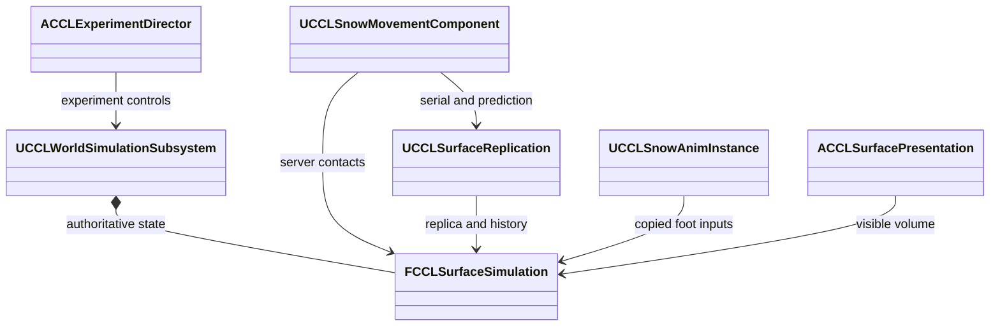

# 깊은 눈과 캐릭터 이동

[EnvironmentPlan](EnvironmentPlan.md)의 단계 5를 구현하고 코드·설계 검토, 생성·빌드와 실행 검증을 통과했다. 눈의 물 환산 체적·외형 체적을 서버 표면 상태에 추가하고 캐릭터 이동 컴포넌트(CMC)와 발 IK, 접촉 흔적과 저장·복제를 연결했다. 검증 대상은 UE 5.8.3이며 코드·에셋을 이 문서와 함께 Git에 기록했다. 프로젝트 문서·Obsidian 기록까지 마쳤으며 사용자의 직접 테스트를 위해 단계 5에서 멈춘다. 단계 6-9는 시작하지 않는다.

## 목표와 책임

적설·압축·주변 재분배·융해에서 물질을 보존한다. 실제 캐릭터가 0.6m 깊이의 눈을 통과하며 저항과 발 배치, 눈가루와 흔적이 같은 CPU 표면 상태를 읽는다. 지형·공통 시간의 기존 소유권은 유지한다.

| 소유자 | 책임과 수명 |
|---|---|
| `FCCLSurfaceSimulation` | 세계의 눈 체적·강설·융해·접촉 영수증을 저장한다 |
| `UCCLSnowMovementComponent` | Character 수명의 CMC 확장이다. 저장 이동, 저항과 서버 접촉을 처리한다 |
| `UCCLSurfaceReplication` | PlayerController 수명의 사본 전송·서버 전송 이력·임시 접촉 표현을 관리한다 |
| `UCCLSnowAnimInstance` | 원래 포즈 뒤에 두 발의 IK를 적용한다. 게임 스레드에서 입력을 복사한다 |
| `ACCLSurfacePresentation` | 지지 지형과 눈 격자를 표시한다. 눈가루는 이동 컴포넌트의 로컬 메시 인스턴스다 |
| 실험장 구역 03 | 실제 이동·강설·융해·저장·초기화와 판정을 연결한다 |



## 질량·깊이와 접촉 경계

`SnowCubicMeters`는 녹였을 때의 물 체적(m³), `SnowVolumeCubicMeters`는 눈의 외형 체적(m³)이다. 깊이는 외형 체적을 셀 면적으로 나눈 값이다. 물 대비 밀도 비율은 두 체적의 비율이며 현재 검증 범위는 0.05-0.65다. 새 눈은 0.1 비율로 쌓인다. 이 값들은 실험용 재료 모델이다.

압축은 물 환산량을 유지한 채 외형 체적을 줄인다. 접촉 영역의 일부 눈을 인접 셀에 옮길 때 양쪽에서 같은 질량·체적을 차감·가산한다. 이웃의 공간이 부족하면 옮기지 못한 양을 원래 셀에 남긴다. 융해는 눈의 물 환산량을 액체에 더하는 내부 전환이다. 외부 강설만 장부의 입력에 더한다.

서버 접촉은 `(SourceId, Sequence)`로 중복을 제거한다. 검사·후보 계산·보존 검증을 통과한 뒤 격자와 영수증을 함께 바꾼다. 거부한 접촉은 순번을 소비하지 않는다. 초기화는 영수증을 비우며 저장 복원은 영수증까지 복원한다. 비동기 지형 변경도 확정 직전의 최신 눈을 새 지표에 붙인다. 상한 아래 공간이 부족하면 지형 편집을 거부한다.

```cpp
bool SampleSnow(const FVector& PositionMeters, FCCLSnowSample& Sample) const;
bool ApplySnowContact(FGuid RegionId, FGuid SourceId, uint64 Sequence,
    const FVector& PositionMeters, double RadiusMeters, FString& Error);
uint64 LastSnowContact(FGuid SourceId) const;
```

`ApplySnowContact`의 세계 실행 진입점은 `UCCLWorldSimulationSubsystem`이다. CMC는 실제 서버 이동 경로를 짧은 간격으로 나눠 접촉을 만든다. 큰 순간이동은 출발점부터 흔적을 긋지 않는다. 클라이언트는 영구 상태를 변경하지 않고, 응답 또는 2초 경과까지 임시 눌림만 표시한다.

## CMC 예측과 발 배치

캡슐은 실제 지지 지형 위를 걷는다. 부드러운 눈의 표면에는 충돌을 새로 만들지 않는다. 앞쪽 눈 깊이 `d`에 따른 지상 최고 속도는 기존 최고 속도에 `clamp(1 / (1 + 3d), 0.25, 1)`을 곱한다. 이미 밟아 압축된 자기 발밑만 읽으면 저항이 너무 빨리 사라지므로 이동 방향의 캡슐 앞을 질의한다.

`FSnowSavedMove::SetMoveFor`는 표면 게시 순번·접촉 순번·깊이를 보관한다. `PrepMoveFor`는 보정 후 재실행에 같은 값을 공급한다. 이동 패킷은 두 순번만 추가하며 클라이언트의 깊이 수치를 서버에 전달하지 않는다. 서버는 자기 전송 이력에서 해당 순번의 깊이를 읽는다. 현재보다 지나치게 얕은 이력, 만료된 이력과 이전 세계 Epoch는 현재 상태로 계산하고 보정한다.

UE 5.8.3의 `ForceClientAdjustment()`는 `ServerLastClientAdjustmentTime`만 초기화한다. 실제 강제 위치 보정은 서버 예측 데이터의 플래그도 필요하다. 현재 구현의 핵심은 다음과 같다.

```cpp
GetPredictionData_Server_Character()->bForceClientUpdate = true;
ForceClientAdjustment();
```

엔진 근거는 `<Engine>/Source/Runtime/Engine/Private/Components/CharacterMovementComponent.cpp:8116`의 `ForceClientAdjustment`, 같은 파일 `:10401`의 보정 분기와 `:8674`의 `PrepMoveFor` 호출이다. 이 방식은 CMC를 확장하며 별도의 전체 캐릭터 예측기를 만들지 않는다.

발 IK는 기존 포즈를 연결 입력으로 받은 후 `AnimationCore::SolveTwoBoneIK`를 적용한다. 지지 발은 압축된 지표를 사용하고, 들어 올리는 발은 다음 보폭 앞의 눈 높이도 읽는다. 최대 추가 높이는 65cm로 제한한다. 게임 스레드의 `PreUpdate`에서 Actor·표면을 읽고, 평가 스레드는 복사한 목표와 포즈만 사용한다. 전체 몸의 균형·피로·경사 보행은 현재 구현에 없다.

두 환경 맵에서 `ABP_SnowPostProcess`를 사용한다. 기존 캐릭터 포즈를 받는 최소 AnimBlueprint의 부모는 `UCCLSnowAnimInstance`다. `Tools/Validation/configure_snow_playgrounds.py`가 이 에셋·눈 재질·구역 03 정의를 에디터에서 생성·저장한다.

## 저장·복제와 비용

세계 스키마는 3을 유지하고 내부 표면 스냅샷을 버전 2로 확장했다. 버전 1의 물·얼음·토양 수분은 보존하며 눈·강설·영수증을 빈 값으로 읽는다. 새 버전은 눈의 두 체적과 강설 장부, 접촉 영수증을 함께 저장한다. 손상·초과 입력은 원본을 바꾸기 전에 거부한다.

구역 03은 8m × 8m, 64 × 64셀, 간격 0.125m다. 첫 1m 구간은 깊이 0.08m, 나머지는 0.6m다. 계획의 0.05m 세부 타일은 성능 비교 후보로 남긴다. 물 구역과 합친 표면은 총 5,504셀이다. 보행 후 접촉 출처가 하나인 저장물은 358,528바이트였다.

현재 한도는 16개 지역·총 65,536셀·표면 저장 8MiB·접촉 출처 128개다. 서버는 접속자마다 최대 4개의 전체 표면 이력을 보관하며 15초 안의 같은 Epoch만 사용한다. 임시 접촉은 최대 64개다. 전체 후보 복사와 전체 스냅샷 전송은 실패 처리와 재접속을 단순하게 만들지만, 접속자·지역 수에 따라 메모리와 대역폭 비용이 증가한다. 출처를 계속 추가하는 장시간 재스폰 정책과 대규모 비용은 단계 9에서 검증할 범위다.

## 직접 테스트하는 순서

1. `Content/Maps/EnvironmentScenario.umap` 또는 `EnvironmentPlayground.umap`을 열고 PIE를 시작한다.
2. F8 화면에서 **03 깊은 눈·눈길**을 선택하고 **선택 구역으로 이동**을 누른다.
3. **시작 / 재실행**을 누르고 F8로 창을 닫는다. WASD로 중앙의 흰 눈 격자에 들어가 가로질러 걷는다. 이동 중에는 조작 창을 닫아야 한다.
4. 이동 저항, 발을 드는 동작, 눈가루와 이어지는 눌림을 확인한다. 3m 이상 이동하고 압축 조건을 만족하면 F8 결과가 PASS로 바뀐다.
5. PASS 후 **실험 저장 → 융해 → 저장 불러오기**로 흔적 복원을 확인한다. **새 적설 켜기 / 끄기**는 눌린 곳에 눈이 다시 쌓이는 입력이다. Scenario의 **60배**에서 변화를 보기 쉽다.
6. 처음 상태로 돌아가려면 **전체 초기화**를 사용한다. 저장 복원·초기화 때 캐릭터를 안전 지점으로 옮기므로 필요하면 구역 03으로 다시 이동한다.

수치 PASS는 이동 거리·압축 셀·수지 검사다. 보행 감각이나 최종 미술 품질에 대한 판정은 포함하지 않는다. 눈의 격자 표시는 진단용이며 부츠 모양의 정밀 변위 표현은 아직 없다.

## 실행 근거와 검토 결과

2026-10-09 로컬 실행을 기록한다. 아래 경로는 저장소 상대 경로이며 `Saved/`의 원본은 Git 제출 대상이 아니다.

| 검사 | 결과와 근거 |
|---|---|
| 프로젝트 생성·Editor 빌드 | 성공. `Saved/EnvironmentStages/Stage5-GPF.log`, `Stage5-Build.log` |
| 환경 자동 검사 | 52/52, 경고·실패·미실행 0. `Saved/Tests/Automation/20261009-233306-271/report/index.json` |
| Dedicated Server와 첫·늦은 접속 | 눈 상태 바이트 일치. `Saved/Tests/Snow/Dedicated-20261009-232411-995` |
| Listen Server와 두 클라이언트 | 눈 상태 바이트 일치. `Saved/Tests/Snow/Listen-20261009-234208-119` |
| 압축 흔적의 별도 프로세스 저장·복원 | 전체 세계 상태 일치. `Saved/Tests/TerrainScenario/EnvironmentScenario-20261009-233359-222` |
| 서로 다른 두 맵의 흔적과 영수증 | 네 번 왕복 후 전체 세계 상태 일치. `Saved/Tests/TerrainTravel/Standalone-20261009-233359-799` |
| 이력 만료와 지연·손실 중 CMC 보정 | 통과. 각 프로세스의 50ms 지연·2% 손실 설정에서 실제 저장 이동 재실행과 서버·첫·늦은 접속의 표면 바이트 일치. `Saved/Tests/Snow/Dedicated-20261009-233859-043` |
| 최종 렌더링 보행·발 배치·눈가루 | 통과. `Saved/Tests/Snow/Standalone-20261009-233859-874`의 조작부·보행·발 진단·흔적 화면을 직접 확인 |
| 일반 캠페인 회귀 | 경로 이동·전투·보스·승리·재스폰 통과. `Saved/Tests/CampaignSmoke/Standalone-20261009-233859` |
| 기존 Agent 실행 | 통과. `Saved/Tests/AgentWorld/20261009-234205/editor.log` |

보정 시험은 이동 속도를 낮추고 서버의 표면 전송 틱을 일시 중단해 이력을 만료시킨다. 현재 상태로 계산한 강제 보정 경로 1,559회, 첫 클라이언트의 저장 이동 재실행 5,081회를 관측했다. 이 횟수는 시험 조건의 계측값이며 실제 패킷 수나 성능 목표가 아니다. 렌더링에서 발 높이는 지지 지표 기준 7.933-70.074cm였고 눈가루 인스턴스 생성도 확인했다. 발 진단 화면은 한 프레임 동안 눈 표시만 숨겼으며 권위 표면과 정상 보행 화면은 유지했다.

자동 검사는 강설 시간 구간의 분할, 반복 압축·재분배·융해 수지, 접촉 중복·실패 후 원본 유지, 지형 지지 변경·수용 공간 거부와 비어 있지 않은 버전 1 저장물의 변환을 포함한다. 저장·맵 왕복 검사는 초기 눈뿐 아니라 실제 접촉으로 변형한 눈과 영수증도 비교한다.

검토 중 자기 발밑 압축으로 이동 저항이 약해지는 문제, 다음 눈 높이를 반영하지 않은 발 목표, CMC 보정 요청과 실제 강제 보정의 차이를 수정했다. 검증기의 계측은 복원 과정의 상태 변화에도 실행 중 관측한 최대 횟수를 유지한다.

## 대안과 남은 범위

눈을 실제 충돌 지형으로 만들면 하중 지지와 높이 판정을 통일하기 쉽지만, 접촉마다 충돌 준비·게시와 이동 예측 비용이 생긴다. 현재 모델은 부드러운 눈을 통과하는 실험에 맞췄다. 얼어 단단해진 눈을 밟고 올라서는 역학은 별도 설계가 필요하다.

국소 발 조정은 native TwoBoneIK로 처리했다. 전신 균형 조절이 필요하면 Control Rig를 비교할 수 있으며 포즈 전달과 리그 평가 비용을 측정해야 한다. 현재 눈가루는 단순 메시 입자이며 최종 VFX 품질과 원격 관찰자별 표현은 후속 범위다.

자연 날씨, 장시간·대규모 성능, 실제 Server 타깃과 패키지의 재질·애니메이션 포함은 이번 단계의 통과 범위가 아니다. 단계 6-9와 Framework 분리는 시작하지 않는다. 현재 검증 결과를 바탕으로 사용자가 테스트 레벨에서 직접 확인한다.
