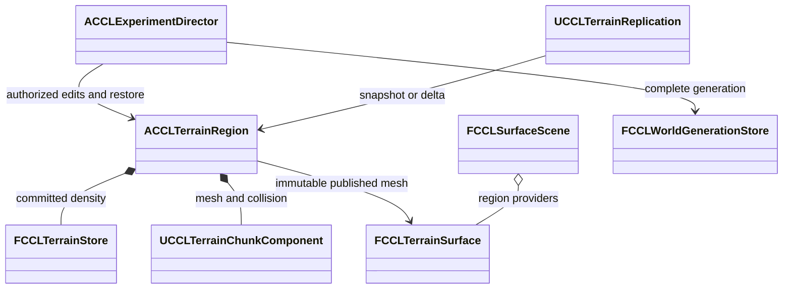

# 영구 지형 통합과 검증

[EnvironmentPlan](EnvironmentPlan.md) 단계 3의 표면 질의, 저장 세대, 내비게이션, 복제와 구역 05 연결을 다룬다. 2026-10-09 UE 5.8.3 소스 빌드에서 단계 3의 통과 조건을 확인했다. 구현 위치는 `Source/CCL/Environment/`이며 실행 검사는 `Source/CCL/Tests/`와 `Tools/Validation/`에 있다. 물과의 확정·복원 연결은 [물 순환 설계와 검증](EnvironmentWater.md)이 소유한다. 눈의 지지·체적 보존과 이동·저장 연결은 [깊은 눈과 캐릭터 이동](EnvironmentSnow.md)에 기록했다.

> 검증 범위: 코드·에셋을 문서와 함께 Git에 기록했다. 아래 실행 결과는 명시한 엔진과 환경의 결과이며 다른 기기에서는 프로젝트 생성·빌드와 실행을 다시 확인한다.

## 책임과 게시 순서

`ACCLTerrainRegion`은 한 지역의 밀도, 메시, 실제 충돌과 게시 순번을 소유한다. 서버는 호출자 권한과 예상 순번을 검증한 뒤 후보를 준비한다. 이전 충돌은 후보의 전체 청크가 준비될 때까지 유지한다. 기존 실행기의 점유 검사와 참여자 검증을 통과해야 밀도와 충돌을 함께 바꾼다. 내비게이션과 접속자별 충돌 준비는 그 뒤에 완료될 수 있다.

| 소유자 | 책임과 수명 |
|---|---|
| `FCCLTerrainSurface` | 확정 메시의 불변 사본으로 다층 표면을 질의한다. 게시마다 교체한다 |
| `FCCLSurfaceScene` | 지역별 표면 공급자를 합성한다. 교체와 제거 시 질의 Epoch를 바꾼다 |
| `FCCLWorldGenerationStore` | 세계와 지역 파일을 같은 문맥으로 검증하고 완료 세대를 게시한다 |
| `ACCLTerrainRegion` | 후보 충돌 준비, 확정 상태, 내비게이션 리비전과 클라이언트 적용 순번을 관리한다 |
| `UCCLTerrainReplication` | PlayerController 하나의 전송, 마지막 확인 바이트와 준비 완료 응답을 관리한다 |
| `ACCLExperimentDirector` | 실험 조작 권한, 구역 05와 세계 저장 복원을 연결한다 |
| `UCCLAgentSessionStore` | GameInstance 수명 동안 도메인별 세계·지형 전환 스냅샷을 보관한다 |



`RequestRestore`는 밀도만 먼저 바꾸지 않는다. 후보 충돌을 준비한 뒤 세계 복원 콜백과 지형 교체를 같은 게임 스레드 확정 구간에서 수행한다. 실패하면 후보를 폐기한다. 정본 지형 바이트가 같은 경우에만 기존 충돌을 재사용하며 새 Epoch와 게시 순번을 발급한다. 후속 물이나 눈 참여자가 등록된 복원은 아직 거부한다. 참여자를 누락한 채 성공으로 처리하지 않는다.

```cpp
bool RequestRestore(const TArray<uint8>& Bytes,
    const FCCLTerrainSaveContext& Context, FString& Error,
    TFunction<bool(FString&)> BeforePublish = {});
bool IsTerrainReady() const;
bool IsNavigationReady() const;
bool IsReplicaReady() const;
```

세 준비 상태의 뜻은 다르다. `IsTerrainReady`는 기존 확정 충돌의 존재를 나타낸다. `IsNavigationReady`는 현재 리비전과 Epoch의 동적 NavMesh 갱신 완료를 나타낸다. `IsReplicaReady`는 해당 클라이언트가 최신 게시를 적용하고 물리 프레임을 지난 상태다. 편집 준비 중에도 이전 지형은 사용할 수 있다.

## 다층 질의와 메시

표면 질의는 실제 충돌에 사용한 메시에서 광선 교차를 계산한다. 지상, 동굴 천장과 바닥을 거리순으로 반환하며 재질과 바깥쪽 법선을 포함한다. 요구 리비전이나 Epoch가 다르거나 결과 예산을 넘으면 출력 배열을 바꾸지 않고 실패한다. 합성 질의는 장면 리비전과 원본 지형 리비전을 별도로 반환한다.

표면 ID는 세계, 지역, 격자 셀과 주 법선 방향으로 계산한다. 청크 순서와 재추출에 영향받지 않지만 지형 편집으로 셀이나 방향이 바뀐 표면의 동일성을 보장하지 않는다. 임의의 지형 변형을 추적하는 영구 객체 ID로 사용하지 않는다.

정수 밀도의 영점 꼭짓점에서는 UE MarchingCubes의 보간 처리가 작은 삼각형을 만든다. 정확한 청크 교차점에서 실제 Chaos 광선 검사가 빠지는 현상을 재현했다. 추출 기준을 `-0.5mm`로 두어 정수 밀도의 고체/공기 분류를 유지하면서 영점 꼭짓점을 피한다. 평면은 밀도 영점보다 0.5mm 안쪽에 생긴다. 밀도 저장값을 바꾸지는 않으며 표시, 충돌과 표면 질의는 같은 추출 결과를 사용한다.

엔진 근거는 `<Engine>/Source/Runtime/GeometryCore/Public/Generators/MarchingCubes.h:978-1000`의 영점 보간이다. 이 변경은 이번 프로젝트의 추출 정책이며 UE4와 UE5의 일반적인 차이라고 해석하지 않는다.

## 완료 세대와 복원

실험 저장 위치는 `Saved/EnvironmentGenerations/<슬롯>/g-<세대>-<GUID>/`다. 세계 파일, 지역별 파일과 CRC를 검증하고 파일을 닫은 다음 `complete.tmp`를 `complete.bin`으로 바꾼다. 복구는 완료 표식과 모든 파일이 유효한 가장 높은 세대를 선택한다. 세계 ID, 기반 버전, 세대와 두 완료 시각이 다른 지역 파일은 같은 묶음에 들어갈 수 없다.

최신 세대의 지역 파일이 손상되거나 누락됐거나 완료 표식이 없으면 이전 완료 세대를 찾는다. 모든 세대가 잘못됐으면 복구를 거부하고 실행 상태를 유지한다. 이 절차는 미완료 파일과 프로세스 중단을 다룬다. 실제 전원 차단 후 디스크 내구성까지 검증한 것은 아니다.

보호 한도는 지역 파일 32MiB, 한 묶음 64개 지역과 전체 256MiB다. 이전 디렉터리는 보존하며 자동 정리 정책은 아직 없다. 불변 세대는 실패 시 되돌리기 쉽지만 저장 공간이 계속 늘어난다. 현재 실험장의 복원은 한 지역을 대상으로 하며 여러 로드 지역의 동시 런타임 복원은 후속 확장 범위다.

## 맵 전환과 세션 복원

실험장의 맵 전환은 `SaveSessionForTravel`로 시계, Agent와 로드된 지형을 같은 게임 스레드에서 캡처한 뒤 시작한다. 모든 지역이 확정됐을 때만 후보 묶음을 `UCCLAgentSessionStore::TravelSnapshots`에 넣는다. 준비 중인 지역이 있으면 전환을 거부하며 작업 완료 후 재시도할 수 있다. 전환 요청이 접수된 뒤에는 추가 조작을 막는다.

`EnvironmentPlayground`와 `EnvironmentScenario`는 서로 다른 도메인에 저장한다. 새 월드는 해당 세계 스냅샷으로 시작하고 `InitializeTerrain`이 저장된 지형으로 첫 메시와 충돌을 준비한다. 지역 ID와 저장 문맥이 맞지 않으면 초기화를 거부한다. 평평한 기본 지형을 중간 상태로 게시하지 않는다. Actor와 Epoch는 새 월드에서 다시 만든다.

일반 월드 종료에서는 `OnWorldBeginTearDown`에서 진행 중 후보를 취소하고 확정된 상태를 보관한다. 명시적 전환에서 이미 캡처한 경우에는 그 묶음을 유지한다. 뒤늦은 `Deinitialize`가 세계 바이트만 덮어 지형과 세대를 섞지 않도록 막는다. 도메인을 초기화하면 그 도메인의 전환 묶음도 지운다.

이 경로는 프로세스 안의 세션 보존이다. 디스크 저장은 앞 절의 완료 세대 저장소가 담당한다. 맵별 마지막 묶음을 메모리에 유지하는 비용이 생기며, 현재 실험장의 초기 복원은 한 지역을 대상으로 한다. Framework 분리 시점과 후보는 [FrameworkPlan](FrameworkPlan.md)이 소유하고 실제 분리는 보류한다.

엔진 근거는 `<Engine>/Source/Runtime/Engine/Private/World.cpp:6138`의 `BeginTearingDown`과 `<Engine>/Source/Runtime/Engine/Private/UnrealEngine.cpp:16183`의 맵 해제 순서다. 프로젝트 연결은 `Source/CCL/Agents/CCLAgentWorldSubsystem.cpp`와 `Source/CCL/Environment/CCLExperimentTerrain.cpp`에 있다.

## 경로와 복제

활성 청크는 직접 메시를 NavMesh에 내보낸다. 게시 후 동적 갱신 완료 이벤트, 남은 작업과 대기 영역을 확인해 현재 리비전을 준비 상태로 만든다. 생활 Agent와 적 AI는 시작점과 목표뿐 아니라 현재 찾은 우회 경로가 준비되지 않은 지형을 지나는지도 검사한다.

UE 근거는 `<Engine>/Source/Runtime/NavigationSystem/Private/NavigationSystem.cpp:5562`의 갱신 작업·잠금 검사와 `<Engine>/Source/Runtime/NavigationSystem/Private/NavMesh/RecastNavMeshGenerator.cpp:699`의 사용자 메시 내보내기다. `IsNavigationDirty`만으로 완료를 판정하지 않는다. 타일 부재 상태가 남은 작업과 별개로 보고될 수 있기 때문이다.

복제는 접속자마다 마지막으로 충돌 준비를 확인한 바이트를 기준으로 한다. 첫 접속과 기준 상태가 없을 때는 전체 스냅샷을 보낸다. 이후에는 공통 접두부와 접미부를 제외한 바이트를 보내며 최대 8KiB씩 응답을 기다린다. CRC, 바이트 수, 기준 순번과 게시 순번을 확인한다. 최신 게시가 바뀌면 이전 전송을 취소한다.

클라이언트는 후보 충돌 게시 후에 준비 응답을 보낸다. 준비되지 않은 클라이언트는 구역 05로 이동할 수 없고, 이미 주변에 있다면 해당 접속자의 이동을 보류한다. 다른 접속자를 함께 기다리게 하지 않는다. Actor 참조가 먼저 도착해 해석되지 않으면 0.5초 뒤 재전송한다. 지역별 압축이나 편집 명령 재연보다 구현은 단순하지만 변경 위치에 따라 전송량이 전체 스냅샷에 가까워질 수 있다.

같은 게시 순번을 다시 받으면 이미 적용한 지형 또는 준비 중 후보의 정본 바이트와 비교한다. 내용이 같으면 기존 준비와 Epoch를 유지하고 실제 충돌 준비 조건을 만족한 뒤 새 전송 ID에 완료 응답을 보낸다. 동일 순번의 다른 내용과 오래된 순번은 거부한다. 완료 응답을 서버가 제한 시간 안에 처리하지 못한 경우에도 전체 스냅샷 재전송으로 준비 상태를 회복할 수 있다.

## 직접 확인

`/Game/Maps/EnvironmentPlayground` 또는 `/Game/Maps/EnvironmentScenario`를 실행하고 F8 조작 화면에서 구역 05를 선택한다. 시작은 지형 초기화 후 굴착, 실제 충돌, 경로와 보호 구역 검사를 실행한다. 개별 버튼으로 굴착, 성토, 수로, 보호 구역 거부와 지형 초기화를 요청할 수 있다. 저장과 불러오기는 세계 시계, Agent와 지형의 같은 완료 세대를 사용한다.

구역 05는 가로세로 16m, 높이 8m의 실험 지역이다. 표면 높이는 기존 바닥보다 4m 높다. 보호 위치로 이동해 조작하며, 물이 흐르는 수로의 유동은 단계 4에서 연결한다. 현재 수로 버튼은 지형만 굴착한다.

## 검증

최종 소스 변경 뒤 프로젝트 파일 생성과 `CCLEditor Win64 Development` 빌드가 성공했다. 원본은 Git에서 제외된 `Saved/Tests/` 아래에 보관하며 다음 경로는 저장소 기준이다. 현재 작업 트리의 기존 UI와 캠페인 변경을 유지한 상태에서 검증하며 깨끗한 체크아웃이나 패키지 실행 결과로 확대 해석하지 않는다.

| 검사 | 결과와 근거 |
|---|---|
| 프로젝트 파일 생성·Editor 빌드 | 성공. `Saved/Reviews/terrain-fixes-generate.log`, `terrain-fixes-build.log` |
| CCL 환경 자동 검사 | 42개 성공, 경고·실패·미실행 0개. `Saved/Tests/Automation/20261009-205054-003/report/index.json` |
| 충돌·점유·실패·취소·복원·경로 | 통과. `Saved/Tests/Terrain/20261009-205052-778/result.json` |
| Dedicated와 클라이언트 2개 | 완료 응답 지연 후 재전송, 중복 후보 유지, 동순번 내용 충돌 거부, 전체·변경량 전송과 늦은 접속 통과. `Saved/Tests/TerrainNetwork/Dedicated-20261009-203137-699/result.json` |
| Listen과 클라이언트 2개 | 같은 조건 통과. `Saved/Tests/TerrainNetwork/Listen-20261009-203409-541/result.json` |
| Standalone 맵 왕복 | 두 실험장 사이 4회 전환, 도메인별 세계·지형 복원과 준비 중 전환 거부 통과. `Saved/Tests/TerrainTravel/Standalone-20261009-204919-429/result.json` |
| Listen 맵 왕복 | 클라이언트 1개와 4회 전환, 복귀 후 최신 충돌 준비 응답까지 통과. `Saved/Tests/TerrainTravel/Listen-20261009-204919-041/result.json` |
| Dedicated 맵 왕복 | 같은 조건 통과. `Saved/Tests/TerrainTravel/Dedicated-20261009-205053-123/result.json` |
| 격리 실험장 디스크 저장·새 프로세스 복원 | 굴착·성토·수로·초기화·취소와 세계·지형 복원 통과. `Saved/Tests/TerrainScenario/EnvironmentScenario-20261009-204920-951/result.json` |
| 격리 실험장 화면·새 프로세스 복원(기존 검사) | 실제 Slate 시작 버튼, 굴착·성토·수로·초기화·재실행 취소, 세계·지형 복원 통과. `Saved/Tests/TerrainScenario/EnvironmentScenario-20261009-182619-883/result.json` |
| 종합 실험장 화면·새 프로세스 복원(기존 검사) | 같은 조건 통과. `Saved/Tests/TerrainScenario/EnvironmentPlayground-20261009-182720-205/result.json` |
| 기존 세계 저장 재시작 | 통과. `Saved/Tests/Environment/EnvironmentScenario-Standalone-20261009-175521-967/result.json` |
| 기존 생활 Agent 실행 | 행동·저장·Actor 재구성 통과. `Saved/Tests/AgentWorld/20261009-210014/editor.log` |

기존 화면 검토는 두 지형 시나리오 폴더의 `terrain-controls.png`와 `terrain-overview.png`를 사용했다. 한국어 버튼과 상태가 잘리지 않고 굴착과 성토가 표시되는지 확인했다. 초기 화면 검사에서 DDC 종료 대기와 첫 Slate 클릭의 미반영이 발생했다. 종료 제한을 120초로 조정하고 실제 실행 상태를 확인해 클릭을 최대 네 번 재시도한다. 위 최종 실행은 정상 종료까지 통과했다.

표면 자동 검사는 같은 XY의 지상·천장·동굴 바닥, 재질, 청크 순서 독립적인 ID, 오래된 질의와 결과 예산을 확인한다. 세대 저장 자동 검사는 최신 파일 손상, 완료 표식 누락과 세대 혼합 거부, 이전 완료 세대 선택을 확인한다. 지형 시나리오 검사는 비동기 복원 중 시계의 자동 Tick을 끄고 명시적으로 누적한 시간·대기 입력·Agent와 실제 충돌을 비교한다.

왕복 검사는 자동 시계 Tick을 끄고 서로 다른 완료 시간과 대기 입력을 넣는다. 저장된 Agent의 필드 전체와 기존 경제 기록, 지형 바이트, 충돌 높이와 새 Epoch를 비교한다. 맵 로드 후 새 PlayerState가 개설한 계좌만 현재 접속자 ID와 미사용 초기 잔액으로 따로 검사한다. 그 밖의 추가 기록이나 기존 기록의 변화는 허용하지 않는다.

복제 재시도 검사는 최종 준비 응답 하나를 서버에서 무시하고 해당 전송의 제한 시간을 넘긴다. 정상 시간 초과 분기, 변경량 기준 불일치에 따른 전체 전송과 서버 준비 상태의 회복을 확인한다. 같은 순번을 준비 중 또는 적용 후 다시 처리해도 후보 작업과 Epoch가 바뀌지 않는지 검사한다. 이는 조건을 주입한 재현이며 실제 패킷 손실 측정은 아니다.

```powershell
& Tools/Validation/run_automation.ps1 -Filter 'CCL.Environment' -TimeoutSeconds 240
& Tools/Validation/run_terrain_smoke.ps1 -Rendered -TimeoutSeconds 240
& Tools/Validation/run_terrain_scenario_smoke.ps1 -Map EnvironmentScenario -Rendered
& Tools/Validation/run_terrain_scenario_smoke.ps1 -Map EnvironmentPlayground -Rendered
& Tools/Validation/run_terrain_network_smoke.ps1 -Mode Dedicated -Port 19831
& Tools/Validation/run_terrain_network_smoke.ps1 -Mode Listen -Port 19832
& Tools/Validation/run_terrain_travel_smoke.ps1 -Mode Standalone
& Tools/Validation/run_terrain_travel_smoke.ps1 -Mode Listen -Port 19841
& Tools/Validation/run_terrain_travel_smoke.ps1 -Mode Dedicated -Port 19842
```

대규모 지역의 질의 시간, 다수 접속자의 메모리와 전송량, 실제 네트워크 손실, 패키지 실행과 아트 품질은 별도 측정이 필요하다. 현재 표면은 기본 재질을 사용한다. 기존 선택적 EditorToolset의 Python 초기화 오류는 지형 PASS와 구분해 기록한다.
