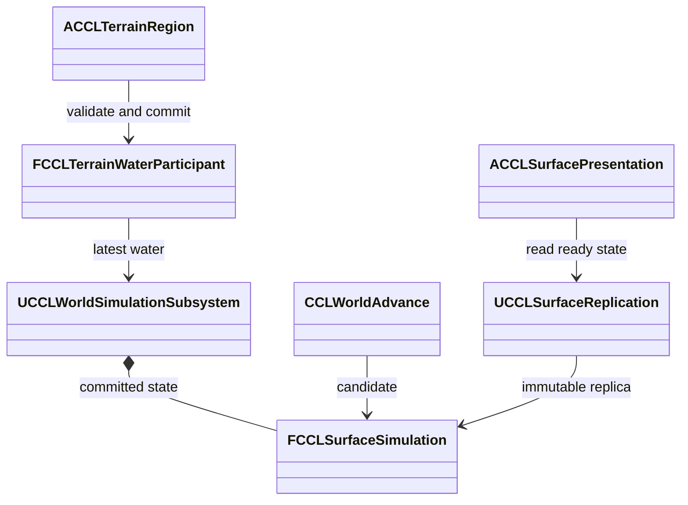

# 물 순환 설계와 검증

물·얼음·토양 수분을 서버의 값 상태로 저장하고 지형·공통 시간과 함께 확정한다. [EnvironmentPlan](EnvironmentPlan.md)의 단계 4를 UE 5.8.3에서 구현하고 생성·빌드, 환경 자동 검사, 네트워크·저장·화면 검사를 통과했다. 범위는 [결정 19](DesignLog.md)에 따른다. 단계 5에서 연결한 눈의 보존량·이동·저장은 [깊은 눈과 캐릭터 이동](EnvironmentSnow.md)이 소유한다. 검증한 코드·에셋을 이 문서와 함께 Git에 기록했다.

## 목표와 제약

지표 위 수평 격자에서 강수, 흐름, 젖음, 진흙, 결빙·융해와 건조를 연결한다. 각 셀은 지표·상한 높이(m)와 액체·얼음·토양 수분의 물 환산 체적(m³)을 소유한다. 얼음은 녹았을 때의 물 체적으로 계산한다. 밀도 차이에 따른 얼음 팽창, 터널 내부 유체와 운동량 기반 파도는 현재 모델에 없다.

강수·증발·침투·융해·결빙은 세계 초, 인접 셀 흐름은 게임 초를 사용한다. 완료 구간의 강수량을 하위 단계에 나눠 한 번만 적용한다. 강·해안은 외부 수위와 교환 계수를 가진 경계이며 실제 유입·유출을 원장에 각각 기록한다. 입력이 셀 수용량을 넘으면 후보를 거부하고 시간을 미처리 상태로 남긴다.

## 책임과 수명

| 소유자 | 책임과 수명 |
|---|---|
| `FCCLSurfaceSimulation` | 세계 실행기가 소유하는 값 상태. 체적·입력·외부 원장·후보 진행·직렬화 |
| `UCCLWorldSimulationSubsystem` | 서버 World 수명. 시계·Life·표면을 같은 구간에서 확정하고 저장·복원 |
| `FCCLTerrainWaterParticipant` | 지형 확정 직전의 최신 물을 새 지표에 연결. 실패 시 기존 지형과 물 유지 |
| `UCCLSurfaceReplication` | 실험장 PlayerController별 불변 스냅샷 전송·응답·클라이언트 사본 |
| `ACCLSurfacePresentation` | 확정 값으로 물·얼음·진흙 타일 표시. 권위 수치를 진행하지 않음 |
| `ACCLExperimentDirector` | 서버 조작 권한, 구역 04 입력·실험과 구역 05 지형·저장 연결 |



## 보존과 실패 경계

셀 경계는 동쪽·북쪽으로 한 번씩 열거한다. 모든 유량 후보와 출발·도착 셀의 제한 계수를 먼저 계산한다. 그 뒤 출발 셀의 남은 보유량과 도착 셀의 빈 공간을 차감하고 유입은 별도로 더한다. 같은 하위 단계에서 방금 받은 물을 다시 지출하지 않는다. 마지막 비트의 반올림 때문에 음수가 생기는 경우도 남은 예산으로 제한한다.

현재 전체 수지는 `액체 + 얼음 + 토양 수분 + 눈의 물 환산량 = 시작량 + 강수 + 강설 + 경계 유입 - 경계 유출 - 증발`이다. 침투·배수·상변화는 내부 이동이다. 보존 검사 실패 시 후보 전체를 버린다. 현재 구현 한도는 16개 지역, 총 65,536셀, 저장 8MiB, 진행당 4,096개 하위 단계다. 값은 `CCLSurfaceSimulation.h`의 상수이며 게임의 최종 성능 사양이 아니다.

`CCLWorldAdvance.cpp`는 후보 시계가 정한 구간으로 표면 후보를 계산한다. 이후 Life의 원자적 진행까지 성공해야 원본을 교체한다. 다음은 실제 확정 순서의 핵심이다. `CandidateClock`과 `CandidateSurface`는 앞선 준비·검증을 마친 후보다.

```cpp
if (!Life.TryAdvanceTo(Step.WorldToSeconds, Error, MaxLifeSlices))
{
    return false;
}
if (Surface)
{
    *Surface = MoveTemp(CandidateSurface);
}
Clock = MoveTemp(CandidateClock);
```

지형 참여자는 비동기 충돌 준비 동안 물을 고정하지 않는다. 확정 직전에 최신 물을 복사해 새 지표로 재배치한다. 성토로 넘치는 액체는 연결된 빈 공간이나 명시한 외부 경계로 보낸다. 공간이 없거나 얼음의 지지 체적을 보존할 수 없으면 편집을 거부한다. 지형 복원은 저장 표면의 세계 ID·지형 ID·리비전·지표 높이를 함께 검증한다.

## 인터페이스와 저장·복제

```cpp
bool Advance(const FCCLWorldStep& Step, FString& Error);
bool Capture(TArray<uint8>& Bytes, FString& Error) const;
bool Restore(const TArray<uint8>& Bytes, FString& Error);
bool RebaseTerrain(FGuid RegionId, const TArray<double>& BedsMeters,
    uint64 TerrainRevision, FString& Error, bool bRestoring = false);
```

세계 스키마 3은 길이·CRC를 검사한 표면 스냅샷을 포함한다. 스키마 1·2는 저장한 세계 ID·시각·진행 번호에 맞는 빈 표면으로 변환한다. 손상·과대 배열·시각 불일치는 실제 상태를 바꾸기 전에 거부한다. 실험장 저장과 맵 왕복은 이 세계 스냅샷을 사용한다.

접속자별 전송은 8,192바이트 청크와 응답으로 제한한다. 전송 도중 원본이 바뀌어도 보내던 바이트는 유지하며 완료 후 최신 상태를 보낸다. 변경 감지 CRC는 저장물 끝의 CRC 필드를 제외한 내용에서 계산한다. CRC를 붙인 전체 코드워드를 다시 해시하면 변경 감지가 상수로 굳을 수 있다.

지형 저장 리비전은 과거 저장 복원 시 재사용될 수 있다. 전송에는 지형의 현재 `PublicationSerial`도 포함한다. 클라이언트의 지형 사본·게시 순번이 모두 같아야 물을 표시한다. 지형이 준비될 때까지 이동을 보류하는 책임은 기존 지형 복제기에 있다. 캠페인의 표면 지역 구성과 복제는 통합 단계에서 연결한다.

## 실행 근거와 검토 결과

2026-10-09의 로컬 로그다. 경로는 저장소 상대 경로로 정규화했다. `Saved/`의 원본 로그·화면은 Git 제출 대상이 아니다.

| 검사 | 결과와 근거 |
|---|---|
| 최종 프로젝트 생성·Editor 빌드 | 성공. `Saved/EnvironmentStages/Stage4-GPF.log`, `Stage4-Build.log` |
| 환경 자동 검사 | 48/48. `Saved/Tests/Automation/20261009-222257-126/report/index.json` |
| Dedicated Server와 첫·늦은 클라이언트 | 통과. `Saved/Tests/Water/Dedicated-20261009-222346-928` |
| Listen Server와 클라이언트 2개 | 통과. `Saved/Tests/Water/Listen-20261009-222534-500` |
| 실제 저장 후 별도 프로세스 복원 | 표면 포함 세계 바이트와 지형 충돌 일치. `Saved/Tests/TerrainScenario/EnvironmentScenario-20261009-222348-752` |
| 맵 왕복 | 표면 포함 세계 상태 보존. `Saved/Tests/TerrainTravel/Standalone-20261009-222535-646` |
| 기존 Agent 실행 | 통과. `Saved/Tests/AgentWorld/20261009-222747/editor.log` |
| 화면과 실제 Slate 시작 버튼 | 통과. `Saved/Tests/Water/Standalone-20261009-223308-249`의 controls·overview·ice·mud 화면을 직접 확인 |

자동 검사는 경계 교환·강수·결빙·융해·침투·증발, 비동기 지형 연계와 실패 시 원본 유지, 시계 예산 실패 후 재시도, 스키마 2 변환·CRC·잘못된 배열 길이를 다룬다. 마른 셀 경계의 반올림 회귀 검사는 32×32 격자를 1,200회 진행한다. 실제 실험장의 두 격자는 총 1,408셀이고 저장된 표면은 69,472바이트다. 이 값은 실험 구성의 측정값이다.

검토에서 유량 적용 순서 의존성, 작은 음수 체적, 지형 재배치의 잔여량 손실, CRC 변경 감지, 복원 시 지형 순번 재사용, 초기화 중 남은 실험 상태를 발견해 수정했다. 렌더링 검사에서는 인스턴스 메시 재질 사용 플래그 누락을 수정하고 에디터에서 다시 저장했다. 최종 소스 변경 후 생성·빌드와 해당 화면 검사를 다시 통과했다.

## 대안과 남은 범위

UE 5.8.3의 `<Engine>/Plugins/Experimental/Water/Source/Runtime/Private/WaterBodyTypes.cpp:166-193`에서 강의 수면 위치는 스플라인, 바다는 위치와 높이 보정, 호수는 위치로 질의된다. 이 위치 질의 API는 현재 CPU 격자의 보존 원장·공통 시간 후보를 소유하지 않는다. Water 플러그인의 모든 유체 기능이 없다는 주장은 아니다. 표현에 해당 기능을 채택하더라도 권위 수치와의 연결을 별도로 검증해야 한다.

전체 후보 복사와 전체 스냅샷 복제는 실패 처리와 재접속 검증을 단순하게 만든다. 지역 수가 늘면 복사·직렬화·대역폭 비용이 증가하므로 부분 갱신과 먼 지역 집계가 대안이다. 대규모 비용은 통합 단계에서 측정한다. 현재 타일 표시는 진단용이며 최종 물 렌더링 품질이 아니다. 자연 날씨, 불 연계, 패키지의 재질 포함과 실제 Server 타깃은 후속 검증 범위다.
