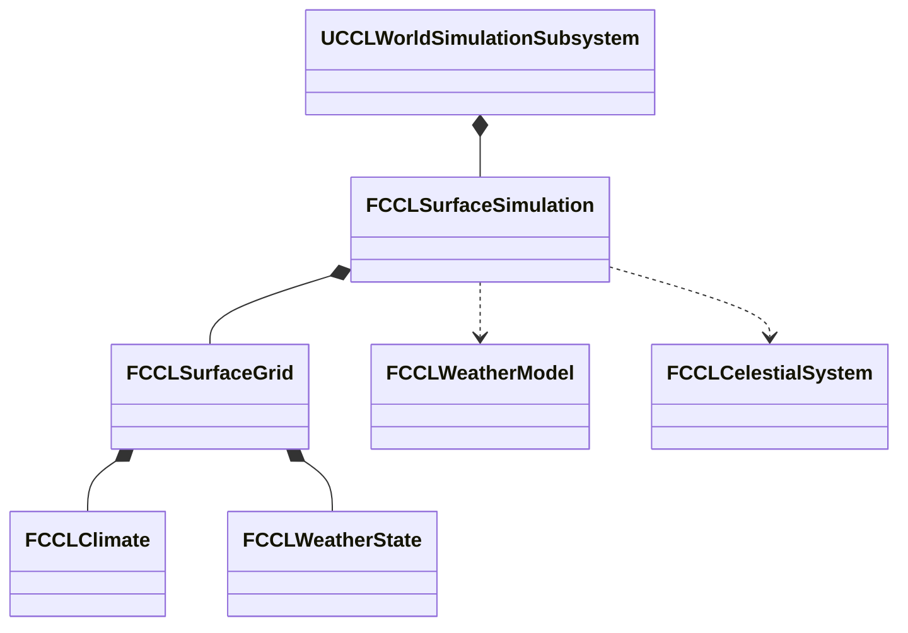

# 자연 날씨의 계산과 연결

지역 날씨를 천체 일조, 기후 정의와 이전 수분·기온 상태에서 진행한다. 구역 02에서 자연 진행과 강제 비·눈을 선택하고 기온, 대기 수분, 바람과 표면 수지를 확인한다. 범위 근거는 결정 19와 [환경 계획](EnvironmentPlan.md#단계별-구현과-통과-기준)이다.

## 목표와 책임

서버의 `UCCLWorldSimulationSubsystem`이 공통 시간을 소유한다. `FCCLWeatherModel`은 일조와 기후 입력으로 지역 날씨 후보를 계산한다. `FCCLSurfaceGrid`가 기후 정의와 지속 날씨 상태를 보관한다. `CCLWorldAdvance`는 날씨·표면·생활·시계의 후보를 같은 완료 경계에서 확정한다. 클라이언트는 기존 표면 스냅샷 복제를 통해 확정 날씨를 받는다.



## 계산 계약

기온은 지역 기준 기온과 차광된 일조가 정하는 목표값으로 지수 완화한다. 바람과 외부 수분 공급은 기후 정의·Seed·세계 시각으로 정한 완만한 주기 입력이다. 지역 대기는 열린 계이며 외부 공급을 허용한다. 수증기가 온도별 용량을 넘으면 구름으로 응결하고 구름의 일부가 강수로 빠진다. 이는 게임용 근사 모델이며 대기 역학이나 실제 예보 정확도를 제공하지 않는다.

강수·증발과 기온 변화는 세계 초, 물의 수평 이동은 게임 초를 쓴다. 강수는 물 환산 깊이로 계산한 뒤 기온에 따라 비·눈으로 분배한다. 기존 셀별 강수 노출률을 적용하며 물·눈·얼음·토양과 증발의 수지 검사를 유지한다. 천체 관측은 처리 구간의 중간 시각에서 수행한다. 날씨 모델의 하위 단계는 최대 60세계 초다. 큰 요청은 최대 4096개로 나누어 일조·대기·표면을 순서대로 계산하고 후보 전체를 한 번에 확정한다. 예산을 넘는 요청은 시간을 미처리 상태로 남긴다. 평소 런타임은 기존 15세계 초 예산을 유지한다.

자연 모드를 활성화한 지역만 날씨가 표면 입력을 갱신한다. 기존 수동 표면 실험은 그대로 시작한다. 수동 강수·온도 변경은 자연 모드를 끄고 화면에 강제 입력으로 표시한다. 자연 모드로 돌아오면 저장된 대기 상태에서 진행한다. 실패 시 이전 날씨·표면·시계와 미처리 시간이 남는다.

표면 저장 버전은 3이며 버전 1·2는 자연 모드 꺼짐으로 복원한다. 날씨 정의·상태와 표면은 동일 스냅샷에 들어간다. 손상·범위 초과 입력은 원본을 교체하지 않고 거부한다.

## 인터페이스와 검증 기준

`FCCLWeatherModel::Advance`는 기후·시각·간격·일조와 상태를 받는다. `FCCLSurfaceSimulation::ChangeClimate`는 지역 기후를 검증하고 교체한다. 진행 API는 선택적 천체 문맥을 받으며 자연 모드에서 시간이 진행할 때 문맥이 없으면 실패한다.

검증은 낮·밤과 계절별 일조에 따른 온도 차이, 차가운 조건의 눈과 따뜻한 조건의 비, 저장·복원 후 같은 결과, 실패 후 재시도의 중복 강수 없음, 0배속, 잘못된 수치 거부를 포함한다. 구역 02에서 자연·강제 입력 표시와 표면 변화를 확인한다. 프로젝트 파일 생성·Editor 빌드·자동 검사·실제 실행 결과를 각각 기록한다.

## 대안과 비용

기존 표면 소유자에 날씨 상태를 붙이면 저장·복제·원자적 확정을 재사용할 수 있다. 대신 여러 표면이 같은 기후를 공유하는 광역 기상장의 계산을 중복할 수 있다. 현재는 제한된 지역 모델을 먼저 검증하고 광역 공유·이류는 별도 확장으로 남긴다. 천체와 표면은 프로젝트 계산 코어다. 기존 UE5 복제를 재사용하며 이번 변경에 UE4 대비 엔진 API 전환은 없다.

## 직접 확인

1. `EnvironmentScenario` 또는 `EnvironmentPlayground`에서 F7로 메뉴를 연다.
2. **02 자연 날씨**를 선택하고 **선택 구역으로 이동**을 누른다. 자연 진행은 세계 시간 배율이 0보다 클 때 변한다.
3. 기온, 수증기, 구름, 바람과 비·눈 강수율을 읽는다. 강수율은 물 환산 mm/h이며 표면의 수지 오차는 m³다.
4. **강제 비** 또는 **강제 눈**을 누르면 해당 지역의 대기 계산이 멈추고 지정한 표면 입력을 사용한다. **자연 진행**으로 돌아오면 보관한 대기 상태에서 이어진다.
5. 격리 맵의 천체 구역에서 위도·자전·공전 입력을 바꾼 뒤 자연 날씨의 기온 변화를 비교한다. 온도는 즉시 점프하지 않고 열 반응 시간에 따라 변한다.
6. **실험 저장**, 입력 변경, **저장 불러오기** 순서로 비교한다. **자동 검사**는 실제 상태의 복사본을 900세계 초 진행하고 표면 수지·저장 왕복을 검사한다.

## 구현 위치와 단위

| 파일 | 소유 내용 |
|---|---|
| `Source/CCL/Environment/CCLWeatherModel.h`, `CCLWeatherModel.cpp` | 기후 값, 지속 날씨 상태, 입력 검증·진행·직렬화 |
| `Source/CCL/Environment/CCLSurfaceSimulation.cpp` | 구간 중간의 천체 관측, 비·눈·증발 입력과 표면 수지 |
| `Source/CCL/Environment/CCLWorldAdvance.cpp` | 생활 실패 시 날씨·표면 후보 폐기와 시간 재시도 |
| `Source/CCL/Environment/CCLExperimentWeather.cpp` | 구역 02 초기값·자연/강제 조작·격리 자동 검사 |
| `Source/CCL/Tests/CCLWeatherSmokeSubsystem.cpp` | 실제 월드 진행·복원, 참가자 수신과 권한 거부 |
| `Tools/Validation/run_weather_smoke.ps1` | Standalone·Listen·Dedicated 프로세스와 결과 비교 |

초기 기후 수치는 `FCCLClimate`에 있는 실험용 값이다. 자연 날씨는 구역 02에서 켜져 있고 기존 물·눈 구역은 별도의 수동 입력을 유지한다. 활성 지역은 같은 천체 관찰 지점을 쓰되 기후 값과 대기 상태는 지역마다 보관한다.

## 검증 범위와 남은 표현

날씨 변화가 표면의 물·얼음·진흙·눈 메시로 이어지고 메뉴는 서버 확정 상태를 읽는다. 비·눈 Niagara 입자, 구름 외형과 바람에 흔들리는 식생은 아직 구현하지 않았다. 구름 차광은 기온 계산에 적용하며 하늘·태양의 렌더링 밝기와는 아직 연결하지 않았다. 공간별 실내 기온과 환기는 다음 불·공간 환경 작업의 범위다.

지붕 노출은 기존 셀의 `RainExposure`를 사용한다. 자연 날씨 실행 때 공간 차폐를 다시 질의해 셀의 노출률을 갱신하는 연결은 남아 있다. 자동 검사는 노출률 0인 셀의 비·눈 유입이 0인지 확인하며 실제 지붕 변화까지 검사한 것으로 확대하지 않는다.

기후의 대기 공급은 외부 유입이다. 표면 증발량을 같은 지역의 수증기에 되돌리는 닫힌 대기 순환, 광역 기상장 이류와 실제 예보 정확도는 이번 구현에 포함하지 않는다. 저장 복원 후 같은 입력·구간에서는 같은 상태를 재현한다. 서로 다른 시간 분할에서 완전히 같은 수치가 나온다고 보장하지 않는다.

## 실행 검증

2026-10-10 UE 5.8.3 소스 빌드의 로컬 작업 트리에서 아래 결과를 확인했다. 경로는 저장소 기준이며 원본 로그·이미지는 Git에서 제외된 `Saved/`에 있다. Dedicated 검사는 Editor 실행 파일의 `-server` 모드다. 실제 Server 타깃·패키지·네트워크 지연·손실·대규모 성능은 이번 검증에 포함하지 않는다.

| 검사 | 결과와 근거 |
|---|---|
| 최종 프로젝트 파일 생성 | 성공, `Saved/EnvironmentStages/Weather-GPF.log` |
| 최종 CCLEditor Win64 Development | 성공, `Saved/EnvironmentStages/Weather-Build.log` |
| 환경 자동 검사 | 57/57, 경고·실패·미실행 0. `Saved/Tests/Automation/20261010-105239-940/report/index.json` |
| Standalone 날씨 | 자연 강수·모드 전환·동일 세대 복원·구역 이동·1280×720 화면 통과. `Saved/Tests/Weather/Standalone-20261010-105240-474` |
| Dedicated 첫·늦은 참가자 | 서버와 두 참가자의 기온·수증기·구름 일치, 클라이언트 직접 변경 거부. `Saved/Tests/Weather/Dedicated-20261010-105240-258` |
| Listen 첫·늦은 참가자 | 같은 세 가지 수치 일치와 권한 검사 통과. `Saved/Tests/Weather/Listen-20261010-104751-345`. 큰 시간 요청의 내부 분할 보완 전 결과이며, 보완 후 네트워크 재검사는 위 Dedicated에서 수행했다 |
| 기존 실험장 회귀 | 안내·천체의 큰 시간 요청과 실패 재시도·저장·초기화·차폐 통과. `Saved/Tests/Environment/EnvironmentScenario-Standalone-20261010-105242-456` |
| 에셋 저장 | `DA_Environment_02`를 UE에서 저장하고 새 게임 프로세스로 정의 검증. `Saved/EnvironmentStages/Weather-Asset.log` |

검토 중 두 결함을 수정했다. 에셋 설정 함수가 패키지에 변경 표시를 남기지 않아 기본 저장이 건너뛰던 문제는 생성 도구의 `save_loaded_asset(asset, False)`로 해결했다. 큰 시간 요청이 날씨 단일 단계 상한에 막히던 문제는 후보 안에서 일조·대기·표면을 함께 나누어 처리하도록 고쳤다. 새 자동 검사는 7200세계 초 요청과 60세계 초씩 120회 진행의 기온·수분·표면량을 비교하며, 예산을 넘긴 요청의 원본 보존도 확인한다.

프로젝트 루트에서 실행한 명령은 다음과 같다. 렌더링 검사는 Standalone에서 실행한다.

```powershell
& Tools/Validation/run_automation.ps1 -Filter 'CCL.Environment.' -TimeoutSeconds 480
& Tools/Validation/run_weather_smoke.ps1 -Rendered -TimeoutSeconds 300
& Tools/Validation/run_weather_smoke.ps1 -Mode Dedicated -Port 19881 -TimeoutSeconds 300
& Tools/Validation/run_weather_smoke.ps1 -Mode Listen -Port 19882 -TimeoutSeconds 300
& Tools/Validation/run_environment_smoke.ps1 -Mode Standalone -TimeoutSeconds 300
```

## 확정 경계의 코드

지역 기후를 바꾸는 공개 진입점은 다음과 같다. 월드 소유자는 서버 권한과 실행 상태를 검사한 뒤 값 코어에 전달한다.

```cpp
bool ChangeClimate(FGuid RegionId, const FCCLClimate& Climate, FString& Error);
```

`CCLWorldAdvance.cpp`에서 날씨를 포함한 표면 후보가 유효한 뒤의 핵심 경로다. 생활 계산 실패 뒤에 표면과 시계를 교체하지 않으므로 재시도에서 강수를 두 번 소비하지 않는다.

```cpp
if (!Life.TryAdvanceTo(Step.WorldToSeconds, Error, MaxLifeSlices))
{
    return false;
}

if (Surface)
{
    *Surface = MoveTemp(CandidateSurface);
}
Clock = MoveTemp(CandidateClock);
return true;
```
