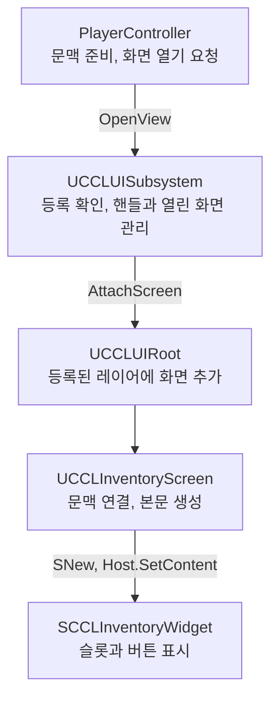

# 인벤토리 UI: 화면 생성과 입력 관리를 분리한 이유

인벤토리 UI는 처음에 `PlayerController`가 화면 생성부터 입력 설정까지 직접 처리했다. 비교 대상인 현재 구현에서는 플레이어별 공용 UI 관리자가 화면의 수명을 관리하고, 인벤토리 화면은 자신의 표시와 정리에 집중한다.

이 장에서는 실제 이전·현재 코드를 비교하면서 책임을 나눈 이유를 살펴본다. 특히 `SNew`, 문맥 객체, 화면 태그와 핸들이 각각 어떤 역할을 하는지 이해하는 것이 목표다. 대상은 `Source/CCL/CCLPlayerController.cpp`와 `Source/CCL/UI/`의 인벤토리 화면 연결이다. 아이템 저장·장착 판정 전체는 [ProgressionFoundation](../ProgressionFoundation.md)이 소유한다.

## 1. 비교 기준

2026-10-09 예시 작성 시 로컬에서 확인한 브랜치는 `main`과 같은 커밋을 가리키는 `origin/main`이었다. 원격 서버를 새로 조회한 결과는 아니다. 이 장은 해당 이력의 커밋을 기준으로 비교하며, 이후 저장소가 진행돼도 아래 기준을 유지한다.

| 구분 | 기준 | 의미 |
|---|---|---|
| 이전 구현 | `b5d9495` | 공용 UI 기반은 추가됐지만 인벤토리는 아직 컨트롤러가 직접 관리 |
| 전환 커밋 | `494a0ac` | 인벤토리와 세션 메뉴를 공용 UI 관리 경로로 이전 |
| 현재 구현 | `5e2050b` | 이 장에서 ‘현재’라고 부르는 비교 대상 |

전체 커밋은 각각 `b5d9495d99bcfb903a7f5ef205f9f5b2cfcfe45e`, `494a0ac977c7037d8ca732eeb27edbc317162f1f`, `5e2050b72ab722f7b18745ef1c4363a644495e62`다. 이전 코드는 첫 번째 커밋, 별도 표기가 없는 현재 프로젝트 코드는 마지막 커밋의 발췌다. 저장 시 대상 소스에 미커밋 차이가 없음을 확인했다.

코드는 필요한 부분을 발췌하고 줄바꿈했다. 함수 일부만 인용한 곳은 본문에 표시한다. 설명을 위해 든 문제 상황은 실제 발생한 버그 기록과 구분한다. 당시 코드와 경로·줄 번호는 기준 커밋으로 대조하며, 상대 링크는 현재 체크아웃 파일을 연다.

엔진 매크로 설명은 별도로 확인한 설치본의 `<Engine>/Build/Build.version` 기준 UE 5.8.3 소스를 사용한다. 이는 과거 프로젝트 커밋의 빌드·실행 엔진을 판정하는 근거는 아니다. 작성 형식은 [시스템 학습 문서 작성 규칙](../SystemExplanationGuide.md)을 따른다.

## 2. 인벤토리를 열 때 필요한 일

플레이어가 인벤토리를 열면 아이템 목록과 캐릭터 미리보기가 나타난다. 마우스로 슬롯을 선택할 수 있어야 하고, 화면을 닫으면 다시 캐릭터를 조작할 수 있어야 한다.

이를 구현하려면 몇 가지 처리가 함께 움직여야 한다.

1. 화면에 사용할 선택 상태를 준비한다.
2. 위젯을 만들고 화면에 배치한다.
3. 키보드와 마우스 입력을 받을 대상을 정한다.
4. 닫을 때 위젯, 드래그 상태, 미리보기 자원을 정리한다.

처음에는 이 처리를 모두 `PlayerController`에 두면 흐름을 찾기 쉽다. 입력을 받은 컨트롤러에서 곧바로 화면을 만들 수 있기 때문이다.

이후 화면 종류가 늘어나면 인벤토리뿐 아니라 일시정지 메뉴, 대화창, 지도도 함께 고려해야 한다. 이때부터 화면마다 반복되는 처리와 인벤토리에만 필요한 처리를 구분할 필요가 생긴다.

## 3. 코드를 읽기 위한 Slate 기초

### Slate 위젯과 SNew

Slate는 Unreal에서 C++로 UI를 구성하는 프레임워크다. 이 프로젝트의 `SCCLInventoryWidget`은 Slate 위젯이며 `SCompoundWidget`을 상속한다.

다음은 해당 위젯을 만드는 코드다.

```cpp
InventoryWidget = SNew(SCCLInventoryWidget)
    .Controller(this);
```

`SNew`는 엔진이 제공하는 매크로다. 지정한 Slate 위젯을 생성하고 Slate의 초기화 과정을 거쳐 `TSharedRef<SCCLInventoryWidget>`을 반환한다.

이 문법은 UE4에서도 사용하던 방식이다. UE5에서도 사용할 수 있으며, 이번 구조 변경 뒤에도 유지된다.

그런데 `.Controller(this)`는 생성된 위젯의 일반 멤버 함수를 호출하는 것처럼 보인다. 실제로는 **위젯을 초기화할 인자를 설정하는 표현**이다.

### Controller 인자 선언

프로젝트 헤더에는 다음 선언이 있다.

```cpp
SLATE_BEGIN_ARGS(SCCLInventoryWidget) {}
    SLATE_ARGUMENT(TWeakObjectPtr<ACCLPlayerController>, Controller)
SLATE_END_ARGS()
```

이 매크로들은 `FArguments`라는 초기화 인자 구조체를 구성한다. `SLATE_ARGUMENT`는 `Controller`라는 인자와 그 값을 설정할 `.Controller(...)` 함수를 제공한다.

따라서 앞의 표현은 ‘`SCCLInventoryWidget`을 초기화할 때 `Controller` 인자로 현재 컨트롤러를 전달한다’라고 읽으면 된다.

전달한 값은 위젯의 `Construct`에서 받는다. 아래는 실제 함수의 시작 부분이며 생략 주석은 설명을 위해 추가했다.

```cpp
void SCCLInventoryWidget::Construct(const FArguments& Args)
{
    Controller = Args._Controller;

    // 이하 내부 UI 구성 생략
}
```

`Args._Controller`의 밑줄은 앞의 `SLATE_ARGUMENT`가 생성한 인자 필드의 이름에 포함된다.

여기서 사용하는 `TWeakObjectPtr`는 컨트롤러를 강제로 살려 두지 않는 약한 참조다. 나중에 사용할 때 대상이 아직 유효한지 확인해야 한다.

또한 Slate 위젯은 `TSharedRef`와 `TSharedPtr` 같은 공유 포인터로 수명을 관리한다. 뒤에서 나올 `UCCLInventoryContext`는 `UObject` 계열이므로 `NewObject`로 생성한다. 코드에서 두 생성 방식이 등장하는 이유는 생성 대상의 종류가 다르기 때문이다.

근거: `<Engine>/Source/Runtime/SlateCore/Public/Widgets/DeclarativeSyntaxSupport.h:37`의 `SNew`, 같은 파일의 `TSlateDecl::operator<<=`와 `CallConstruct`; [SCCLInventoryWidget.h](../../Source/CCL/UI/SCCLInventoryWidget.h):12의 인자 선언; [SCCLInventoryWidget.cpp](../../Source/CCL/UI/SCCLInventoryWidget.cpp):208의 `Construct`.

## 4. 이전 구현: 컨트롤러가 직접 화면을 관리

### 화면 열기

이전 `ToggleInventory`에서 화면을 생성하고 입력을 설정하던 부분이다. 앞쪽의 생존 여부와 메뉴 표시 여부 검사는 생략했다. 출처는 `b5d9495`의 `Source/CCL/CCLPlayerController.cpp`, `ACCLPlayerController::ToggleInventory`다.

```cpp
CloseDialogue();
FlushPressedKeys();

bInventoryOpen = 1;
SelectedItem = 0;
SelectedEquipment.Invalidate();

UpdateEquipmentPreview();

InventoryWidget = SNew(SCCLInventoryWidget).Controller(this);
GetWorld()->GetGameViewport()->AddViewportWidgetContent(
    InventoryWidget.ToSharedRef(), 20);

bShowMouseCursor = true;

FInputModeGameAndUI Mode;
Mode.SetWidgetToFocus(InventoryWidget);
Mode.SetHideCursorDuringCapture(false);
Mode.SetLockMouseToViewportBehavior(EMouseLockMode::DoNotLock);

SetInputMode(Mode);
```

코드를 위에서부터 읽어 보자.

먼저 기존 대화를 닫고 눌린 입력을 정리한다. 그다음 인벤토리가 열렸다는 상태를 기록하고 선택된 슬롯을 초기화한다.

`UpdateEquipmentPreview()`는 캐릭터 미리보기를 준비한다. 이후 `SNew`로 위젯을 생성하고 `AddViewportWidgetContent`로 게임 뷰포트에 붙인다. 마지막 인자 `20`은 배치 순서를 지정하는 값이다.

끝부분에서는 커서를 표시하고 입력 모드를 설정한다. `SetWidgetToFocus`는 키보드 입력의 포커스를 받을 위젯을 지정한다. 포커스는 현재 키보드 조작의 대상이라고 이해하면 된다.

`FInputModeGameAndUI`는 UI와 게임 입력을 함께 다룬다. 이 설정만으로 모든 게임 행동이 차단되는 것은 아니므로, 게임플레이 쪽에서도 인벤토리가 열린 동안 허용할 행동을 판단해야 한다.

여기까지 보면 컨트롤러가 맡은 일이 드러난다. 선택 상태, 미리보기, 위젯 생성, 배치, 커서와 입력 모드를 모두 알고 있다.

### 화면 닫기

이전 `CloseInventory`에서는 위젯과 미리보기를 정리한 뒤 다음 코드를 실행했다. 아래는 `b5d9495`의 같은 파일에 있는 `ACCLPlayerController::CloseInventory` 중 입력 복구 부분의 발췌다.

```cpp
InventoryWidget.Reset();

if (IsLocalController())
{
    if (FSlateApplication::IsInitialized())
    {
        FSlateApplication::Get().CancelDragDrop();
    }

    FlushPressedKeys();

    bShowMouseCursor = false;
    SetInputMode(FInputModeGameOnly());
}
```

`Reset()`은 컨트롤러가 보관한 공유 포인터를 비운다. 앞선 처리에서 뷰포트에 붙인 위젯도 제거한다.

마지막 두 줄은 인벤토리를 닫은 뒤 돌아갈 상태를 직접 지정한다. 커서를 숨기고 게임 전용 입력으로 바꾸는 것이다.

이 구조에서는 ‘인벤토리를 닫은 뒤 어떤 입력 상태가 되어야 하는가’도 컨트롤러의 인벤토리 코드가 판단한다.

## 5. 변경 계기: 여러 화면에 공통으로 적용할 규칙

프로젝트의 결정 17에는 화면이 늘어날 때 사용할 공용 관리자와 위젯 베이스를 도입한다는 요구가 기록돼 있다. 지도, 능력치, NPC 대화와 퀘스트 등을 연결하고 연출 중 여러 UI를 함께 제어해야 한다는 요구도 포함한다.

이 요구를 앞의 코드에 대입해 보자.

예를 들어 인벤토리 위에 확인 창이 떠 있는 상황을 가정하자. 인벤토리가 닫혔다고 곧바로 다음 코드를 실행하면:

```cpp
SetInputMode(FInputModeGameOnly());
```

남아 있는 확인 창이 필요로 하는 입력 상태를 반영하지 못할 수 있다. 이는 구조의 제약을 설명하기 위한 가정이며, 이 장에서 확인한 실제 버그 발생 기록은 아니다.

이를 기능마다 해결하려면 인벤토리 코드가 다른 메뉴의 상태도 알아야 한다. 지도나 대화창에도 비슷한 조정이 필요해진다.

공용 관리자를 도입하면 화면의 등록, 열기, 닫기와 수명 규칙을 한곳에서 관리할 수 있다. 각 화면은 필요한 입력 정책을 제공하고 CommonUI가 최종 입력 설정을 적용하도록 구성한다.

다만 공용 관리자가 아이템 장착 규칙이나 퀘스트 완료 조건까지 알아야 하는 것은 아니다. 결정 17은 이러한 게임 규칙과 서버 검증을 기능 계층에 남기도록 정했다.

근거: [DesignLog](../DesignLog.md):253의 결정 17, 배경·결정·트레이드오프.

## 6. 현재 구현: 화면을 요청하는 코드

현재 컨트롤러는 인벤토리를 열 수 있는지 확인한 뒤 공용 UI 관리자에 화면을 요청한다. 다음은 `ToggleInventory`의 관리자 연결 부분이다.

```cpp
if (auto* UI = CCLGameUI::Get(this))
{
    CloseDialogue();
    FlushPressedKeys();

    UI->OnViewClosed.RemoveAll(this);
    UI->OnViewClosed.AddUObject(
        this, &ThisClass::HandleUIViewClosed);

    InventoryContext = NewObject<UCCLInventoryContext>(this);
    InventoryContext->Initialize(this);

    InventoryHandle = UI->OpenView(
        CCLUITags::View_Inventory,
        InventoryContext,
        this);

    if (!InventoryHandle.IsValid())
    {
        InventoryContext->Release();
        InventoryContext = nullptr;
    }
}
```

여기서는 처음 보는 이름이 많아졌다. 각각이 기존 코드의 어떤 책임을 가져갔는지 연결해서 읽어야 한다.

### 플레이어별 관리자

위 조건문에서 관리자 조회 부분을 독립된 문장으로 쓰면 다음과 같다.

```cpp
auto* UI = CCLGameUI::Get(this);
```

`CCLGameUI::Get`은 컨트롤러의 `LocalPlayer`에서 `UCCLUISubsystem`을 가져오는 프로젝트 함수다.

`LocalPlayer`는 이 클라이언트에서 플레이하는 로컬 플레이어를 나타낸다. 공용 UI 관리자를 여기에 두면 화면을 플레이어별로 구분할 수 있다. 같은 프로세스의 두 번째 로컬 플레이어가 메뉴를 열 때 첫 번째 플레이어의 화면과 섞이지 않도록 하는 구조다.

관리자 수명과 화면 수명은 별개다. 관리자가 살아 있어도 월드 범위 화면은 맵 이동 때 닫을 수 있다.

### 닫힘 알림

```cpp
UI->OnViewClosed.RemoveAll(this);
UI->OnViewClosed.AddUObject(
    this, &ThisClass::HandleUIViewClosed);
```

화면은 컨트롤러의 `CloseInventory` 호출 외에도 공용 UI 경로에서 닫힐 수 있다. 컨트롤러는 닫힘 알림을 받아 자신이 보관한 상태를 정리해야 한다.

`OnViewClosed`는 여러 구독자에게 알림을 전달하는 델리게이트다. 기존 구독을 제거한 뒤 다시 연결하는 코드는 같은 컨트롤러의 구독이 중복으로 쌓이는 것을 막는다.

### 화면에 필요한 상태를 담는 문맥

```cpp
InventoryContext = NewObject<UCCLInventoryContext>(this);
InventoryContext->Initialize(this);
```

문맥, 즉 Context는 이번에 여는 화면에 필요한 상태와 참조를 담는다. 이 프로젝트의 인벤토리 문맥은 선택된 아이템과 장비, 컨트롤러 참조, 미리보기 자원을 다룬다.

실제 초기화 코드는 다음과 같다.

```cpp
void UCCLInventoryContext::Initialize(
    ACCLPlayerController* InController)
{
    Controller = InController;
    Pawn = InController
        ? Cast<ACCLCharacter>(InController->GetPawn())
        : nullptr;

    SelectedItem = 0;
    SelectedEquipment.Invalidate();
}
```

이전에는 컨트롤러가 직접 보관하던 `SelectedItem`과 `SelectedEquipment`가 문맥으로 이동했다.

이 문맥은 화면에 필요한 상태를 담당한다. 서버가 관리하는 실제 보유 아이템이나 장착 판정의 소유권까지 가져오지는 않는다.

### 화면 태그와 핸들

```cpp
InventoryHandle = UI->OpenView(
    CCLUITags::View_Inventory,
    InventoryContext,
    this);
```

여기서 태그와 핸들을 구분해야 한다.

| 값 | 식별하는 대상 | 이 코드에서의 역할 |
|---|---|---|
| `View_Inventory` | 화면의 종류 | 인벤토리 화면을 요청 |
| `InventoryHandle` | 실제로 열린 창 하나 | 나중에 그 창을 조회하거나 닫음 |

같은 종류의 화면을 여러 개 허용하는 시스템에서는 종류만으로 닫을 창을 구분하기 어렵다. 공용 기반이 창마다 핸들을 제공하는 이유다. 실제로 여러 창을 허용할지는 등록된 인스턴스 정책이 결정한다.

마지막 `this`는 화면 요청의 소유자로 전달된다. 관리자는 화면과 함께 소유자를 기록하고 유효성을 확인한다.

열기에 실패하면 유효하지 않은 핸들이 반환된다. 이때는 만들어 둔 문맥을 정리한다. 문맥 객체를 생성했다는 사실만으로 화면이 열렸다고 판단하지 않는 것이다.

근거: [CCLPlayerController.cpp](../../Source/CCL/CCLPlayerController.cpp):257의 `ToggleInventory`, :830의 `HandleUIViewClosed`; [CCLInventoryScreen.cpp](../../Source/CCL/UI/CCLInventoryScreen.cpp):18의 `Initialize`; [CCLGameUI.cpp](../../Source/CCL/UI/CCLGameUI.cpp):32의 `Get`; [CCLUISubsystem.cpp](../../Source/CCL/UI/Core/CCLUISubsystem.cpp):238의 `OpenView`.

## 7. OpenView 이후 실제 화면이 만들어지는 과정

컨트롤러의 코드는 짧아졌지만 위젯을 만들고 배치하는 작업은 여전히 필요하다. 이제 그 처리를 따라가 보자.

### 태그와 화면 클래스를 연결하는 등록 데이터

관리자는 `View_Inventory`라는 태그만 보고 클래스 이름을 추측하지 않는다. 프로젝트가 구성한 등록 데이터에서 어떤 화면을 사용할지 찾는다.

다음은 인벤토리의 실제 등록 코드다.

```cpp
FCCLUIViewDefinition View;

View.Tag = CCLUITags::View_Inventory;
View.WidgetClass = UCCLInventoryScreen::StaticClass();
View.RequiredContextClass = UCCLInventoryContext::StaticClass();

View.Layer = CCLUITags::Layer_Panels;
View.Groups.AddTag(CCLUITags::Group_Menus);
View.InputPolicy = ECCLUIInputPolicy::Menu;

Registry->Views.Add(View);
```

이 등록은 다음 내용을 함께 정한다.

- 어떤 태그로 화면을 요청하는가.
- 어떤 화면 클래스와 문맥 타입을 사용하는가.
- 어느 레이어에 배치하는가.
- 어떤 입력 정책을 요구하는가.

레이어는 화면을 배치하고 관리하는 구획이다. 그룹은 여러 화면에 표시 제어를 함께 적용할 때 사용할 분류다.

화면 클래스와 필요한 문맥 타입을 데이터로 등록했기 때문에 공용 관리자는 인벤토리 전용 분기문 없이 등록 정보를 사용할 수 있다. 대신 잘못된 클래스나 문맥이 등록되지 않도록 검증하는 비용이 생긴다.

### 화면 연결과 Slate 본문 생성

`OpenView`는 등록과 요청을 검증하고 열린 화면의 기록을 만든다. 이어서 `AttachScreen`이 루트에 화면 추가를 요청하고, 화면에 문맥과 입력 정책을 연결한다.

그 결과 인벤토리 화면의 다음 함수가 호출된다.

```cpp
void UCCLInventoryScreen::OnContextBound()
{
    if (auto* Context = Cast<UCCLInventoryContext>(GetContext()))
    {
        Context->UpdatePreview();

        Body = SNew(SCCLInventoryWidget)
            .Controller(Context->GetController());

        Host->SetContent(Body.ToSharedRef());
    }
}
```

여기에도 `SNew(SCCLInventoryWidget)`이 있다. 기존 Slate 본문을 계속 사용하고 있는 것이다.

이전에는 컨트롤러가 본문을 만들어 뷰포트에 직접 붙였다. 현재는 `UCCLInventoryScreen`이 본문을 만들고 `UNativeWidgetHost`인 `Host`에 넣는다. 이 호스트는 UMG 화면 안에 Slate 위젯을 담는 역할을 한다.

전체 연결은 다음과 같다. 중간 검증과 실패 경로를 생략한 흐름도다.



근거: [CCLGameUI.cpp](../../Source/CCL/UI/CCLGameUI.cpp):57의 화면 등록; [CCLUISubsystem.cpp](../../Source/CCL/UI/Core/CCLUISubsystem.cpp):420의 `AttachScreen`; [CCLInventoryScreen.cpp](../../Source/CCL/UI/CCLInventoryScreen.cpp):144의 `OnContextBound`.

## 8. 입력 설정이 이동한 위치

이전 구현에서는 인벤토리 코드가 `SetInputMode`를 직접 호출했다. 현재 등록 데이터는 인벤토리의 입력 정책을 `Menu`로 지정한다.

```cpp
View.InputPolicy = ECCLUIInputPolicy::Menu;
```

이 값은 프로젝트가 정의한 정책이다. 화면 베이스인 `UCCLScreen`은 이 정책을 CommonUI가 사용하는 입력 설정으로 변환한다.

다음은 `GetDesiredInputConfig`의 마지막 부분이다. 앞쪽에서 게임 전용 정책과 외부 게임 입력 차단 여부를 처리한다.

```cpp
const bool bMenuInput =
    InputPolicy == ECCLUIInputPolicy::Menu || bBlockGameplay;

FUIInputConfig Config(
    bMenuInput ? ECommonInputMode::Menu : ECommonInputMode::All,
    EMouseCaptureMode::NoCapture,
    EMouseLockMode::DoNotLock,
    false);

Config.bIgnoreMoveInput = bMenuInput;
Config.bIgnoreLookInput = bMenuInput;

return Config;
```

`FUIInputConfig`는 화면이 원하는 입력 구성을 CommonUI에 전달한다. 현재 `Menu` 정책에서는 이동과 시점 입력을 무시하도록 지정한다.

CommonUI의 Action Router는 UI 입력을 어떤 활성 화면으로 전달하고 어떤 입력 설정을 적용할지 관리하는 엔진 구성 요소다. 프로젝트 화면이 자신의 요구를 제공하고 최종 적용을 이 경로로 모으는 것이다.

전투 행동의 허용 여부나 서버 검증은 여전히 게임플레이의 책임이다. UI 입력을 막았다는 이유만으로 게임 규칙의 검증을 생략할 수는 없다.

근거: [CCLScreen.cpp](../../Source/CCL/UI/Core/CCLScreen.cpp):18의 `GetDesiredInputConfig`; [UIFoundation](../UIFoundation.md)의 입력과 연출 계약 및 엔진 근거.

## 9. 현재 구현: 닫기와 자원 정리

현재 컨트롤러의 `CloseInventory`는 다음과 같다.

```cpp
void ACCLPlayerController::CloseInventory()
{
    if (const auto* Local = GetLocalPlayer())
    {
        if (auto* UI = Local->GetSubsystem<UCCLUISubsystem>())
        {
            UI->CloseView(InventoryHandle);
        }
    }

    InventoryHandle = {};
    InventoryContext = nullptr;
}
```

컨트롤러는 보관한 핸들로 닫기를 요청한다. 뷰포트에서 위젯을 제거하거나 게임 전용 입력을 직접 지정하는 코드는 여기서 사라졌다.

그렇다면 미리보기와 드래그는 어디에서 정리할까? 관리자가 루트에서 화면을 제거하면 문맥 해제가 호출되고, 인벤토리 화면이 다음 처리를 수행한다.

```cpp
void UCCLInventoryScreen::OnContextReleased()
{
    if (Host)
    {
        Host->SetContent(SNullWidget::NullWidget);
    }

    Body.Reset();

    if (auto* Context = Cast<UCCLInventoryContext>(GetContext()))
    {
        if (auto* PC = Context->GetController())
        {
            SCCLInventoryWidget::CancelOwnedDrag(PC);
            PC->FlushPressedKeys();
        }

        Context->Release();
    }
}
```

`SNullWidget::NullWidget`은 빈 위젯이다. 호스트의 본문을 비우고 `Body` 참조도 해제한다. 이어서 해당 컨트롤러가 소유한 드래그와 눌린 입력을 정리한다.

마지막 `Context->Release()`는 미리보기 카메라를 제거하고 문맥이 보관한 참조를 해제한다.

이 정리를 화면 객체의 최종 파괴에만 맡기지 않는 이유도 있다. 공용 UI는 화면 객체를 풀에 보관했다가 재사용할 수 있다. **화면을 닫는 시점과 객체가 파괴되는 시점이 다를 수 있으므로**, 이번에 연결한 문맥과 자원은 닫을 때 정리해야 한다.

근거: [CCLPlayerController.cpp](../../Source/CCL/CCLPlayerController.cpp):289의 `CloseInventory`; [CCLUIRoot.cpp](../../Source/CCL/UI/Core/CCLUIRoot.cpp):150의 `RemoveScreen`; [CCLInventoryScreen.cpp](../../Source/CCL/UI/CCLInventoryScreen.cpp):154의 `OnContextReleased`, 같은 파일의 `UCCLInventoryContext::Release`.

## 10. 선택한 구조와 대안의 비용

이 변경은 화면을 여는 기능 하나에 더 많은 클래스와 계약을 도입했다. 따라서 코드 줄 수가 줄었다는 이유만으로 평가하기는 어렵다.

비교할 대상은 기능이 늘어났을 때 각 방식이 부담하는 비용이다. 아래 비교는 실제 코드와 결정 17, UIFoundation에 기록된 이전 방침을 바탕으로 한 분석이다.

| 방식 | 장점 | 비용과 제약 |
|---|---|---|
| 컨트롤러가 직접 관리 | 한 화면의 열기·닫기 흐름을 따라가기 쉬움 | 화면마다 입력, 정리, 다른 화면과의 관계를 처리해야 함 |
| 공용 관리자와 기존 Slate 본문 사용 | 화면 수명과 입력 규칙을 공용화하면서 기존 본문을 유지 | 등록, 문맥, 핸들 계약과 수명 검증이 필요 |
| 공용 관리자 도입과 함께 본문도 UMG로 재작성 | 본문 배치를 UMG에서 편집하기 쉬움 | 기존 슬롯, 버튼, 드래그 동작까지 다시 구현하고 검증할 범위가 커짐 |

프로젝트는 가운데 방식을 선택했다. 공용 화면 관리와 입력 경로를 도입하면서 기존 Slate 본문을 유지했다.

그 결과 UMG 화면 안에 들어갔어도 Slate 본문의 내부 배치를 UMG 디자이너에서 직접 편집할 수는 없다. 이 제약은 현재 선택의 비용으로 남아 있다.

또한 공용 관리자는 인벤토리의 세부 규칙을 직접 알지 않지만, 기존 Slate 본문은 여전히 컨트롤러를 전달받는다. 이번 변경으로 기능 코드의 모든 의존성이 제거됐다고 해석해서는 안 된다.

기록된 선택 이유와 제약은 [UIFoundation의 이전 설명](../UIFoundation.md)에서 확인할 수 있다.

## 11. 변경 결과를 확인하는 방법

화면이 한 번 열리는 것만으로 이번 구조 변경을 검증할 수는 없다. 열기와 닫기 사이에 어떤 상태가 남는지 확인해야 한다.

| 확인할 상황 | 확인할 내용 |
|---|---|
| 인벤토리 열기와 닫기 | 화면 표시, 포커스, 입력 복구가 맞는지 |
| 슬롯을 드래그하다 닫기 | 드래그와 눌린 입력이 남지 않는지 |
| 닫은 뒤 다시 열기 | 이전 문맥과 선택 상태가 잘못 남지 않는지 |
| 인벤토리 표시 중 사망·재스폰 | 이전 캐릭터의 미리보기와 참조가 정리되는지 |
| 로컬 플레이어 두 명 사용 | 한 플레이어의 메뉴 조작이 다른 플레이어 화면을 잘못 닫지 않는지 |
| 맵 이동 | 화면 범위에 맞게 닫히거나 다시 연결되는지 |

기존 [UIFoundation](../UIFoundation.md) 문서에는 드래그 중 닫기, 화면 풀 재사용, 메뉴 입력, 재스폰, 로컬 플레이어 분리 등을 검사한 결과와 로그 경로가 기록돼 있다.

이 장을 작성하면서는 코드와 그 기록을 대조했다. 게임 실행 검사를 새로 수행한 것은 아니다.

## 12. 이해 확인

**1. 현재도 SNew를 사용하는 이유는 무엇일까?**

기존 Slate 본문을 유지했기 때문이다. 생성 위치가 `PlayerController`의 인벤토리 열기 처리에서 `UCCLInventoryScreen::OnContextBound`로 이동했다.

**2. View_Inventory가 있는데 InventoryHandle도 필요한 이유는 무엇일까?**

태그는 화면 종류를 식별하고 핸들은 열린 창 하나를 식별한다. 화면 종류와 실행 중인 창을 구분해야 개별 창의 수명을 관리할 수 있다.

**3. 화면을 닫을 때 게임 전용 입력 모드를 직접 지정하지 않는 이유는 무엇일까?**

닫힌 화면 외에 남아 있는 화면과 현재 표시 요청도 입력 상태에 영향을 주기 때문이다. 현재 구조는 화면의 요구를 CommonUI 입력 경로에서 반영한다.

**4. OnContextReleased에서 미리보기와 드래그를 정리하는 이유는 무엇일까?**

화면 객체가 재사용을 위해 살아 있어도 이번 화면 사용은 끝났기 때문이다. 객체 파괴를 기다리면 이전 문맥과 자원이 다음 사용에 남을 수 있다.
