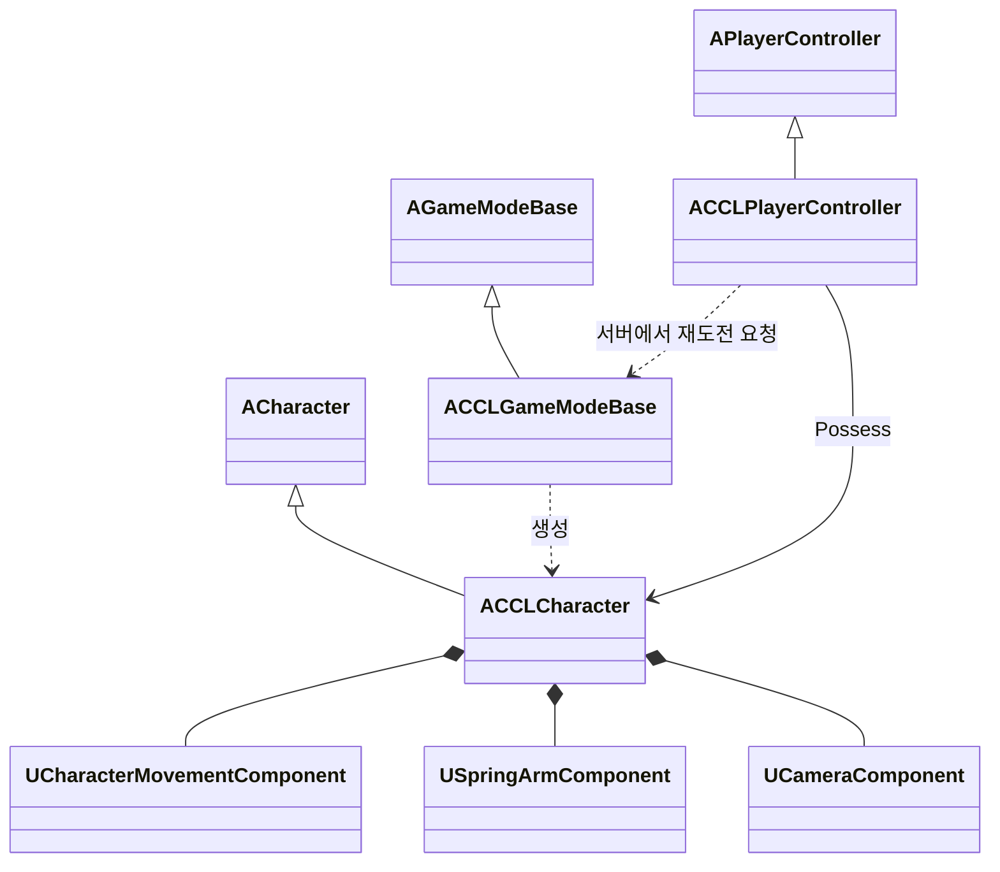

# 멀티플레이 기본 흐름 설계 초안

접속한 플레이어의 스폰, 이동과 카메라, 사망 후 재도전을 연결한다. [제작 로드맵](StudyRoadmap.md)의 순서 1에 해당하며, 현재는 설계 단계다. 아래 클래스와 인터페이스는 구현 제안이다. 인원, 서버 형태와 사망 규칙은 사용자 답변을 받은 뒤 확정한다.

## 목표와 제약

서버가 캐릭터의 생성과 사망을 결정하고 각 클라이언트는 자신이 소유한 캐릭터를 조작하도록 설계한다. 첫 검증은 PIE에서 수행한다. 방 검색과 접속 UI, 저장, 적과의 전투는 이후 작업 범위다. 확정 범위와 순서는 [결정 3](DesignLog.md), 파일 수정 권한은 [Coding](Coding.md)을 따른다.

2026-10-06 로컬 확인에서 `<Engine>/Build/Build.version`은 UE 5.8.2, Changelist 56702186이었다. 아래 엔진 근거는 이 설치본에서 확인했다. 프로젝트 문서의 기본 엔진 기준은 5.8.1이므로 빌드 결과에는 실제 사용 버전을 따로 남긴다.

| 검토 항목 | 추천안 | 대안과 비용 | 상태 |
|---|---|---|---|
| 플레이 형태 | 2인 협동, 리슨 서버 | 4인 협동은 동시 스폰과 전투 가독성의 검증 범위가 늘어난다. 전용 서버는 호스트 의존을 줄이지만 서버 배포와 운영이 필요하다 | 사용자 선택 대기 |
| 사망과 재도전 | 사망한 플레이어가 재도전 입력으로 시작 지점에 재스폰 | 전원 사망 후 재시작은 관전과 파티 상태 판정이 필요하며 생존자의 플레이에도 영향을 준다 | 사용자 선택 대기 |
| 카메라와 입력 | 3인칭 자유 카메라, 키보드·마우스로 첫 검증 | 고정 카메라는 공간별 연출 설계가 필요하다. 게임패드는 감도와 UI 탐색 검증이 추가된다 | AI 구현 제안 |
| 검증용 외형 | 단순 도형으로 조작과 네트워크를 먼저 확인 | 기존 마네킹은 사람 비례를 확인하기 좋지만 이동 애니메이션 연결이 추가된다 | AI 구현 제안 |

월드 진행의 소유자, 호스트 이탈 시 처리와 게스트 성장 저장은 미정이다. 기본 흐름의 완료를 해당 기능의 완료로 간주하지 않는다.

## 책임과 수명

다음 구조는 개별 재스폰을 선택했을 때의 초안이다. 전원 재시작을 선택하면 파티 진행 상태를 소유하는 GameState와 관전 흐름을 추가로 설계한다.

| 타입 | 책임 | 생성과 소멸 | 네트워크 권위 |
|---|---|---|---|
| `ACCLGameModeBase` | 시작 위치 선택, 사망 후 재스폰 허용, 캐릭터 생성 | 월드가 열릴 때 생성, 월드 종료 시 소멸 | 서버 전용 |
| `ACCLPlayerController` | 로컬 입력 설정, 재도전 요청 전달 | 접속 때 생성, 접속 종료 시 소멸. 캐릭터 재생성 사이에도 유지 | 서버와 소유 클라이언트 |
| `ACCLCharacter` | 이동, 카메라 구성, 해당 생명의 사망 상태 | 스폰 때 생성, 재도전 시 이전 캐릭터 정리 | 사망 상태는 서버 결정 후 복제 |
| `UCharacterMovementComponent` | 캐릭터 이동과 네트워크 이동 처리 | Character의 컴포넌트로 함께 생성·소멸 | 엔진 이동 경로 사용 |
| `USpringArmComponent`, `UCameraComponent` | 로컬 플레이어 시점 | Character와 함께 생성·소멸 | 로컬 시점 처리 |

사망 여부는 Character의 `uint8 bDead`로 둔다. 사망 상태를 `ReplicatedUsing`으로 전달하고 서버와 클라이언트가 같은 표현 함수를 호출하도록 제안한다. 영구 성장 정보가 없는 범위에서는 커스텀 PlayerState를 추가하지 않는다.

## 클래스 관계



상속은 빈 삼각형, 컴포넌트 소유는 채운 마름모, 참조는 실선 화살표로 표시했다. GameMode의 생성 의존은 점선 화살표다.

## 인터페이스 초안

다음 선언은 각 클래스 헤더에 들어갈 후보이며 아직 소스에 추가하지 않았다.

```cpp
// ACCLCharacter
public:
    bool IsDead() const { return bDead != 0; }
    void Die(); // 서버에서만 상태 변경
protected:
    UPROPERTY(ReplicatedUsing = OnRep_Dead)
    uint8 bDead = 0;

    UFUNCTION()
    void OnRep_Dead();

// ACCLPlayerController
protected:
    UFUNCTION(Server, Reliable)
    void ServerRequestRetry();

// ACCLGameModeBase
public:
    void RequestRetry(ACCLPlayerController* Player);
```

재도전 RPC는 대상 캐릭터나 위치를 인자로 받지 않는다. 서버가 요청자의 현재 Pawn과 사망 상태를 확인한다. 살아 있는 캐릭터의 요청과 이미 처리한 요청은 무시한다. 입력은 Enhanced Input의 Action과 Mapping Context를 사용하고 `CCL.Build.cs`에 `EnhancedInput` 의존성을 추가하는 안이다.

## 재도전 코드 예시

아래는 개별 재스폰의 정상 경로 예시다. UE 5.8의 `RestartPlayer`를 사용하며, 아직 컴파일한 게임 구현은 아니다.

```cpp
void ACCLGameModeBase::RequestRetry(ACCLPlayerController* Player)
{
    if (!HasAuthority() || !IsValid(Player))
    {
        return;
    }

    ACCLCharacter* Character = Cast<ACCLCharacter>(Player->GetPawn());
    if (!IsValid(Character) || !Character->IsDead())
    {
        return;
    }

    Player->UnPossess();
    Character->Destroy();
    RestartPlayer(Player);
}
```

실제 구현에는 스폰 실패 시 Pawn이 없는 상태에서도 다시 시도할 수 있는 서버 소유 대기 상태가 필요하다. 타이머로 재시도한다면 접속 종료 때 취소한다. 정상 경로 예시만으로 완료 판정을 내리지 않는다.

## 검증 기준

아래는 실행할 검증 계획이다. 게임 구현과 플레이 검증은 아직 수행하지 않았다.

기준 빌드는 `Build.bat CCLEditor Win64 Development -Project=<repository>/CCL.uproject -WaitMutex -NoHotReloadFromIDE`로 시도했다. UnrealBuildTool 실행 메시지 이후 추가 출력이 없어 중단했으며, 성공 여부는 미확인이다. 명령의 실제 경로는 자리표시자로 치환했다. 빌드 실행 환경 확인이 다음 검증 작업에 포함된다.

| 조건 | 예상 결과 | 확인할 증거 |
|---|---|---|
| 서버와 클라이언트 접속 | 서로 다른 Character를 소유하고 겹치지 않는 시작 위치에 스폰 | 서버의 Controller/Pawn 식별 로그, 각 화면 |
| 두 플레이어가 다른 방향으로 이동 | 본인 입력만 본인 Character에 반영되고 상대 이동도 보임 | 각 화면과 서버 위치 로그 |
| 한 플레이어가 카메라 회전 | 해당 플레이어 시점만 회전 | 각 화면 |
| 검증용 사망 또는 낙하 | 서버가 사망을 한 번 처리하고 이동을 막음 | 서버 상태 전이와 클라이언트 사망 표현 |
| 사망 후 재도전 | 선택한 재도전 규칙에 따라 캐릭터와 조작 복구 | 이전 Pawn 제거, 새 Pawn 소유, 입력과 카메라 복구 |
| 생존 중 재도전, 재도전 연속 입력 | 부당한 스폰과 중복 캐릭터 생성 없음 | 서버 거부 로그와 Pawn 수 |
| 시작 위치가 막힘, 재도전 중 접속 종료 | 실패를 기록하고 중복 생성이나 잘못된 참조 접근 없음 | 서버 로그와 복구 결과 |
| 별도 프로세스 접속 | 같은 기본 흐름 재현 | 서버·클라이언트 프로세스별 로그 |

AI는 C++ 빌드 결과와 실제 멀티플레이 실행 결과를 분리해 기록한다. 빌드 성공만으로 이동·카메라·재도전 검증을 대체하지 않는다. 패키징 실행은 [로드맵](StudyRoadmap.md)의 순서 1-3 사이에 추가 확인한다.

## 엔진 근거와 선택 이유

UE 5.8.2의 `<Engine>/Source/Runtime/Engine/Private/GameModeBase.cpp:1068`에서 `HandleStartingNewPlayer_Implementation`은 관전 여부와 재시작 가능 여부를 확인한 뒤 `RestartPlayer`를 호출한다. 같은 파일의 `:1241`은 시작 위치 선택, `:1264`의 `RestartPlayerAtPlayerStart`는 Pawn 확인과 생성, `:1362`는 `Possess`를 담당한다.

`RestartPlayerAtPlayerStart`는 이미 Pawn이 있으면 그 Pawn을 사용한다. 따라서 사망한 Pawn을 유지한 채 `RestartPlayer`만 호출하는 방식은 새 캐릭터 생성을 보장하지 않는다. 위 예시는 소유 해제와 이전 Pawn 제거를 먼저 수행한다.

`<Engine>/Source/Runtime/Engine/Private/Components/CharacterMovementComponent.cpp:8907`에는 `ReplicateMoveToServer`, `:9137`에는 `CallServerMovePacked`가 있다. 이동은 이 엔진 경로를 활용하는 안이다. 별도 위치 RPC와 보간기를 만드는 대안은 이동 규칙을 자유롭게 바꿀 수 있지만 예측·보정 구현과 검증 부담이 커진다.

입력은 `<Engine>/Plugins/EnhancedInput/Source/EnhancedInput/Public/EnhancedInputSubsystemInterface.h:265`의 `AddMappingContext`를 활용한다. UE4 프로젝트에서 흔히 쓰던 `DefaultInput.ini`의 Action/Axis 이름 바인딩과 달리 이 제안은 Action과 Mapping Context를 구성한다. GameMode, PlayerController, Character의 역할 분리는 UE5만의 신규 구조로 취급하지 않는다.

이동 속도와 카메라 거리 등 조작감 수치는 첫 플레이 결과로 조정한다. 전투 시스템이 없는 상태에서 GAS, 별도 이동 프레임워크나 대규모 모듈 분리를 먼저 도입하는 것은 보류한다.
