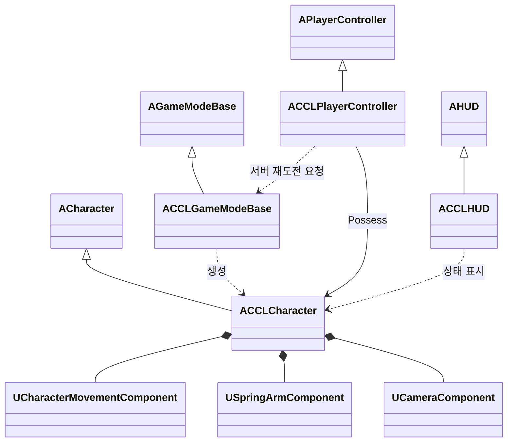

# 멀티플레이 기본 흐름

`Source/CCL/`에 스폰, 이동과 카메라, 사망 후 개별 재스폰을 구현했다. [결정 5](DesignLog.md)에 따라 평소에는 Standalone에서 작업하고 Dedicated Server와 Listen Server에서 검증한다. 테스트 맵은 `Content/Maps/MultiplayerPlayground.umap`이며 기본 시작 맵으로 설정했다.

## 목표와 제약

서버가 캐릭터의 생성과 사망을 결정하고 각 클라이언트는 자신이 소유한 캐릭터를 조작한다. Standalone도 같은 권위 경로를 사용한다. 사망한 플레이어만 재도전하며 생존자의 캐릭터와 진행은 유지한다. 근거는 [결정 5](DesignLog.md)다.

접속 인원과 협동·대전 여부는 미정이다. 서버 검증에는 플레이어 2명을 사용했으며 이는 출시 인원 제한이 아니다. 테스트 맵에 배치한 PlayerStart 4개도 콘텐츠 사양이 아닌 검증용 배치다. 공격과 체력, 동료 부활, 월드 진행·성장 저장, 호스트 이탈 복구와 방 검색 UI는 포함하지 않는다.

조작감 확인용으로 3인칭 카메라, 키보드·마우스 입력과 단순 도형 캐릭터를 사용한다. 기존 마네킹을 연결하는 대안은 사람 비례와 애니메이션 확인에 유리하지만, 이번 기본 흐름에는 애니메이션 의존을 추가하지 않았다. 최종 외형과 조작감 수치는 아직 확정하지 않았다.

## 책임과 수명

입력은 PlayerController에 두고 재도전 때 Character를 교체한다. 사망한 Pawn은 재도전 전까지 남아 있어 플레이어가 같은 시점에서 재도전을 선택할 수 있다.

| 타입 | 책임 | 생성과 소멸 | 네트워크 권위 |
|---|---|---|---|
| `ACCLGameModeBase` | 시작 위치 검증, 재스폰 허용, 스폰 실패 대기 상태와 재시도 간격 관리 | 월드 생성·종료, 접속 종료 때 플레이어별 대기 기록 제거 | 서버 전용 |
| `ACCLPlayerController` | Enhanced Input 구성, 현재 Pawn 조작, 재도전 RPC | 접속부터 종료까지 유지 | 입력은 소유 클라이언트, RPC 판정은 서버 |
| `ACCLCharacter` | 이동, 카메라 구성, 현재 생명의 사망 상태 | 스폰부터 다음 재도전 또는 접속 종료까지 | `bDead`는 서버 결정 후 복제 |
| `UCharacterMovementComponent` | 이동 예측과 서버 이동 처리 | Character의 컴포넌트 | 엔진 이동 경로 |
| `USpringArmComponent`, `UCameraComponent` | 카메라 충돌 검사와 플레이어 시점 | Character의 컴포넌트 | 로컬 시점 |
| `ACCLHUD` | 조작 안내와 재도전 메시지 | 로컬 플레이어 HUD | 로컬 표시 |

사망은 `uint8 bDead`를 `ReplicatedUsing`으로 전달한다. 서버에서도 `OnRep_Dead`의 공통 표현 경로를 실행해 이동을 멈추고 캡슐 충돌을 해제한다. 영구 성장 정보가 없는 범위에서는 커스텀 PlayerState를 추가하지 않았다.

## 클래스 관계



상속은 빈 삼각형, 컴포넌트 소유는 채운 마름모, 참조는 실선 화살표로 표시했다. 점선은 생성과 호출의 의존 관계다.

## 인터페이스와 처리 흐름

공개 진입점은 다음과 같다. 전체 선언과 기본값은 `Source/CCL/CCLCharacter.h`, `CCLPlayerController.h`, `CCLGameModeBase.h`가 소유한다.

```cpp
// ACCLCharacter
bool IsDead() const;
void Die();

// ACCLPlayerController
UFUNCTION(Exec)
void CCLRetry();
UFUNCTION(Exec)
void CCLDie();

// ACCLGameModeBase
void RequestRetry(APlayerController* Player);
```

`CCLRetry`는 대상 Pawn이나 위치를 인자로 받지 않는 서버 RPC로 전달된다. 서버가 요청자의 현재 Pawn을 검사해 살아 있으면 거부한다. 사망한 Pawn은 소유를 해제하고 제거한 뒤 `RestartPlayer`로 교체한다. 새 Pawn 생성에 실패하면 서버의 대기 집합에 남아 다음 입력으로 다시 시도할 수 있다. 재시도 간격은 반복 요청을 제한하기 위한 구현 기본값이며 전투 사양이 아니다.

`FindPlayerStart_Implementation`은 캡슐이 들어갈 공간을 확인한다. 시작 위치가 모두 막혔으면 실패를 기록하고 대기 상태를 유지한다. 프로젝트의 `RestartPlayer`는 검사에 통과한 위치로 `RestartPlayerAtPlayerStart`를 호출한다. 엔진 기본 구현이 이전 `StartSpot`으로 되돌아가는 경로를 사용하지 않는다. 게임 제작 단계에서 체크포인트를 추가하면 이 시작 위치 정책을 확장한다.

## UE 5.8 코드 경로

다음은 실제 `ACCLCharacter::Die`의 핵심 경로다. 사망은 중복 적용하지 않으며, 원격 클라이언트에는 복제 상태로 전달한다.

```cpp
void ACCLCharacter::Die()
{
    if (!HasAuthority() || IsDead())
    {
        return;
    }
    bDead = 1;
    OnRep_Dead();
    ForceNetUpdate();
    // 실제 소스에는 서버의 사망 로그도 남긴다.
}
```

현재 사망 진입점은 양수 피해, 월드의 KillZ 아래 낙하, 개발용 `CCLDie`다. 체력 계산은 다음 전투 작업에 포함한다. 개발용 사망 요청의 처리와 K 키 바인딩은 Shipping·Test 구성에서 비활성화된다.

입력 Action과 Mapping Context는 PlayerController가 런타임에 만들고 종료 때 해제한다. `CCL.Build.cs`에 `EnhancedInput` 의존성을 추가했다. 별도 입력 에셋 편집 없이 테스트할 수 있지만, 디자이너가 키 배치를 바꾸려면 후속 작업에서 에셋이나 설정으로 옮겨야 한다.

## 조작과 실행

| 입력 | 동작 |
|---|---|
| WASD | 카메라 yaw를 기준으로 이동 |
| 마우스 | 3인칭 카메라 회전 |
| Space | 점프 |
| K | 개발용 사망 |
| R | 사망 또는 스폰 실패 후 재도전 |
| 콘솔 `CCLDie`, `CCLRetry` | 같은 사망·재도전 경로 호출 |

`Tools/Validation/create_playground.py`로 Unreal 에디터에서 맵을 생성·저장했다. 바닥, 점프용 단차, 카메라 가림 확인용 벽과 시작 위치가 들어 있다. 도구는 기존 맵을 덮어쓰지 않는다. 일상 작업에서는 기본 맵을 열고 Standalone으로 플레이한다.

자동 검증은 저장소 루트에서 다음 명령으로 실행한다. 엔진 경로는 Git에서 제외한 `.local/agent-paths.json`을 읽는다. 도구가 시작한 프로세스만 종료하며 원본 로그는 `Saved/Tests/NetworkSmoke/`에 남긴다.

```powershell
.\Tools\Validation\run_network_smoke.ps1 -Mode Standalone
.\Tools\Validation\run_network_smoke.ps1 -Mode Dedicated
.\Tools\Validation\run_network_smoke.ps1 -Mode Listen -Port 18778
.\Tools\Validation\run_network_smoke.ps1 -Mode Listen -Port 18779 -DriverIsHost
```

## 검증 상태

2026-10-06 사용한 설치본은 `<Engine>/Build/Build.version` 기준 UE 5.8.2, Changelist 56702186이다. 프로젝트 문서의 기본 기준 5.8.1과 구분한다. `Build.bat CCLEditor Win64 Development -Project=<repository>/CCL.uproject -WaitMutex -NoHotReloadFromIDE` 빌드가 성공했다. 명령과 로그의 실제 경로는 이 문서에서 자리표시자 또는 저장소 상대 경로로 치환했다.

| 실행 | 검증 내용 | 결과와 증거 |
|---|---|---|
| Standalone | 이동 입력, 생존 중 재도전 거부, 사망 후 이동 차단, 반복 재도전, 카메라 대상과 입력 복구 | PASS, `Saved/Tests/NetworkSmoke/Standalone-20261006-141642/driver.log` |
| Dedicated Server + 클라이언트 2개 | 원격 이동, 사망과 새 Pawn 복제, 다른 플레이어의 Pawn 유지 | PASS, `Saved/Tests/NetworkSmoke/Dedicated-20261006-141715/` |
| Listen Server + 원격 클라이언트 | 원격 클라이언트 사망·재스폰, 호스트 Pawn 유지 | PASS, `Saved/Tests/NetworkSmoke/Listen-20261006-141821/` |
| Listen 호스트 재스폰 | 호스트 사망·재스폰, 원격 플레이어 Pawn 유지 | PASS, `Saved/Tests/NetworkSmoke/Listen-20261006-141924/` |
| 낙하·스폰 실패 복구 | KillZ 사망, 모든 시작 위치가 막힌 상태에서 대기 후 재시도 | PASS, 위 Standalone 로그의 `CCL Spawn blocked`와 후속 PASS |

네트워크 검증은 `UnrealEditor-Cmd -game`과 `-server`의 별도 프로세스를 `-nullrhi`로 실행했다. 입력은 Enhanced Input Action에 주입했다. 테스트용 `UCCLNetworkSmokeSubsystem`은 개발 구성에서 `-CCLSmoke=driver` 또는 `witness`를 명시했을 때만 생성된다. 실패하면 `CCL_SMOKE FAIL`, 통과하면 `CCL_SMOKE PASS`를 기록한다.

화면의 실제 렌더링, 물리 키보드·마우스 조작감과 카메라 가림은 수동 확인이 남아 있다. 패키징한 게임·전용 서버, 패킷 손실 환경과 재접속은 미검증이다. `EditorToolset`의 `AgentSkill`, `ToolsetRegistry`의 `PythonTestRunner` Python 초기화 오류도 게임 실행 로그에서 관찰됐으며 기본 흐름 검증은 통과했다. 해당 엔진 플러그인은 수정하지 않았다.

## 엔진 근거와 대안

UE 5.8.2의 `<Engine>/Source/Runtime/Engine/Private/GameModeBase.cpp:1068`에서 `HandleStartingNewPlayer_Implementation`은 조건을 확인한 뒤 `RestartPlayer`를 호출한다. 같은 파일의 `:1241`은 시작 위치 선택, `:1264`는 Pawn 확인과 생성, `:1362`는 `Possess`를 담당한다. 이미 Pawn이 있으면 그 Pawn을 사용하므로 재스폰 전에 이전 Pawn을 정리한다.

`<Engine>/Source/Runtime/Engine/Private/Components/CharacterMovementComponent.cpp:8907`의 `ReplicateMoveToServer`와 `:9137`의 `CallServerMovePacked`를 포함한 엔진 이동 경로를 사용한다. 별도 위치 RPC와 보간기는 이동 규칙을 자유롭게 만들 수 있지만 예측·보정 구현과 검증 부담이 커진다.

입력은 `<Engine>/Plugins/EnhancedInput/Source/EnhancedInput/Public/EnhancedInputSubsystemInterface.h:265`의 `AddMappingContext`를 사용한다. UE4에서 흔히 쓰던 `DefaultInput.ini` Action/Axis 이름 바인딩과 구분한다. GameMode, PlayerController, Character의 역할 분리는 UE5만의 신규 구조가 아니다.
