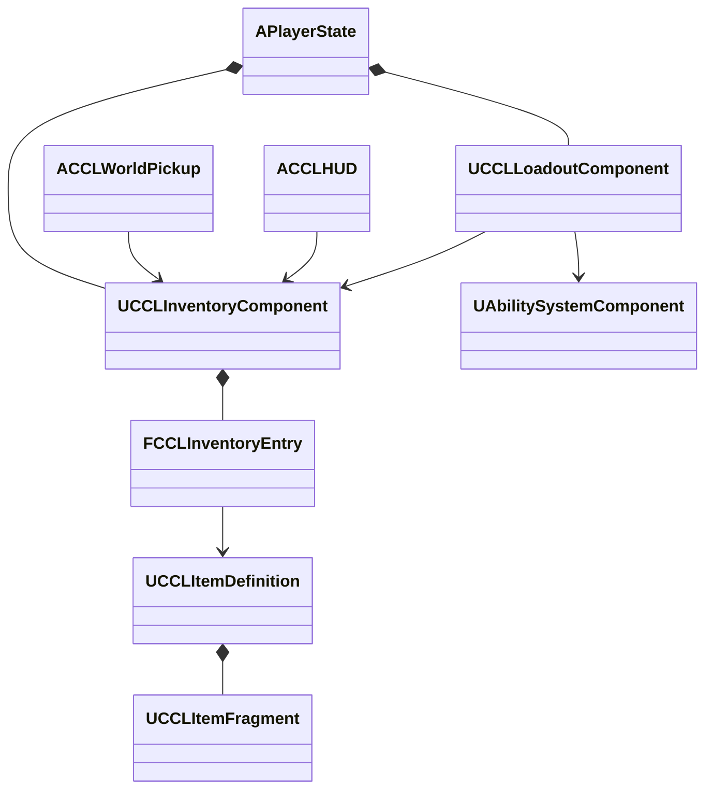

# 인벤토리·장비·성장 설계

단계 4는 마을의 보급품 획득, 장비 장착, 회복품 사용과 스킬 포인트 소비를 전투에 연결한다. 아래 값과 콘텐츠 명칭은 구현용 초안이며 최종 밸런스와 세계관은 아니다. 보관·장착·회복·훈련과 UI를 구현했고 실행 결과는 아래에 구분한다.

## 목표와 책임

| 구성 | 책임과 수명 | 변경 권위 |
|---|---|---|
| ItemDefinition과 Fragment | 공유하는 표시·중첩·장비·소비 정의 | 에셋 |
| InventoryComponent | GUID·정의 참조·수량의 일관된 보관, PlayerState 또는 상자 Actor 수명 | 서버, 소유자에게 복제 |
| LoadoutComponent | 장비·학습 상태와 포인트, GAS 효과 적용, Avatar 교체 연결 | 서버, PlayerState 수명 |
| WorldPickup | 월드 아이템의 한 번만 지급과 소멸 | 서버 |
| PlayerController | 실제 소유 플레이어의 획득·장착·사용 요청 | 요청만 전달 |
| HUD | 복제된 아이템·장비·스킬·능력치 표시와 선택 | 로컬 |

Inventory는 Character, 무기, 스태미나나 UI를 참조하지 않는다. 수량과 GUID는 런타임 상태이며 공유 정의를 수정하지 않는다. 장비와 소비는 Fragment를 조회하는 LoadoutComponent가 실행한다. 소유 Actor의 AbilitySystemInterface로 GAS를 조회하고 현재 Avatar에 장비를 연결한다. 상자에 같은 인벤토리를 붙여도 GAS가 필요하지 않다.



## 이번 콘텐츠와 입력

마을에서 E로 가까운 보급품을 얻는다. 월드 보급품은 세션 공유이며 먼저 수령한 플레이어에게 한 번 지급한다. 이 임시 정책은 최종 협동·대전의 보상 규칙을 확정하지 않는다. 철제 건틀릿은 기존 맨손 공격 애니메이션을 사용하고 공격 보너스 10을 부여한다. 회복약은 체력 50을 회복하며 최대 중첩은 20개다. 기본 공격 수치는 20이다. 훈련 스킬은 공격 숙련과 생명력 훈련이며 각각 포인트 1을 써서 공격 보너스 5 또는 최대 체력 25를 얻는다. 같은 스킬을 중복 습득할 수 없다. 시작 포인트는 1이며 이후 콘텐츠의 보상은 단계 5에서 연결한다.

I로 인벤토리 패널을 열고 위·아래로 선택한다. F는 장착, G는 장비 해제, H는 선택한 회복품 사용, 1·2는 각 훈련 습득 요청이다. 성공·거부 결과와 남은 포인트를 표시한다. 이 단계의 UI는 기능 검증용이며 최종 시각 디자인은 아니다.

## 계약과 일관성

```cpp
FGuid Add(UCCLItemDefinition* Definition, int32 Quantity);
bool Remove(FGuid EntryId, int32 Quantity);
bool Equip(FGuid EntryId);
bool Use(FGuid EntryId);
bool Learn(UCCLSkillDefinition* Definition);
```

서버는 실제 보유 GUID, 수량, 중첩 한도와 슬롯 수를 확인한다. 획득 요청에는 원하는 수량이나 가격을 받지 않는다. 월드 픽업의 서버 데이터를 사용하고 거리·시야·생존 상태를 검증한다. 클라이언트가 보낸 효과 수치나 스킬 비용을 신뢰하지 않는다. 공격 중·사망 상태에서는 장착과 사용을 거부한다. 가득 찬 체력에서 회복품을 소비하지 않는다. 장착 효과는 중복 적용하지 않고 이전 핸들을 제거한다.

능력치는 GAS AttributeSet에 두고 전투 정책은 공격 보너스 세트가 없는 공격자도 처리한다. 장비·학습 효과에는 생명 단위 제거 태그를 붙이지 않아 개별 재스폰 뒤에도 유지한다. Avatar 교체 때 장비 정의를 다시 연결하고 회복된 최대 체력까지 초기화한다. 아이템 삭제와 장비 참조가 어긋나지 않도록 보관 변경을 구독한다.

Fast Array의 항목별 복제를 사용한다. 전체 배열 복제도 가능하지만 수량·항목의 변경을 명시적으로 표시하는 엔진 계약을 재사용한다. 현재 한도는 16개 항목이며 무게·내구도·정렬·거래 기능은 이번 범위에 추가하지 않는다. UI와 Actor 참조를 저장하지 않으며 저장 계약은 단계 6에서 정의 ID·GUID·수량·장비·학습 상태를 대상으로 확정한다.

## 검증

프로젝트 생성 BAT와 CCLEditor 빌드 후 Standalone·Dedicated·Listen에서 획득·장착·회복·습득 요청을 확인한다. 음수 수량, 없는 GUID, 슬롯 부족, 비용 부족과 중복 습득을 거부하는지 검사한다. 장착 전후 실제 공격 피해와 재스폰 뒤 인벤토리·장비·학습 상태를 비교한다. 기존 전투 회귀와 UI 캡처도 확인한다. 원본 로그는 `Saved/StageValidation/`, 화면은 `Saved/Tests/`에 보존한다.

## 현재 검증

2026-10-07 UE 5.9에서 프로젝트 생성·CCLEditor 빌드와 `create_progression.py` 에셋 저장이 통과했다. Standalone에서는 클라이언트 요청으로 획득·장착·회복·두 훈련 습득, 중복·비용 부족 거부, 공격 피해 20에서 35로 증가, 개별 재스폰 후 수량·장비·훈련·체력 125 유지를 확인했다. 실행 검사는 `run_campaign_smoke.ps1 -Progression`으로 기존 진행 검사와 함께 수행한다. 일반 Actor의 인벤토리로 중첩·슬롯 한도도 확인했다. Dedicated·Listen 원격·호스트·Dedicated 왕복 지연 100ms와 손실 2% 구성도 통과했다. 네트워크 구성마다 늦은 접속과 인벤토리 소유자 구분을 확인했다. 렌더링 실행과 승리 화면에서 장비·회복약·훈련·능력치 표시를 확인했다.

Fast Array의 변경 표시 계약은 `<Engine>/Source/Runtime/Net/Core/Classes/Net/Serialization/FastArraySerializer.h`의 `MarkItemDirty`·`MarkArrayDirty` 설명을 확인했다. 보관은 이 엔진 복제 경로를 쓰고 장비 효과는 GAS 핸들로 추적한다. 컴포넌트 종료 때 소유 효과를 정리한다. 장비가 전투 Fragment를 갖지 않으면 기존 맨손 공격 정의를 사용한다.

| 검사 | 로컬 근거 |
|---|---|
| 최종 생성 BAT·빌드 | `Saved/StageValidation/Stage4-Generate.log`, `Stage4-Build.log` |
| 정의·보급품 저장 | `Saved/StageValidation/Stage4-Assets.log` |
| Standalone 기능 | `Saved/StageValidation/Stage4-Standalone.log` |
| Dedicated·Listen 원격·호스트·지연과 손실 | `Saved/StageValidation/Stage4-Dedicated-Final.log`, `Stage4-Listen-Final.log`, `Stage4-Host-Final.log`, `Stage4-Impaired-Final.log` |
| 기존 전투·이동 회귀 | `Saved/StageValidation/Stage4-Combat-Standalone.log`, `Stage4-Combat-Dedicated.log`, `Stage4-Movement.log` |

근거 경로는 저장소 기준이다. 검사의 추가 훈련 포인트 1은 테스트 서버가 지급한 값이며 일반 게임의 보상 연결은 단계 5 작업이다. 저장 파일과 게임 재실행 후 복원은 단계 6에서 검사한다.
