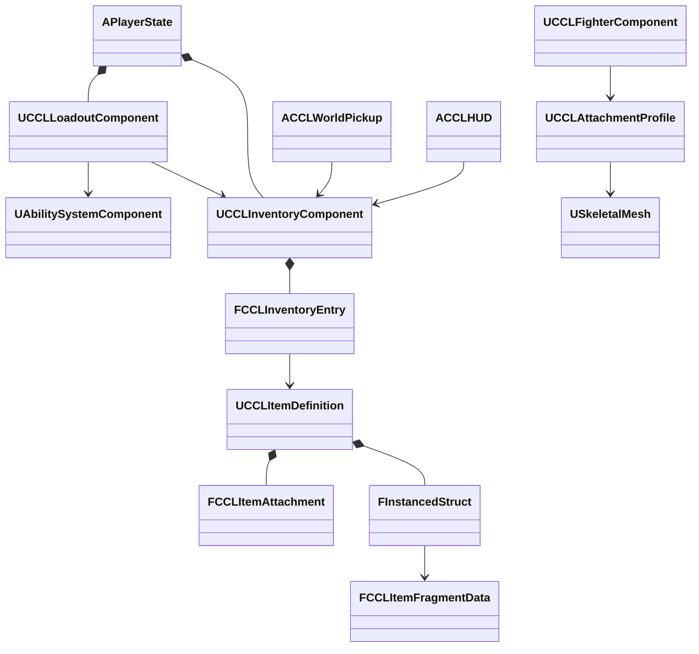

# 인벤토리·장비·성장 설계

단계 4는 마을의 보급품 획득, 장비 장착, 회복품 사용과 스킬 포인트 소비를 전투에 연결한다. 아래 값과 콘텐츠 명칭은 구현용 초안이며 최종 밸런스와 세계관은 아니다. 보관·장착·회복·훈련과 UI를 구현했고 실행 결과는 아래에 구분한다.

## 목표와 책임

2026-10-07 사용자는 장비·무기 설정을 Gameplay Tag로 지정하고, 부착 지점 태그를 캐릭터별 실제 소켓에 연결하는 개편을 승인했다. 이번 변경에서는 Equip의 허용·기본 슬롯을 태그로, Weapon의 한손·양손 정보를 단일 태그로 옮긴다. 슬롯 점유는 장착 처리와 저장 검증이 같은 규칙으로 계산한다. Visual은 슬롯별 부착 지점 태그를 보관하고 캐릭터가 참조하는 AttachmentProfile이 메시 소켓으로 해석한다. 프로필에는 대상 메시, 소켓 선택 목록, 아이템 미리보기와 데이터 검증을 제공한다. 기존 구조체 에셋은 로드 시 변환하고 저장 형식 1-3은 새 태그 형식 4로 읽는다. 설계 근거는 [결정 16](DesignLog.md)이다. 코드를 반영하고 생성 BAT·UHT·에디터 컴파일을 통과했다. 실행 중인 에디터 때문에 전체 링크·에셋 변환·새 코드의 실행 검증은 아직 완료하지 않았다.

검증은 잘못된 슬롯·무기 사용 방식·소켓 매핑 거부, 기존 양손 교체·반환·원격 입력, 저장 호환, 실제 메시 부착과 장비 창을 포함한다. 기존 소켓을 자동 추정하지 않고 프로필에 등록한 실제 소켓만 사용한다. 기본 마네킹에는 별도의 명명된 장착 소켓을 추가하고 기존 본과 소켓을 보존한다. 양손 슬롯 점유와 보조 손 IK는 구분하며 새 IK·수납 동작은 이번 범위에 포함하지 않는다.

태그 관련 구현과 편집 위치는 다음과 같다. 프로필 에셋은 변환 도구 실행 뒤 생성되며 현재 디스크에는 아직 없다.

| 설정 | 편집 위치와 계약 |
|---|---|
| 장착 부위 | Equip의 `AllowedSlots`, `DefaultSlotTag`: `Equipment.Slot.*`의 구체적인 슬롯 |
| 한손·양손 | Weapon의 `HandUsage`: `Weapon.HandUsage.OneHanded` 또는 `TwoHanded` 중 하나 |
| 부착 위치 | Visual의 `Attachments`: 슬롯 태그, `Attachment.*` 지점 태그, 아이템별 오프셋 |
| 메시 소켓 | `UCCLAttachmentProfile`의 `ReferenceMesh`, `Bindings`: 지점 태그를 실제 소켓 이름에 연결 |
| 에디터 미리보기 | 프로필의 `PreviewItem`, `PreviewSlot`: 기준 포즈의 캐릭터와 선택 장비 표시 |

`CCLEquipment::GetOccupiedSlots`를 장착과 저장 검증에서 함께 사용한다. 복제된 장비 목록은 태그와 GUID로 구성한다. 실제 메시 부착은 Fighter가 프로필을 해석하며 누락된 매핑·소켓이면 경고를 남기고 표시를 생략한다. 본 이름을 소켓으로 간주하거나 루트에 대신 붙이지 않는다. 프로필 데이터 검증과 미리보기는 중복 매핑·부적합한 스켈레톤·잘못된 아이템 설정도 확인한다. 이전 Equip의 양손 플래그와 Visual의 소켓 이름은 로드 변환에만 남기고 새 편집 화면에서는 숨겼다.

`Tools/Validation/migrate_equipment_tags.py`는 기존 정의 12개와 기본 마네킹을 `Saved/EquipmentTagBackup/`에 백업한 뒤 변환을 요청한다. 도구는 기본 마네킹에 `CCL_Grip_L/R`, `CCL_Shield_L/R`, `CCL_Stow_Back` 소켓을 추가하고 `Content/Progression/DA_HumanoidAttachments.uasset`을 생성한다. 기존 소켓과 이미 있는 프로필 설정은 덮어쓰지 않는다. 재시작한 새 에디터 모듈에서 실행해야 하며, 구버전 모듈에서는 에셋 저장 전에 실패하도록 했다. 아직 이 도구를 실행하지 않았으므로 소켓·프로필 에셋 적용도 대기 중이다.

현재 검증 근거는 `Saved/StageValidation/Tags-Generate.log`와 `Tags-Compile.log`다. 후자는 `-NoLink` 컴파일 성공이며 전체 빌드 성공을 뜻하지 않는다. `CCL.Equipment.TagContracts` 자동 검사와 UI의 오른손 단일 메시 검사도 컴파일했지만 실행하지 않았다. 에디터 종료 뒤 전체 `CCLEditor Win64 Development` 빌드, 변환 도구, 태그 자동 검사, 단독·Listen·저장·화면 검사를 이어서 수행해야 한다. 아래의 기존 실행 결과는 태그 변경 이전 결과다.

장비 체계 개편은 [결정 15](DesignLog.md)를 따른다. 구조체 Fragment와 장착·저장 코드를 구현했고 단독 실행·Listen 원격 입력·저장 복원 검사를 통과했다. 화면 수정의 최종 검증 상태는 아래에 구분한다.

ItemDefinition이 이름·설명·아이콘·최대 중첩 수를 소유하고, 선택 기능은 `FInstancedStruct` 배열로 보관한다. 새 구조체의 루트는 `FCCLItemFragmentData`다. 기존 UObject Fragment 클래스는 저장된 에셋을 `PostLoad`에서 읽는 호환 경로로 남긴다. 새 정의에는 Equip, ConsumableData, Visual, SkeletalVisual, HarvestTool, MeleeWeapon, ProjectileWeapon을 조합한다. SkeletalVisual은 Visual의 바닥 표시용 StaticMesh를 상속하고 장착용 SkeletalMesh를 추가한다. 무기 속성은 Weapon 계층 안에 둔다. ProjectileWeapon·HarvestTool은 정의 형식만 추가했으며 발사·채집 실행은 이번 장비 UI 구현에 포함하지 않는다.

장착 부위는 왼손·오른손·갑옷·신발·망토·목걸이·반지 두 칸이다. 한손 장비와 방패는 어느 손에나 장착하며 기본 손은 오른손이다. 양손 장비는 같은 GUID로 두 손을 점유하고 효과는 한 번 적용한다. 장착 항목은 소유 목록에 남고 가방 슬롯만 `INDEX_NONE`으로 바뀐다. 교체 시 새 장비가 비우는 칸을 포함해 이전 장비의 반환 공간을 확인한다. 부족하면 장착 상태와 효과를 바꾸지 않는다. 장비를 가방으로 드래그해 해제할 때는 빈 칸이 필요하다.

좌클릭·우클릭은 왼손·오른손 장비에 정의된 액션을 실행한다. Loadout과 ASC는 같은 PlayerState에 속한다. 손 선택 RPC를 먼저 보내고 기존 GAS 예측 입력을 실행해 서버가 현재 보유 장비로 전투 정의를 선택한다. 인벤토리 화면의 장비 패널은 캐릭터 캡처를 중앙에, 장착 슬롯을 양옆에 표시한다. 가방은 오른쪽 4×4 격자이며 슬롯 간 드래그로 장착·해제한다. 검·방패·양손 지팡이의 검증용 장착 메시는 임시 도형이고, 방어구 외형은 아직 제작하지 않았다.

구현 위치는 `Source/CCL/Items/CCLItemFragments.h`, `CCLLoadoutComponent.cpp`, `Source/CCL/UI/SCCLInventoryWidget.cpp`다. `Tools/Validation/create_equipment.py`로 기존 정의를 덮어쓰지 않고 시험용 장비 8종을 생성했다. `migrate_item_fragments.py`는 기존 정의 네 개를 로컬 백업한 뒤 변환 저장하는 별도 도구이며 아직 실행하지 않았다. 기존 파일의 `PostLoad` 변환은 실행 검사에서 확인했다.

2026-10-07 UE 5.9에서 생성 BAT와 CCLEditor 전체 빌드를 통과했다. 단독·Listen 원격 검사에서 왼손 방패와 양손 장비의 보조 액션, 입력 해제, 장착 후 재스폰을 확인했다. 별도 프로세스 저장·복원과 양손 점유 형식 검사도 통과했다. 오프스크린 UI 검사에서는 가방 슬롯의 장비 여부 인자가 초기화되지 않아 드래그가 실패하는 결함을 발견했다. 인자 초기값을 지정하고 슬롯 제목·아이템 이름의 줄바꿈과 캐릭터 캡처 비율을 수정했다.

수정 후 생성 BAT·에디터 `-NoLink` 컴파일·게임 타깃 빌드와 별도 패키징을 통과했다. 패키지의 1280×720·1920×1080에서 Slate 드래그 이동·교환·취소·장착·해제, 장비 8칸 표시, 인벤토리 닫기와 NPC 대화 전환을 확인했다. 마지막 UI 수정은 열려 있는 에디터의 DLL에는 아직 반영하지 않았다. 해당 DLL의 전체 링크 시도는 실행 중인 에디터가 사용하는 파일을 교체할 수 있다는 이유로 자동 승인 검토에서 거절되어 실행하지 못했다. 최종 CCLEditor 전체 빌드는 에디터 종료 후 남아 있다.

| 장비 개편 검사 | 로컬 근거 |
|---|---|
| 생성 BAT·화면 수정 전 전체 에디터 빌드 | `Saved/StageValidation/Equipment-Generate.log`, `Equipment-Build.log` |
| 시험용 장비 8종 생성 | `Equipment-Assets.log` |
| 단독·Listen 원격 기능 | `Equipment-Standalone.log`, `Equipment-Listen.log` |
| 별도 프로세스 저장·복원 | `Equipment-Session.log` |
| 가방 부족·양손 교체·반지·저장 무결성, 수정 전 UI 실패 재현 | `Equipment-Offscreen.log`, `Saved/Tests/UIVisual/1280x720-20261007-170902/game.log` |
| 화면 수정 후 컴파일, 링크 제외 | `Equipment-UIFix-Compile.log` |
| 최종 생성 BAT·에디터 컴파일, 링크 제외 | `Equipment-Final-Generate.log`, `Equipment-Final-Compile.log` |
| 게임 타깃 빌드·패키지 | `Equipment-Package.log`의 게임 빌드 성공, `Equipment-Package-Final.log`의 UAT 성공 |
| 패키지 720p·1080p UI | `Equipment-Packaged-UI-1280.log`, `Equipment-Packaged-UI-1920.log` |

파일명만 적은 로그는 `Saved/StageValidation/` 기준이다. 오프스크린 검사는 게임 내부의 Slate 포인터 이벤트를 사용하며 Windows 바탕화면의 수동 조작 검사는 아니다.

| 구성 | 책임과 수명 | 변경 권위 |
|---|---|---|
| ItemDefinition과 Fragment | 공유하는 표시·중첩·장비·소비 정의 | 에셋 |
| InventoryComponent | GUID·정의 참조·수량의 일관된 보관, PlayerState 또는 상자 Actor 수명 | 서버, 소유자에게 복제 |
| LoadoutComponent | 장비·학습 상태와 포인트, GAS 효과 적용, Avatar 교체 연결 | 서버, PlayerState 수명 |
| WorldPickup | 월드 아이템의 한 번만 지급과 소멸 | 서버 |
| PlayerController | 실제 소유 플레이어의 획득·장착·사용 요청 | 요청만 전달 |
| HUD | 복제된 아이템·장비·스킬·능력치 표시와 선택 | 로컬 |

Inventory는 Character, 무기, 스태미나나 UI를 참조하지 않는다. 수량과 GUID는 런타임 상태이며 공유 정의를 수정하지 않는다. 장비와 소비는 Fragment를 조회하는 LoadoutComponent가 실행한다. 소유 Actor의 AbilitySystemInterface로 GAS를 조회하고 현재 Avatar에 장비를 연결한다. 상자에 같은 인벤토리를 붙여도 GAS가 필요하지 않다.



## 이번 콘텐츠와 입력

2026-10-07 사용자의 게임 내 글자 확대 요청에 따라 HUD의 기본 글자 배율을 기존의 2배로 바꿨다. ACCLHUD가 로컬 화면 크기에 맞춘 배치·줄바꿈을 담당하며 인벤토리 슬롯은 Slate 위젯으로 표시한다. 긴 문구는 영역 안에서 줄바꿈한다. 별도 패키지의 1280×720과 1920×1080 캡처에서 안내·체력·인벤토리의 표시를 확인했다. 훈련 영역은 스크롤로 나머지 항목을 볼 수 있다.

추가 UI 요청에 따라 인벤토리는 아이템 이름·수량을 표시하는 4×4 Slate 슬롯으로 교체한다. 빈 슬롯으로 드래그하면 이동하고 점유 슬롯이면 교환하며 창 밖 드롭은 취소한다. GUID와 슬롯 번호를 서버에서 검증하고 Fast Array로 소유자에게 복제한다. 슬롯 배치와 장착 상태의 저장 형식은 [SessionFoundation](SessionFoundation.md)의 저장 정책을 따른다. 선택·장착·사용·훈련은 기존 요청 경로를 사용한다. 마우스 조작 중 게임 입력을 차단하고 닫을 때 돌려준다. NPC 대화와 인벤토리는 동시에 열지 않아 하단 영역이 겹치지 않게 한다. 서버 이동·교환·잘못된 요청, 실제 Slate 드래그·취소, 저장 복원과 화면 배치를 검증한다. 검증 상태는 위 목표와 책임 절을 따른다. 기존 배포 폴더의 실행 파일은 이번 UI 변경을 포함하지 않는다.

마을에서 E로 가까운 보급품을 얻는다. 월드 보급품은 세션 공유이며 먼저 수령한 플레이어에게 한 번 지급한다. 이 임시 정책은 최종 협동·대전의 보상 규칙을 확정하지 않는다. 철제 건틀릿은 기존 맨손 공격 애니메이션을 사용하고 공격 보너스 10을 부여한다. 회복약은 체력 50을 회복하며 최대 중첩은 20개다. 기본 공격 수치는 20이다. 훈련 스킬은 공격 숙련과 생명력 훈련이며 각각 포인트 1을 써서 공격 보너스 5 또는 최대 체력 25를 얻는다. 같은 스킬을 중복 습득할 수 없다. 시작 포인트는 1이며 이후 콘텐츠의 보상은 단계 5에서 연결한다.

I로 인벤토리 패널을 열고 위·아래로 선택한다. F는 장착, G는 장비 해제, H는 선택한 회복품 사용, 1·2는 각 훈련 습득 요청이다. 성공·거부 결과와 남은 포인트를 표시한다. 이 단계의 UI는 기능 검증용이며 최종 시각 디자인은 아니다.

## 계약과 일관성

```cpp
FGuid Add(UCCLItemDefinition* Definition, int32 Quantity);
bool Remove(FGuid EntryId, int32 Quantity);
bool Equip(FGuid EntryId, FGameplayTag Slot = FGameplayTag());
bool Unequip(FGuid EntryId, int32 BagSlot = INDEX_NONE);
bool Use(FGuid EntryId);
bool Learn(UCCLSkillDefinition* Definition);
```

서버는 실제 보유 GUID, 수량, 중첩 한도와 슬롯 수를 확인한다. 획득 요청에는 원하는 수량이나 가격을 받지 않는다. 월드 픽업의 서버 데이터를 사용하고 거리·시야·생존 상태를 검증한다. 클라이언트가 보낸 효과 수치나 스킬 비용을 신뢰하지 않는다. 공격 중·사망 상태에서는 장착과 사용을 거부한다. 가득 찬 체력에서 회복품을 소비하지 않는다. 장착 효과는 중복 적용하지 않고 이전 핸들을 제거한다.

능력치는 GAS AttributeSet에 두고 전투 정책은 공격 보너스 세트가 없는 공격자도 처리한다. 장비·학습 효과에는 생명 단위 제거 태그를 붙이지 않아 개별 재스폰 뒤에도 유지한다. Avatar 교체 때 장비 정의를 다시 연결하고 회복된 최대 체력까지 초기화한다. 아이템 삭제와 장비 참조가 어긋나지 않도록 보관 변경을 구독한다.

Fast Array의 항목별 복제를 사용한다. 전체 배열 복제도 가능하지만 수량·항목의 변경을 명시적으로 표시하는 엔진 계약을 재사용한다. 가방은 16칸이고 장착 항목은 별도로 유지한다. 무게·내구도·정렬·거래 기능은 이번 범위에 추가하지 않는다. UI와 Actor 참조를 저장하지 않으며 저장 계약은 단계 6에서 정의 ID·GUID·수량·장비·학습 상태를 대상으로 확정한다.

## 검증

프로젝트 생성 BAT와 CCLEditor 빌드 후 Standalone·Dedicated·Listen에서 획득·장착·회복·습득 요청을 확인한다. 음수 수량, 없는 GUID, 슬롯 부족, 비용 부족과 중복 습득을 거부하는지 검사한다. 장착 전후 실제 공격 피해와 재스폰 뒤 인벤토리·장비·학습 상태를 비교한다. 기존 전투 회귀와 UI 캡처도 확인한다. 원본 로그는 `Saved/StageValidation/`, 화면은 `Saved/Tests/`에 보존한다.

## 기존 구현 검증

2026-10-07 UE 5.9에서 프로젝트 생성·CCLEditor 빌드와 `create_progression.py` 에셋 저장이 통과했다. Standalone에서는 클라이언트 요청으로 획득·장착·회복·두 훈련 습득, 중복·비용 부족 거부, 공격 피해 20에서 35로 증가, 개별 재스폰 후 수량·장비·훈련·체력 125 유지를 확인했다. 실행 검사는 `run_campaign_smoke.ps1 -Progression`으로 기존 진행 검사와 함께 수행한다. 일반 Actor의 인벤토리로 중첩·슬롯 한도도 확인했다. Dedicated·Listen 원격·호스트·Dedicated 왕복 지연 100ms와 손실 2% 구성도 통과했다. 네트워크 구성마다 늦은 접속과 인벤토리 소유자 구분을 확인했다. 렌더링 실행과 승리 화면에서 장비·회복약·훈련·능력치 표시를 확인했다.

Fast Array의 변경 표시 계약은 `<Engine>/Source/Runtime/Net/Core/Classes/Net/Serialization/FastArraySerializer.h`의 `MarkItemDirty`·`MarkArrayDirty` 설명을 확인했다. 보관은 이 엔진 복제 경로를 쓰고 장비 효과는 GAS 핸들로 추적한다. 컴포넌트 종료 때 소유 효과를 정리한다. 장비가 전투 Fragment를 갖지 않으면 기존 맨손 공격 정의를 사용한다.

| 검사 | 로컬 근거 |
|---|---|
| 최종 생성 BAT·빌드 | `Saved/StageValidation/Stage4-Generate.log`, `Stage4-Build.log` |
| 정의·보급품 저장 | `Saved/StageValidation/Stage4-Assets.log` |
| Standalone 기능 | `Saved/StageValidation/Stage4-Standalone.log` |
| Dedicated·Listen 원격·호스트·지연과 손실 | `Saved/StageValidation/Stage4-Dedicated-Final.log`, `Stage4-Listen-Final.log`, `Stage4-Host-Final.log`, `Stage4-Impaired-Final.log` |
| 기존 전투·이동 회귀 | `Saved/StageValidation/Stage4-Combat-Standalone.log`, `Stage4-Combat-Dedicated.log`, `Stage4-Movement.log` |

근거 경로는 저장소 기준이다. 검사의 추가 훈련 포인트 1은 테스트 서버가 지급한 값이며 일반 게임의 보상 연결은 단계 5 작업이다. 저장 파일과 게임 재실행 후 복원은 단계 6에서 검사한다.
