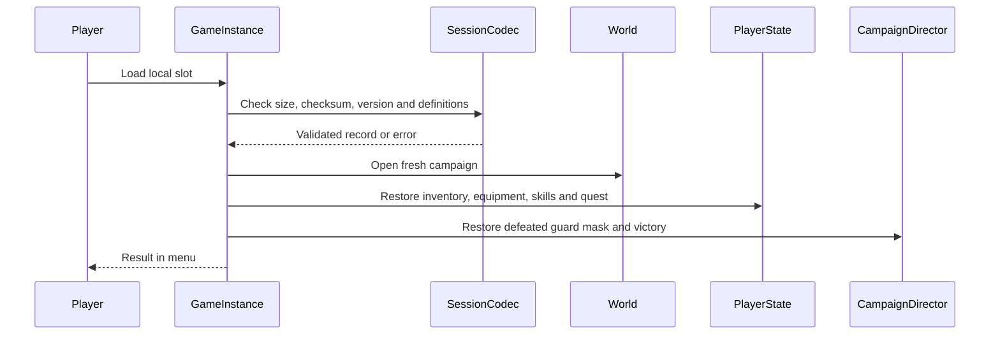

# 시작·접속·저장 흐름

단계 6은 시작 화면에서 혼자 시작, 방 생성, 주소로 접속, 저장 불러오기와 종료를 제공한다. 게임 중 Esc는 같은 메뉴를 열어 저장·설정·시작 화면 복귀를 제공한다. 전투 중에도 월드는 계속 실행되며 메뉴는 해당 플레이어의 입력만 막는다.

## 책임과 수명

| 구성 | 책임과 수명 |
|---|---|
| GameInstance | 맵 이동을 넘는 로컬 메뉴·접속 결과·보류한 불러오기 |
| Slate 메뉴 | 버튼·주소 입력·설정·성공과 실패 표시, 뷰포트 수명 |
| SessionRecord와 Codec | 버전·무결성·수량·정의 ID 검증, Actor와 UI를 참조하지 않는 값 |
| Inventory·Loadout·Expedition | 검증된 개인 상태 적용, 서버 PlayerState 수명 |
| CampaignDirector | 처치 체크포인트와 남은 적 재구성, 서버 월드 수명 |

## 이번 저장 정책

단일 로컬 슬롯에 호스트의 인벤토리 GUID·정의 ID·수량, 장비, 학습 스킬, 포인트, 금화·퀘스트와 원정 체크포인트를 저장한다. 접속한 손님의 개인 상태는 이번 파일에 포함하지 않는다. 손님은 호스트의 파일 저장·불러오기를 요청할 수 없다. 최종 계정·협동 보상 소유권을 확정하는 정책은 아니다.

체크포인트는 처치한 경비병, 보스 격파 여부와 남은 마을 보급품이다. 불러오면 마을에서 완전한 체력으로 시작하고 살아 있던 적은 원래 위치와 체력으로 재생성한다. 사망·행동 중에는 저장을 거부한다. 정확한 적 위치·공격 타이머를 직렬화하는 방식보다 재시작 상태의 일관성을 우선한 초안이다.

파일은 엔진의 플랫폼 저장 슬롯 API로 기록하되 UObject 클래스 경로를 역직렬화하지 않는다. 제한된 크기의 JSON 값 앞에 형식 식별자와 CRC를 붙인다. CRC는 우발적인 손상 감지용이며 변조 방지 장치가 아니다. 필수 필드·버전·알려진 정의 ID·수량·GUID 중복·장비 참조·스킬과 체크포인트 조합을 검증한 뒤 새 월드에 적용한다. 실패한 파일은 자동으로 덮어쓰지 않는다.

주소 입력은 호스트 이름 또는 IPv4와 선택적인 포트만 허용한다. URL 옵션·경로·공백·범위를 벗어난 포트는 거부한다. LAN 또는 직접 접속이 가능한 호스트 주소를 쓰며 매치메이킹·계정·NAT 중계는 이번 범위가 아니다. 접속·이동 실패는 엔진 이벤트를 받아 메뉴에 표시한다.

설정은 엔진 GameUserSettings의 화면 품질과 창 모드를 사용한다. 입력은 메뉴 버튼으로 적용하고 저장하며 다음 실행에도 유지한다. 원격 서버나 다른 플레이어의 설정을 바꾸지 않는다.

## 검증 결과

2026-10-07 UE 5.9에서 프로젝트 생성 BAT·CCLEditor 빌드·시작 맵 저장을 통과했다. 서로 다른 프로세스의 저장·불러오기에서 GUID·수량·장비·두 스킬·체력·금화·퀘스트와 부분 처치 상태를 확인했다. 이미 수집한 보급품은 복원하지 않았다. 메뉴 복귀 후 재불러오기, 남은 경비병 처치로 보스 진입, 승리 저장·복원 후 적이 없는 상태도 통과했다.

잘못된 주소, 손상된 실제 검증 슬롯, 모르는 버전·정의, 음수 수량, 중복 GUID와 없는 장비 참조를 거부했다. 화면 품질 변경과 설정 파일 재읽기로 저장을 확인했다. 별도 호스트·클라이언트가 메뉴의 접속 경로로 연결됐고 손님의 호스트 저장 요청은 거부됐다. 존재하지 않는 포트의 접속 실패도 메뉴에 표시됐다.

실제 Slate 첫 버튼에 Enter 입력을 보내 새 원정을 시작했다. 전체 버튼의 수동 마우스 조작과 화면 모드 전환은 미확인이다. 화면 검토에서 글자 크기·문구 잘림·키보드 포커스를 수정한 뒤 최종 렌더링과 저장 검사를 다시 통과했다. 시작·불러온 인벤토리·게임 중 메뉴 화면을 확인했다. 콘텐츠 Standalone, 성장 Dedicated, 전투 Listen 회귀도 통과했다. 패키징 실행은 단계 7에서 별도로 검사한다.

| 검사 | 로컬 근거 |
|---|---|
| 생성·빌드·시작 맵 | `Saved/StageValidation/Stage6-Generate.log`, `Stage6-Build.log`, `Stage6-Assets.log` |
| 최종 저장·불러오기·키보드·화면 | `Stage6-Rendered-Final.log`, `Saved/Tests/SessionSmoke/`의 최종 실행 원본 로그 |
| 방 생성·접속, 접속 실패 | `Stage6-Network.log`, `Stage6-Failure.log` |
| 콘텐츠·성장·전투 회귀 | `Stage6-Content.log`, `Stage6-Progression.log`, `Stage6-Combat.log` |
| 화면 | `Saved/Tests/SessionVisual/` |

표에서 파일명만 쓴 로그는 `Saved/StageValidation/` 기준이다. 테스트는 `CCL_Validation` 슬롯을 쓰며 일반 플레이의 `CCL_Checkpoint` 슬롯과 구분한다. 로컬 저장 파일은 Git에 넣지 않는다. 엔진 API 근거는 `<Engine>/Source/Runtime/Engine/Private/GameplayStatics.cpp:2215`의 `SaveDataToSlot`과 같은 파일 2316행의 `LoadDataFromSlot` 경로와 `Engine.h:2390`의 `OnNetworkFailure` 이벤트다.
