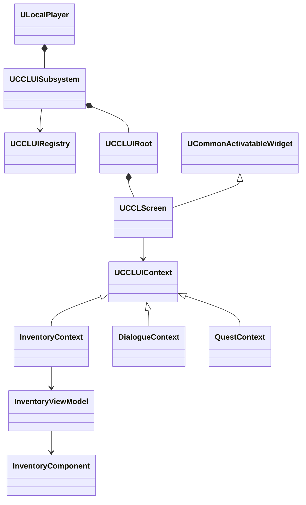

# 공용 UI 기반

공용 UI는 로컬 플레이어마다 화면의 수명·배치·입력을 관리한다. 인벤토리, NPC 대화, 퀘스트, 지도와 능력치의 규칙은 기능별 문맥과 표시 모델이 담당한다. 관리자·루트·레이어·등록·문맥·화면 풀을 구현하고 인벤토리·장비·시작·일시정지 메뉴를 연결했다. HUD·대화창도 독립 위젯으로 이전했다. 그룹별 숨김·입력·갱신 정지·페이드를 구현하고 중첩 요청, 맵 이동과 실제 입력 검사를 통과했다.

`Source/CCL/UI/Core/`는 등록 데이터·플레이어별 관리자·문맥·화면 베이스·루트를 제공한다. 검증 범위와 실행 근거는 아래 검사 절에 기록한다. 공용 기반의 검사 통과가 대화 선택지·퀘스트 목록 등 개별 콘텐츠 화면의 구현 완료를 뜻하지는 않는다.

## 목표와 경계

`Source/CCL/UI/Core/`는 Character, Inventory, GAS, 퀘스트 상태를 직접 참조하지 않는다. 화면 태그는 종류를 식별하고 핸들은 열린 창 하나를 식별한다. 같은 종류의 창도 비교 대상이나 퀘스트 문맥이 다르면 별도로 열 수 있다. 콘텐츠는 등록 데이터를 바꾸거나 기능을 등록해 공용 코드를 수정하지 않고 화면을 추가한다.

기본 구현은 UMG와 CommonUI를 사용한다. 스택은 메뉴와 확인 창, 겹침 패널은 HUD·동시 표시 도구, 큐는 순서대로 표시하는 알림에 사용한다. 특정 장르의 화면 목록과 레이어 수를 공용 관리자에 고정하지 않는다. 지도 표시 데이터는 미니맵·전체맵이 공유할 수 있지만 확대·이동 같은 화면 상태는 각 창이 소유한다. MP·버프·월드 상호작용 아이콘의 데이터 제공자를 연결할 수 있어야 하며 이번 작업에서 새 마나·버프 게임 규칙을 만들지는 않는다.

## 책임과 수명

| 구성 | 소유자·수명 | 책임 |
|---|---|---|
| `UCCLUISubsystem` | `ULocalPlayer` | 화면 등록, 인스턴스·비동기 요청 핸들, 루트 연결과 정리 |
| `UCCLUIRegistry` | 공유 DataAsset | 화면 클래스·문맥 타입·레이어·그룹·인스턴스 정책 정의 |
| `UCCLUIRoot` | 플레이어 관리자 | 데이터로 구성한 레이어와 태그 확장 지점, 실제 위젯 배치 |
| `UCCLScreen` | 루트/위젯 풀 | 활성화·문맥 연결·연결 해제와 닫기 요청의 공통 계약 |
| `UCCLUIContext` 파생형 | 요청 또는 열린 화면 | 기능별 표시 문맥; 게임 상태의 소유권을 넘겨받지 않음 |
| 기능별 표시 모델 | 해당 기능 | 데이터 변경 구독과 표시 값 통지; GAS 등은 기능별 어댑터로 연결 |
| 표시 제어 요청 | 요청 소유자와 지정 범위 | 그룹 숨김·입력 억제·페이드·갱신 정지 정책 |

모두 클라이언트 로컬 표현이다. 서버의 보유 아이템·장착·거래·퀘스트 검증은 UI가 대신하지 않는다. 등록 소유자가 사라지면 해당 등록과 보류 요청·화면을 해제한다. 기본 화면 범위는 월드이며 맵 이동 때 닫는다. 로컬 플레이어 범위 화면도 PlayerController 참조를 고정하지 않고 새 컨트롤러에 재연결한다.



## 공개 계약

화면·등록·비동기 요청·표시 제어 핸들은 서로 다른 타입으로 둔다. 유효하지 않거나 이미 해제한 핸들의 닫기·취소·해제는 안전하게 실패한다. 잘못된 문맥 타입, 중복 화면 태그, 없는 레이어·확장 지점은 화면을 생성하기 전에 거부한다. 인스턴스 정책은 플레이어별 단일 창, 문맥별 단일 창, 여러 창을 구분한다.

```cpp
FCCLUIRegistrationHandle RegisterView(const FCCLUIViewDefinition& Definition, UObject* Owner);
void UnregisterView(FCCLUIRegistrationHandle Registration);
FCCLUIViewHandle OpenView(FGameplayTag View, UCCLUIContext* Context, UObject* Owner);
FCCLUIRequestHandle RequestOpenView(FGameplayTag View, UCCLUIContext* Context, UObject* Owner);
void CancelRequest(FCCLUIRequestHandle Request);
void CloseView(FCCLUIViewHandle View);
FCCLUIPresentationHandle PushPresentation(const FCCLUIPresentationDefinition& Definition, UObject* Owner);
void ReleasePresentation(FCCLUIPresentationHandle Request);
bool SetBasePresentation(FCCLUIViewHandle View, const FCCLUIViewPresentation& State);
```

`OpenView`는 이미 로드된 클래스에만 사용한다. Soft Class가 아직 로드되지 않았으면 비동기 요청을 사용한다. 완료 콜백은 요청이 아직 유효한지, 등록·소유자·월드가 같은지 확인한 뒤 화면을 만든다. 취소한 요청이나 이전 월드의 콜백이 새 화면을 열어서는 안 된다. 화면 풀에서 재사용할 때에는 이전 문맥과 델리게이트·포커스 참조를 먼저 해제한다. Construct/Destruct만으로 연결 수명을 처리하지 않는다.

단일 창을 교체하는 도중 같은 등록을 다시 여는 호출은 거부한다. `CloseAllViews`의 닫기 콜백에서도 새 창을 열 수 없다. 그 밖의 일반 닫기 완료 콜백은 다음 화면을 열 수 있다. 플레이어 범위 화면은 맵 이동 후 최초로 열린 순서대로 다시 붙여 스택과 큐의 순서를 보존한다.

기능 연결의 형태는 다음과 같다. 구현 시 실제 공개 인터페이스에 맞춰 검증한다.

```cpp
const FCCLUIViewHandle View = UI->OpenView(ViewTag, InventoryContext, FeatureOwner);
// 기능 종료는 화면 핸들만 닫으며 다른 문맥의 같은 종류 화면에는 영향을 주지 않는다.
UI->CloseView(View);
```

## 입력과 연출

CommonUI의 Action Router가 최종 UI 입력 설정을 적용한다. 콘텐츠 화면이 각자 `SetInputMode`를 호출해 다른 창의 설정을 덮어쓰지 않도록 기존 호출을 이전한다. 전투 행동 가능 여부는 게임플레이가 판단한다. 새 화면의 포커스를 지정하고 닫을 때 아직 유효한 이전 화면으로 복원한다. 드래그 중 닫기·컨트롤러 교체 때에는 드래그와 눌린 입력을 해제한다.

레지스트리는 루트 활성화 때 적용할 Enhanced Input 매핑과 우선순위를 지정할 수 있다. ccl8의 `UCCLUIInputData`는 Escape·게임패드 취소와 Enter·게임패드 확인의 기본 액션을 제공한다. 공용 기반에는 구체적인 키를 고정하지 않는다. 뒤로 가기 바인딩은 Menu·GameAndUI 화면에만 연결하고 문맥 해제 때 제거한다. 상시 표시용 Inherit 화면이 활성 메뉴의 닫기 입력을 소비하지 않도록 한다. 기존 메뉴·인벤토리의 직접 입력 설정은 제거했다. Menu 정책은 이동·시점 입력도 무시하며 닫을 때 루트의 Game 정책으로 돌아간다. UI가 키를 처리하지 않는 게임 상태에서는 동일 키의 게임 액션이 계속 실행되도록 공용 액션의 Enhanced Input 소비를 끈다.

연출 요청은 그룹별 표시, 입력, 갱신 정책을 구분한다. 복구는 과거의 표시 상태를 통째로 덮어쓰지 않고 현재 기본 상태와 남아 있는 요청을 다시 계산한다. 컷신·사망 요청을 반대 순서로 해제하거나 같은 핸들을 두 번 해제해도 다른 요청은 유지한다. 페이드 중 UI 입력은 차단하고 완료 후 현재 정책에 따라 복구한다. 화면 닫기와 잠시 숨기기는 다른 동작이다.

연출 제어 구현은 소유자·월드 범위가 있는 별도 핸들을 사용한다. 태그 그룹을 선택하거나 전체 화면을 명시하며, 숨김·UI 입력 차단·표시 갱신 정지·불투명도 제한을 합성한다. 숨김과 차단은 하나의 요청이라도 요구하면 유지하고 불투명도는 가장 낮은 제한을 따른다. 게임 입력 차단은 해당 로컬 플레이어 전체에 적용하는 별도 옵션이다. 페이드 시작 시 대상 UI 입력을 차단하고 복구 페이드가 끝나면 허용한다. 관리자의 Tick에서 페이드를 진행하므로 숨긴 위젯의 Tick에 복구를 의존하지 않는다.

CommonUI 스택의 비활성화는 화면 제거로 이어질 수 있으므로 일시 숨김은 활성화 상태와 핸들을 보존한다. 화면의 입력·포커스 참여만 조정하고 CommonUI Action Router의 파생형에서 현재 루트의 입력 경로를 갱신한다. 게임 입력 정책은 현재 루트·화면의 요구에서 다시 계산하며 과거 입력 모드를 저장해 되돌리지 않는다. 인벤토리 미리보기는 갱신 정지 중 캡처를 멈추고, HUD는 데이터 구독을 유지하면서 표시 갱신을 보류했다가 복구 시 최신 값을 읽는다. 게임 상태와 상호작용 유효성 검사는 계속 실행한다.

검사는 중첩 요청의 양방향 해제·중복 해제, 숨긴 상태에서 기본 표시값 변경·새 화면 열기, 소유자 소멸·맵 이동·플레이어 분리, 페이드 도중 역전, 입력과 포커스 복구, 캡처 정지와 숨김 중 사망을 포함한다. 동일한 화면 등록 계약에 RPG HUD, RTS 동시 도구 패널, 대화 전용 표시 정책을 대입한다.

연출 제어의 최종 생성·빌드는 `Saved/StageValidation/UIPresentation-Generate.log`, `UIPresentation-Build.log`에서 성공했다. 720p 검사 `Saved/Tests/UIVisual/1280x720-20261008-100357/`와 최종 보완 후 1080p 검사 `1920x1080-20261008-100611/`에서 중첩·페이드·갱신·입력·사망 검사가 통과했다. `presentation-dialogue-only.png`에서 HUD가 숨겨지고 NPC 대화만 남는 화면을 확인했다. 맵 이동과 플레이어 격리는 `Saved/Tests/UIFoundation/20261008-100611/game.log`, 자동 검사 2개는 `Saved/Tests/Automation/20261008-100503-711/report/index.json`에서 통과했다.

코드 검토에서 월드 정리 Tick 직전에도 이전 월드의 요청을 입력·표시 계산에서 제외하도록 보완했다. 공용 Core는 캐릭터·장비·GAS·퀘스트 클래스를 참조하지 않으며, 서버 RPC는 이번 연출 변경에서 수정하지 않았다. 실제 컷신 에셋이나 사망 연출 타임라인은 만들지 않았고 해당 기능이 요청 핸들을 소유하도록 연결할 수 있는 기반을 검증했다.

## 이전과 검증

`ACCLHUD`는 로컬 기능 문맥을 소유하고 공용 관리자에서 능력치 화면과 안내 화면을 연다. `UCCLCombatViewModel`은 MVVM FieldNotify로 GAS 변경을 전달하고 능력치 위젯은 해당 통지를 구독한다. NPC 대사 문맥은 컨트롤러의 서버 응답을 받아 변경을 알리고, 거리·생존 검사는 화면의 표시 여부와 무관하게 컨트롤러에서 수행한다. 기존 퀘스트·적 패턴·근접 상호작용은 기능 계층에서 주기적으로 조회하되 문자열이 변할 때만 위젯을 갱신한다. 위치 변화에는 조회가 필요하며 공용 관리자에 게임 월드 검색을 넣지 않는다.

검사는 능력치 변경 통지, 재스폰 후 ASC 재연결, 이전 구독 해제, 대사 교체·거리 이탈·사망·인벤토리 전환, 720p·1080p 배치와 기존 입력 회귀를 포함한다. 선택지 분기나 여러 퀘스트 목록은 별도 콘텐츠 구현이며 이번 이전에서 새 게임 규칙을 추가하지 않는다.

NPC 서버 응답이 늦게 도착한 경우에는 현재 생존·거리와 인벤토리·메뉴 표시 상태를 다시 확인한다. 사망한 캐릭터의 대화를 열거나 이후에 연 인벤토리를 닫지 않도록 응답을 거부한다. 서버의 거래·퀘스트 판정은 그대로 유지하고 클라이언트 표시만 제한한다. 인벤토리·메뉴가 열린 상태의 응답 거부는 실제 게임 검사에서 확인했다.

인벤토리 화면은 기존 서버 RPC를 유지하면서 공용 화면으로 옮겼다. 슬롯 드래그와 캐릭터 미리보기는 실제 화면에서 검사했다. HP·기력 표시와 NPC 대화는 독립 위젯으로 구성하고 기능별 변경 알림에 연결했다. 퀘스트 추적·알림도 같은 등록 계약에 연결할 수 있어야 한다.

HUD·대화창 변경의 생성 BAT와 전체 빌드는 `Saved/StageValidation/UIHUD-Generate.log`, `UIHUD-Build.log`에서 성공했다. `CCL.UI.RegistryContracts`와 `CCL.UI.ViewModelLifetime`은 `Saved/Tests/Automation/20261008-094539-900/report/index.json`에서 2개 모두 통과했다. 이전 ASC의 알림 해제, 새 ASC 연결, 동일 원본 재연결 시 중복 알림 방지를 확인한다. 실제 GAS 체력 변경이 FieldNotify를 거쳐 표시 문자열까지 동기적으로 갱신되는 경로도 게임 검사에 포함했다.

`Saved/Tests/UIVisual/1280x720-20261008-094813/`와 `1920x1080-20261008-094813/`에서 독립 대화창의 본문 변경, 거리 이탈, 늦은 응답 거부, 인벤토리 입력, 재스폰과 로컬 플레이어 분리를 통과했다. `npc-dialogue.png`와 `managed-hud.png`를 열어 배치와 글자 크기를 확인했다. 새 UMG 화면은 1280×720 설계 크기를 ScaleBox로 맞춰 프로젝트 DPI 배율 때문에 글자가 작아지는 것을 방지한다. 공용 수명 회귀는 `Saved/Tests/UIFoundation/20261008-094647/game.log`, Listen 원격 장비·퀘스트·재스폰 회귀는 `Saved/Tests/CampaignSmoke/Listen-20261008-094921/`에서 통과했다.

초기 실행 시도는 Windows 스마트 앱 컨트롤에 의해 차단됐지만 사용자가 설정을 변경한 뒤 위 검사를 실제 실행했다. 차단 당시 기록은 `Saved/StageValidation/UIHUD-BlockedRecheck.log`에 남아 있다. 차단된 시도는 통과 횟수에 포함하지 않는다.

인벤토리 이전에서는 `UCCLInventoryContext`가 선택 상태와 미리보기 캡처를, `UCCLInventoryScreen`이 기존 Slate 본문과 문맥 연결을 소유한다. 화면이 닫히면 해당 플레이어의 드래그·눌린 입력과 캡처를 정리한다. 컨트롤러는 공용 관리자에서 얻은 화면 핸들과 기존 서버 요청 경로를 사용한다. 시작·일시정지 메뉴도 `UCCLSessionMenuScreen`으로 옮겨 최종 입력 설정을 CommonUI 한 경로에서 적용한다. 기능별 Slate 본문을 `UNativeWidgetHost`에 넣으면 기존 슬롯·버튼 동작을 유지할 수 있지만 UMG에서 그 내부 배치를 직접 편집할 수는 없다. 화면 전체를 새 UMG 트리로 다시 만드는 대안은 시각 편집에는 유리하나 이번 이전의 입력·드래그 회귀 범위를 함께 늘리므로 본문은 유지한다.

`CCLGameUI::Get`은 콘텐츠 계층의 기본 레지스트리를 구성한다. 일반 게임 컨트롤러를 기준으로 루트 입력 정책을 활성화하며 Core에는 구체적인 게임 화면 의존성이 없다. 세션 메뉴 핸들도 LocalPlayer별로 보관해 두 번째 플레이어가 메뉴를 열 때 첫 번째 플레이어의 인벤토리를 닫지 않는다. 이 검사는 화면·문맥의 분리를 확인한다. 여러 플레이어가 데스크톱 마우스 하나의 캡처를 독립적으로 사용하는 기능은 보장하지 않는다. CommonUI의 `CommonUIActionRouterBase.cpp:2073`에도 공유 뷰포트의 마우스 캡처 제약이 명시돼 있다.

| 인벤토리·메뉴 이전 검사 | 로컬 근거와 결과 |
|---|---|
| 최종 생성 BAT·전체 Editor 빌드 | `Saved/StageValidation/UIInventory-Generate.log`, `UIInventory-Build.log`, 성공 |
| 실제 포인터 이동·교환·장착·해제, 드래그 중 닫기, 풀 재사용, 메뉴 입력, 재스폰 | `Saved/Tests/UIVisual/1280x720-20261008-001933/game.log`, 통과 |
| 위 검사와 로컬 플레이어별 메뉴·인벤토리 분리 | `Saved/Tests/UIVisual/1920x1080-20261008-002538/game.log`, 통과 |
| Listen 원격 장착·복제·원정·개별 재스폰 | `Saved/Tests/CampaignSmoke/Listen-20261008-002532/`, 서버·클라이언트 통과 |
| 기본 레지스트리 연결 후 공용 수명 계약 회귀 | `Saved/Tests/UIFoundation/20261008-002702/game.log`, 통과 |
| 시작 메뉴 키보드 입력·맵 이동·별도 프로세스 저장·복원 | `Saved/Tests/SessionSmoke/20261008-002754/write.log`, `read.log`, 통과 |

두 UI 검사 폴더의 `equipment-full.png`에서 장착 슬롯과 캐릭터 미리보기를 확인했다. 1080p의 `managed-session-menu.png`에서는 메뉴 배치를 확인했다. 미리보기의 장비 외형은 기존 검증용 임시 도형을 사용한다.

코드 검토에서는 첫 번째 로컬 플레이어에 고정된 메뉴 소유를 플레이어별 핸들로 바꾸고, 드래그 취소도 해당 소유자의 작업에만 적용했다. 컨트롤러의 서버·클라이언트 RPC 정의 18개는 이전과 동일하며 비교 근거는 `Saved/StageValidation/UIInventory-Review.log`에 있다. `Source/CCL/`에서 UI별 직접 입력 모드·뷰포트 추가 호출을 제거한 상태도 확인했다.

실행 검사는 재스폰·맵 이동·저장·Listen 및 Dedicated 입력, 포커스 복원, 인벤토리 드래그, 720p·1080p 표시를 포함한다. 장르 독립성은 RPG 장비 창, RTS 동시 패널, 대화 중심 화면을 구체적인 등록 데이터로 구성해 공용 관리자의 변경 없이 동작하는지 확인한다. 기존 화면 이전 후의 전체 통합 검사는 다음 단계에서 수행한다.

`CCL.UI.RegistryContracts`는 레이어·확장 지점·중복 태그·문맥 검증과 재연결 시 이전 콜백 해제를 검사한다. 결과는 `Saved/Tests/Automation/20261007-235614-219/report/index.json`에서 성공했다. `Tools/Validation/run_ui_foundation.ps1`은 실제 게임 프로세스에서 동시 패널, 스택·큐, 풀 재사용, 미로드 클래스의 비동기 로딩 취소, 등록 소유자 제거, 로컬 플레이어 분리, 뒤로 가기 입력과 맵 이동을 검사한다. `Saved/Tests/UIFoundation/20261007-235928/game.log`에서 통과했으며 맵 이동 후 스택 순서 보존과 닫기 콜백 재진입 거부도 확인했다. 검사에 필요한 Soft Class 에셋은 `Tools/Validation/create_ui_fixture.py`가 생성한다.

생성 BAT와 전체 Editor 빌드 근거는 `Saved/StageValidation/UI-Generate.log`, `UI-Build.log`에 보관한다. 실행 로그에는 엔진 실험 플러그인 ToolsetRegistry의 `PythonTestRunner` 초기화 오류가 별도로 나타난다. 공용 UI 검사 실패·입력 라우터 오류·assert·fatal과 종료 코드를 판정하며 이 플러그인 초기화 문제를 UI의 무오류 검증으로 취급하지 않는다.

## 엔진 근거와 대안

UE 5.9 소스의 `LocalPlayerSubsystem.h:35`는 컨트롤러 교체 알림을 제공한다. `CommonActivatableWidget.h:29`는 활성화와 생성·파괴 수명이 다름을 설명하고, `Widgets/CommonActivatableWidgetContainer.h:43`는 풀에서 얻은 위젯의 활성화 전 초기화를 지원한다. 경로의 기준은 각각 `<Engine>/Source/Runtime/Engine/Public/Subsystems/`, `<Engine>/Plugins/Runtime/CommonUI/Source/CommonUI/Public/`다.

공식 [CommonUI 입력 가이드](https://dev.epicgames.com/documentation/en-us/unreal-engine/commonui-input-technical-guide-for-unreal-engine)는 활성 위젯 트리와 `CommonGameViewportClient`를 통한 입력 라우팅을 설명한다. 이 경로를 사용하면 자체 입력 스택의 유지 비용을 줄일 수 있지만 기존 Slate 화면과 메뉴의 입력 처리를 함께 이전해야 한다. 자체 관리자만으로 모든 입력을 적용하는 대안은 CommonUI와 포커스 정책이 충돌할 수 있어 채택하지 않는다.

공식 [UMG Viewmodel 문서](https://dev.epicgames.com/documentation/en-us/unreal-engine/umg-viewmodel-for-unreal-engine)는 변경 통지 기반 바인딩을 제공하며 Beta로 표시한다. 공용 문맥은 특정 표시 모델 기반 클래스에 묶지 않는다. 기능별 모델에서 FieldNotify 사용을 검증하고, 기존 네이티브 델리게이트를 연결하는 경우에도 갱신은 변경 통지를 기준으로 한다. 위 문서는 2026-10-07 확인했으며 실제 API와 실행 여부는 로컬 엔진 빌드로 검증한다.
